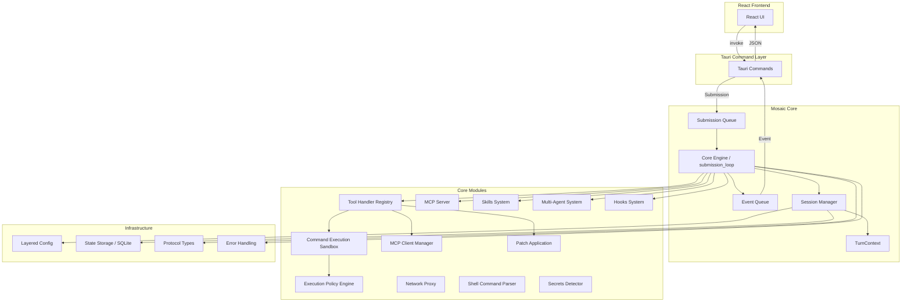
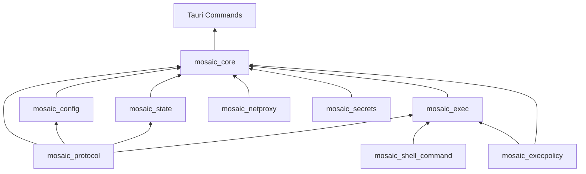
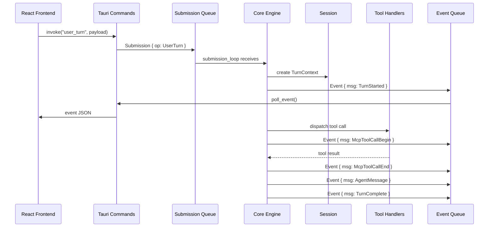
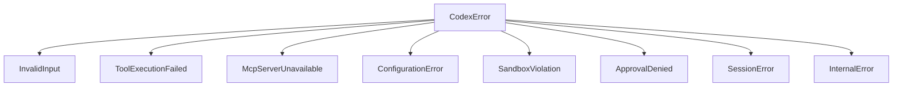

# Mosaic Core System 设计文档

## Overview

Mosaic Core System 是 Tauri v2 桌面应用的 Rust 后端核心，复刻 OpenAI Codex CLI 的核心后端逻辑。系统采用 SQ/EQ（Submission Queue / Event Queue）异步通信模式，所有模块作为 `src-tauri/` 下的 Rust 模块实现。

核心设计目标：

- 通过 SQ/EQ 队列对实现前后端完全解耦的异步通信
- 提供类型安全的协议层，确保所有组件通过一致接口通信
- 实现沙箱化命令执行和分层权限控制
- 支持 MCP 协议的双向集成（客户端 + 服务器），含 OAuth 传输
- 基于 SQLite 的持久化状态存储
- 通过 Tauri Command 暴露给 React 前端
- 网络代理与域名过滤安全隔离
- 对话历史压缩（compact）和回滚（rollback）机制
- Shell 命令解析和敏感信息检测

设计决策：

- 所有模块在同一 crate 内作为子模块组织，而非独立 crate，简化依赖管理
- 使用 `async_channel` 实现 SQ/EQ 通道，支持多生产者多消费者
- 使用 `tokio::sync::Mutex` 保护共享状态，确保异步安全
- 协议层使用 serde 的 `camelCase` 命名，配置层使用 `kebab-case` 命名
- 错误处理采用统一的 `CodexError` 结构体，所有模块共享
- 执行策略引擎基于自定义 `.codexpolicy` 格式解析器实现，使用前缀匹配规则（PrefixRule / PrefixPattern），支持命令规则和网络规则

编码规范引用（详见 docs/03_code_standards.md）：

- `format!` 宏必须内联变量：`format!("Hello {name}")` 而非 `format!("Hello {}", name)`
- 必须折叠 if 语句，遵循 `clippy::collapsible_if`
- 优先使用方法引用而非闭包，遵循 `clippy::redundant_closure_for_method_calls`
- `match` 语句应尽可能穷举，避免使用通配符 `_`
- 测试中优先比较完整对象，而非逐字段比较
- 禁止创建只引用一次的小型 helper 方法

## Architecture

### 系统架构图



### 模块依赖关系



### 数据流时序图



## Components and Interfaces

### 模块目录结构

```
src-tauri/src/
├── main.rs                    # Tauri 入口
├── lib.rs                     # Tauri Builder 配置 + 命令注册
├── commands.rs                # Tauri Command 定义
├── protocol/                  # mosaic-protocol
│   ├── mod.rs
│   ├── submission.rs          # Submission, Op
│   ├── event.rs               # Event, EventMsg
│   ├── types.rs               # SandboxPolicy, AskForApproval, ContentItem 等
│   └── error.rs               # CodexError, ErrorCode
├── core/                      # mosaic-core
│   ├── mod.rs
│   ├── codex.rs               # Codex 结构体, spawn, submission_loop
│   ├── session.rs             # Session, SessionState, TurnContext
│   ├── tools/                 # 工具处理器
│   │   ├── mod.rs             # ToolHandler trait, ToolRegistry
│   │   ├── router.rs          # ToolRouter: 工具路由和编排
│   │   └── handlers/          # 具体处理器实现
│   │       └── dynamic.rs     # DynamicToolSpec, DynamicToolCallRequest
│   ├── mcp_client.rs          # MCP 连接管理器
│   ├── mcp_server.rs          # MCP 服务器暴露
│   ├── skills.rs              # 技能系统
│   ├── agents.rs              # 多 Agent 系统
│   ├── hooks.rs               # 钩子系统
│   ├── patch.rs               # 补丁应用
│   ├── truncation.rs          # TruncationPolicy, 历史截断策略
│   ├── compact.rs             # compact / compact_remote, 历史压缩
│   └── realtime.rs            # RealtimeConversation 实时对话管理器
├── exec/                      # mosaic-exec
│   ├── mod.rs
│   └── sandbox.rs             # 沙箱执行器
├── execpolicy/                # mosaic-execpolicy
│   ├── mod.rs
│   ├── parser.rs              # PolicyParser: .codexpolicy 格式解析器
│   ├── prefix_rule.rs         # PrefixRule, PrefixPattern: 前缀匹配规则
│   └── network_rule.rs        # NetworkRule: 网络访问规则
├── config/                    # mosaic-config
│   ├── mod.rs
│   ├── toml_types.rs          # ConfigToml 结构体
│   ├── layer_stack.rs         # 分层配置栈
│   └── edit.rs                # ConfigEdit 构建器
└── state/                     # mosaic-state
    ├── mod.rs
    ├── db.rs                  # StateDb (SQLite)
    ├── rollout.rs             # Rollout 存储
    └── memory.rs              # Memory 系统
├── netproxy/                  # mosaic-netproxy
│   ├── mod.rs
│   └── proxy.rs               # NetworkProxy: 域名白名单/黑名单, 网络访问控制
├── shell_command/             # mosaic-shell-command
│   └── mod.rs                 # Shell 命令解析模块
└── secrets/                   # mosaic-secrets
    ├── mod.rs                 # 模块入口、scan_for_secrets
    ├── manager.rs             # SecretsManager、SecretsBackend trait、keyring 集成
    ├── backend.rs             # SecretsBackend 实现（keyring、内存等）
    └── sanitizer.rs           # redact_secrets 输出内容脱敏
```

### 核心接口定义

#### 1. Protocol Layer (mosaic_protocol)

```rust
// submission.rs
#[derive(Debug, Clone, Serialize, Deserialize)]
#[serde(rename_all = "camelCase")]
pub struct Submission {
    pub id: String,
    pub op: Op,
}

#[derive(Debug, Clone, Serialize, Deserialize)]
#[serde(rename_all = "camelCase", tag = "type")]
pub enum Op {
    // --- 核心对话操作 ---
    UserTurn {
        input: UserInput,
        cwd: Option<PathBuf>,
        policies: Option<Policies>,
        model: Option<String>,
        effort: Option<Effort>,
        summary: Option<String>,
        service_tier: Option<ServiceTier>,
        collaboration_mode: Option<CollaborationMode>,
        personality: Option<Personality>,
        final_output_json_schema: Option<serde_json::Value>,
    },
    UserInput { input: UserInput },                    // legacy 版本的用户输入
    UserInputAnswer { answer: String },                // 用户输入回答（elicitation 等场景）
    Interrupt,
    Shutdown,

    // --- 审批操作 ---
    ExecApproval { decision: ReviewDecision },
    PatchApproval { decision: ReviewDecision },
    ResolveElicitation { response: serde_json::Value }, // MCP elicitation 请求解析

    // --- 上下文覆盖 ---
    OverrideTurnContext { overrides: TurnContextOverrides },

    // --- 历史管理 ---
    AddToHistory { items: Vec<ResponseInputItem> },

    // --- MCP 管理 ---
    ListMcpTools,
    RefreshMcpServers,

    // --- 动态工具 ---
    DynamicToolResponse { call_id: String, result: serde_json::Value },

    // --- 配置与技能 ---
    ReloadUserConfig,
    ListSkills,
    ListCustomPrompts,

    // --- 实时对话 ---
    RealtimeConversationStart { config: RealtimeConfig },
    RealtimeConversationStop,
    RealtimeConversationSendAudio { data: Vec<u8> },

    // --- 后台管理 ---
    CleanBackgroundTerminals,
}

// 审批决策（替代简单的 bool approved）
#[derive(Debug, Clone, Serialize, Deserialize)]
#[serde(rename_all = "camelCase")]
pub struct ReviewDecision {
    pub approved: bool,
    pub always_approve: bool,
    pub custom_instructions: Option<String>,
}

// event.rs
#[derive(Debug, Clone, Serialize, Deserialize)]
#[serde(rename_all = "camelCase")]
pub struct Event {
    pub id: String,
    pub msg: EventMsg,
}

#[derive(Debug, Clone, Serialize, Deserialize)]
#[serde(rename_all = "camelCase", tag = "type")]
pub enum EventMsg {
    // --- 会话配置与生命周期 ---
    SessionConfigured { config: serde_json::Value },
    TurnStarted,
    TurnComplete { status: TurnStatus },
    TurnAborted { reason: String },

    // --- Agent 消息流 ---
    AgentMessage { content: String },
    AgentMessageDelta { delta: String },
    ReasoningDelta { delta: String },
    PlanDelta { delta: String },

    // --- 结构化项目事件 ---
    ItemStarted { item_id: String, item_type: String },
    ItemCompleted { item_id: String, item_type: String },
    RawResponseItem { item: serde_json::Value },

    // --- 命令执行 ---
    ExecCommandBegin { command: Vec<String> },
    ExecCommandEnd { exit_code: i32, output: String },
    ExecCommandOutputDelta { delta: String },

    // --- 补丁应用 ---
    PatchApplyBegin { path: String },
    PatchApplyEnd { success: bool },

    // --- MCP 工具调用 ---
    McpToolCallBegin { server: String, tool: String },
    McpToolCallEnd { result: serde_json::Value },
    McpStartupUpdate { server: String, status: String },
    McpStartupComplete,

    // --- Token 使用统计 ---
    TokenUsageUpdate { input_tokens: u64, output_tokens: u64 },
    TokenUsageSummary { total_input: u64, total_output: u64 },

    // --- 历史压缩 ---
    Compacted { new_length: usize },

    // --- 警告与错误 ---
    Warning { message: String },
    Error { message: String },
}
```

#### 2. Protocol Additional Types (mosaic_protocol)

```rust
// protocol/types.rs

// SandboxPolicy — 带有 WritableRoot 列表的复杂结构
#[derive(Debug, Clone, Serialize, Deserialize, PartialEq)]
#[serde(rename_all = "camelCase", tag = "type")]
pub enum SandboxPolicy {
    ReadOnly,
    WorkspaceWriteOnly { writable_roots: Vec<PathBuf> },
    DangerFullAccess,
}

// AskForApproval 审批策略
#[derive(Debug, Clone, Serialize, Deserialize, PartialEq)]
#[serde(rename_all = "camelCase")]
pub enum AskForApproval {
    Never,
    OnFailure,
    UnlessAllowListed,
    Always,
}

// TurnStatus — TurnComplete 事件的状态
#[derive(Debug, Clone, Serialize, Deserialize, PartialEq)]
#[serde(rename_all = "camelCase")]
pub enum TurnStatus {
    Completed,
    Aborted,
    Error,
}

// Effort — 模型推理努力级别
#[derive(Debug, Clone, Serialize, Deserialize, PartialEq)]
#[serde(rename_all = "camelCase")]
pub enum Effort {
    Low,
    Medium,
    High,
}

// ServiceTier — 服务层级
#[derive(Debug, Clone, Serialize, Deserialize, PartialEq)]
#[serde(rename_all = "camelCase")]
pub enum ServiceTier {
    Default,
    Flex,
}

// CollaborationMode — 协作模式
#[derive(Debug, Clone, Serialize, Deserialize, PartialEq)]
#[serde(rename_all = "camelCase")]
pub enum CollaborationMode {
    Solo,
    Pair,
}

// Personality — Agent 人格
#[derive(Debug, Clone, Serialize, Deserialize, PartialEq)]
#[serde(rename_all = "camelCase")]
pub struct Personality {
    pub name: Option<String>,
    pub style: Option<String>,
}

// RealtimeConfig — 实时对话配置
#[derive(Debug, Clone, Serialize, Deserialize)]
#[serde(rename_all = "camelCase")]
pub struct RealtimeConfig {
    pub model: String,
    pub voice: Option<String>,
}

// FunctionCallOutputPayload
#[derive(Debug, Clone, Serialize, Deserialize)]
#[serde(rename_all = "camelCase")]
pub struct FunctionCallOutputPayload {
    pub content: ContentOrItems,
}

#[derive(Debug, Clone, Serialize, Deserialize)]
#[serde(rename_all = "camelCase", untagged)]
pub enum ContentOrItems {
    String(String),
    Items(Vec<ContentItem>),
}

// Dynamic Tools 系统
#[derive(Debug, Clone, Serialize, Deserialize)]
#[serde(rename_all = "camelCase")]
pub struct DynamicToolSpec {
    pub name: String,
    pub description: String,
    pub input_schema: serde_json::Value,
}

#[derive(Debug, Clone, Serialize, Deserialize)]
#[serde(rename_all = "camelCase")]
pub struct DynamicToolCallRequest {
    pub call_id: String,
    pub tool_name: String,
    pub arguments: serde_json::Value,
}
```

#### 3. Core Engine (mosaic_core)

```rust
// codex.rs
pub struct Codex {
    pub tx_sub: async_channel::Sender<Submission>,
    pub rx_event: async_channel::Receiver<Event>,
}

impl Codex {
    pub async fn spawn(config: Config) -> Result<Self, CodexError>;
}
```

#### 4. Session (mosaic_core)

```rust
// session.rs
pub struct Session {
    state: tokio::sync::Mutex<SessionState>,
    config: Config,
    tool_registry: ToolRegistry,
    mcp_manager: McpConnectionManager,
    hooks: HookRegistry,
    tx_event: async_channel::Sender<Event>,
}

pub struct SessionState {
    pub history: Vec<ResponseInputItem>,
    pub turn_active: bool,
    pub pending_approval: Option<PendingApproval>,
    pub turn_context: Option<TurnContext>,
}

pub struct TurnContext {
    pub model_info: ModelInfo,
    pub sandbox_policy: SandboxPolicy,
    pub approval_policy: AskForApproval,
    pub cwd: PathBuf,
}

```

#### 5. Tool Handler System

```rust
// tools/mod.rs
#[async_trait]
pub trait ToolHandler: Send + Sync {
    fn matches_kind(&self, kind: &ToolKind) -> bool;
    fn kind(&self) -> ToolKind;
    async fn handle(&self, args: serde_json::Value) -> Result<serde_json::Value, CodexError>;
}

pub struct ToolRegistry {
    handlers: Vec<Box<dyn ToolHandler>>,
}

impl ToolRegistry {
    pub fn register(&mut self, handler: Box<dyn ToolHandler>);
    pub fn dispatch(&self, kind: &ToolKind, args: serde_json::Value)
        -> Result<serde_json::Value, CodexError>;
}
```

#### 6. Command Execution Sandbox (mosaic_exec)

```rust
// exec/mod.rs
pub struct CommandExecutor {
    sandbox_policy: SandboxPolicy,
    approval_policy: AskForApproval,
    allow_list: Vec<String>,
    tx_event: async_channel::Sender<Event>,
}

impl CommandExecutor {
    pub async fn execute(
        &self,
        command: Vec<String>,
        cwd: &Path,
    ) -> Result<ExecResult, CodexError>;
}

pub struct ExecResult {
    pub exit_code: i32,
    pub stdout: String,
    pub stderr: String,
}
```

#### 7. Execution Policy Engine (mosaic_execpolicy)

```rust
// execpolicy/mod.rs

// 决策类型（与实际代码一致：Allow / Prompt / Forbidden）
#[derive(Debug, Clone, PartialEq)]
pub enum PolicyDecision {
    Allow,
    Prompt,
    Forbidden { reason: String },
}

// 前缀匹配模式
#[derive(Debug, Clone)]
pub struct PrefixPattern {
    pub segments: Vec<String>,
    pub is_wildcard: bool,
}

// 命令前缀规则
#[derive(Debug, Clone)]
pub struct PrefixRule {
    pub pattern: PrefixPattern,
    pub decision: PolicyDecision,
}

// 网络访问规则
#[derive(Debug, Clone)]
pub struct NetworkRule {
    pub domain_pattern: String,
    pub decision: PolicyDecision,
}

// .codexpolicy 格式解析器
pub struct PolicyParser;

impl PolicyParser {
    pub fn parse(content: &str) -> Result<Vec<PrefixRule>, CodexError>;
    pub fn parse_network_rules(content: &str) -> Result<Vec<NetworkRule>, CodexError>;
}

// 策略引擎
pub struct ExecPolicyEngine {
    command_rules: Vec<PrefixRule>,
    network_rules: Vec<NetworkRule>,
    default_policy: PolicyDecision,
}

impl ExecPolicyEngine {
    pub fn evaluate(&self, command: &[String]) -> PolicyDecision;
    pub fn evaluate_network(&self, domain: &str) -> PolicyDecision;
    pub fn load_from_file(path: &Path) -> Result<Self, CodexError>;
}
```

#### 8. Layered Configuration (mosaic_config)

```rust
// config/toml_types.rs
#[derive(Debug, Clone, Serialize, Deserialize, PartialEq)]
#[serde(rename_all = "kebab-case")]
pub struct ConfigToml {
    pub model: Option<String>,
    pub approval_policy: Option<String>,
    pub sandbox_policy: Option<String>,
    pub mcp_servers: Option<HashMap<String, McpServerConfig>>,
    pub profiles: Option<HashMap<String, ConfigToml>>,
}

// config/layer_stack.rs
pub enum ConfigLayer {
    Mdm,
    System,
    User,
    Project,
    Session,
}

pub struct ConfigLayerStack {
    layers: Vec<(ConfigLayer, ConfigToml)>,
}

impl ConfigLayerStack {
    pub fn resolve(&self) -> Config;
    pub fn merge(&self) -> ConfigToml;
}
```

#### 9. State Storage (mosaic_state)

```rust
// state/db.rs
pub struct StateDb {
    conn: rusqlite::Connection,
}

impl StateDb {
    pub fn open(path: &Path) -> Result<Self, CodexError>;
    pub fn init_tables(&self) -> Result<(), CodexError>;
    pub fn save_rollout(&self, rollout: &Rollout) -> Result<(), CodexError>;
    pub fn load_rollout(&self, session_id: &str) -> Result<Option<Rollout>, CodexError>;
    pub fn save_session_meta(&self, meta: &SessionMeta) -> Result<(), CodexError>;
    pub fn load_session_meta(&self, id: &str) -> Result<Option<SessionMeta>, CodexError>;
}
```

#### 10. MCP Client (mcp_client)

```rust
// core/mcp_client.rs
pub enum McpServerConfig {
    Stdio { command: String, args: Vec<String>, env: HashMap<String, String> },
    Http { url: String, headers: HashMap<String, String> },
    OAuth { url: String, client_id: String, client_secret: String, token_url: String },
}

pub struct McpConnectionManager {
    connections: HashMap<String, McpConnection>,
}

impl McpConnectionManager {
    pub async fn connect(&mut self, name: &str, config: &McpServerConfig)
        -> Result<(), CodexError>;
    pub async fn discover_tools(&self, server: &str) -> Result<Vec<ToolInfo>, CodexError>;
    pub async fn call_tool(&self, server: &str, tool: &str, args: serde_json::Value)
        -> Result<serde_json::Value, CodexError>;
    pub fn qualify_tool_name(server: &str, tool: &str) -> String;
}
```

#### 11. Tauri Commands

```rust
// commands.rs
#[tauri::command]
pub async fn user_turn(state: State<'_, AppState>, input: UserInput)
    -> Result<(), String>;

#[tauri::command]
pub async fn interrupt(state: State<'_, AppState>) -> Result<(), String>;

#[tauri::command]
pub async fn exec_approval(state: State<'_, AppState>, approved: bool)
    -> Result<(), String>;

#[tauri::command]
pub async fn patch_approval(state: State<'_, AppState>, approved: bool)
    -> Result<(), String>;

#[tauri::command]
pub async fn shutdown(state: State<'_, AppState>) -> Result<(), String>;

#[tauri::command]
pub async fn poll_event(state: State<'_, AppState>)
    -> Result<Option<Event>, String>;

#[tauri::command]
pub async fn get_config(state: State<'_, AppState>)
    -> Result<serde_json::Value, String>;

#[tauri::command]
pub async fn list_skills(state: State<'_, AppState>)
    -> Result<Vec<SkillMetadata>, String>;
```

#### 12. Network Proxy (mosaic_netproxy)

```rust
// netproxy/proxy.rs

// 网络策略决策器
pub struct NetworkPolicyDecider {
    allow_rules: Vec<NetworkRule>,
    deny_rules: Vec<NetworkRule>,
}

impl NetworkPolicyDecider {
    pub fn evaluate(&self, domain: &str, port: u16) -> PolicyDecision;
}

// 完整的代理服务器
pub struct NetworkProxy {
    // MITM 代理
    http_proxy: HttpProxyServer,
    socks5_proxy: Socks5ProxyServer,
    // 证书管理
    cert_manager: CertificateManager,
    // 策略决策器
    policy_decider: NetworkPolicyDecider,
    // 运行时配置重载
    config_reloader: tokio::sync::watch::Receiver<NetworkProxyConfig>,
}

pub struct NetworkProxyConfig {
    pub listen_addr: String,
    pub socks5_addr: String,
    pub allowed_domains: Vec<String>,
    pub blocked_domains: Vec<String>,
    pub mitm_enabled: bool,
}

pub struct HttpProxyServer {
    listener: tokio::net::TcpListener,
}

pub struct Socks5ProxyServer {
    listener: tokio::net::TcpListener,
}

pub struct CertificateManager {
    ca_cert: Vec<u8>,
    ca_key: Vec<u8>,
}

impl NetworkProxy {
    pub async fn start(config: NetworkProxyConfig) -> Result<Self, CodexError>;
    pub async fn stop(&self) -> Result<(), CodexError>;
    pub fn is_domain_allowed(&self, domain: &str) -> bool;
    pub async fn reload_config(&self, config: NetworkProxyConfig) -> Result<(), CodexError>;
}
```

#### 13. Shell Command Parser (mosaic_shell_command)

```rust
// shell_command/mod.rs
pub fn parse_command(input: &str) -> Result<Vec<String>, CodexError>;
```

#### 14. Secrets Manager (mosaic_secrets)

```rust
// secrets/mod.rs

// 密钥名称（带格式验证）
#[derive(Debug, Clone, PartialEq, Eq, Hash)]
pub struct SecretName(String);

impl SecretName {
    pub fn new(name: &str) -> Result<Self, CodexError>;
    pub fn as_str(&self) -> &str;
}

// 密钥作用域
#[derive(Debug, Clone, PartialEq)]
pub enum SecretScope {
    Global,
    Environment(String),
}

// 密钥后端 trait
#[async_trait]
pub trait SecretsBackend: Send + Sync {
    async fn get(&self, name: &SecretName, scope: &SecretScope) -> Result<Option<String>, CodexError>;
    async fn set(&self, name: &SecretName, scope: &SecretScope, value: &str) -> Result<(), CodexError>;
    async fn delete(&self, name: &SecretName, scope: &SecretScope) -> Result<(), CodexError>;
    async fn list(&self, scope: &SecretScope) -> Result<Vec<SecretName>, CodexError>;
}

// 密钥管理器（含 keyring 集成）
pub struct SecretsManager {
    backend: Box<dyn SecretsBackend>,
}

impl SecretsManager {
    pub fn new_with_keyring() -> Result<Self, CodexError>;
    pub async fn get_secret(&self, name: &SecretName, scope: &SecretScope) -> Result<Option<String>, CodexError>;
    pub async fn set_secret(&self, name: &SecretName, scope: &SecretScope, value: &str) -> Result<(), CodexError>;
    pub async fn delete_secret(&self, name: &SecretName, scope: &SecretScope) -> Result<(), CodexError>;
    pub async fn list_secrets(&self, scope: &SecretScope) -> Result<Vec<SecretName>, CodexError>;
}

// 敏感信息检测
pub struct SecretMatch {
    pub kind: String,
    pub range: std::ops::Range<usize>,
    pub redacted: String,
}

pub fn scan_for_secrets(content: &str) -> Vec<SecretMatch>;

// sanitizer 模块 — 输出内容脱敏
pub fn redact_secrets(content: &str, known_secrets: &[String]) -> String;
```

#### 15. Session History Truncation, Compression and Rollback

```rust
// core/truncation.rs
#[derive(Debug, Clone)]
pub enum TruncationPolicy {
    /// 保留最近 N 条消息
    KeepRecent { max_items: usize },
    /// 保留最近 N 个 token
    KeepRecentTokens { max_tokens: usize },
    /// 自动压缩（调用模型生成摘要）
    AutoCompact,
}

// core/compact.rs
/// 本地压缩：使用 SUMMARIZATION_PROMPT 模板生成摘要
pub async fn compact(
    history: &[ResponseInputItem],
    model: &str,
    policy: &TruncationPolicy,
) -> Result<Vec<ResponseInputItem>, CodexError>;

/// 远程压缩：调用远程 API 进行压缩
pub async fn compact_remote(
    history: &[ResponseInputItem],
    endpoint: &str,
    model: &str,
) -> Result<Vec<ResponseInputItem>, CodexError>;

/// 摘要提示模板
pub const SUMMARIZATION_PROMPT: &str = "...";

// core/session.rs (additional methods)
impl Session {
    pub async fn compact_history(&self, policy: &TruncationPolicy) -> Result<(), CodexError>;
    pub async fn rollback(&self, steps: usize) -> Result<(), CodexError>;
}
```

#### 16. Batch Job System (agents)

```rust
// core/agents.rs (additional types)
pub struct BatchJobConfig {
    pub csv_path: PathBuf,
    pub concurrency: usize,
}

pub struct BatchResult {
    pub row_index: usize,
    pub success: bool,
    pub output: String,
}

pub async fn run_batch_jobs(config: BatchJobConfig) -> Result<Vec<BatchResult>, CodexError>;
```

#### 17. Tool Router (mosaic_core::tools::router)

```rust
// core/tools/router.rs
pub struct ToolRouter {
    registry: ToolRegistry,
    mcp_manager: McpConnectionManager,
    dynamic_tools: HashMap<String, DynamicToolSpec>,
}

impl ToolRouter {
    pub fn new(registry: ToolRegistry, mcp_manager: McpConnectionManager) -> Self;

    /// 路由工具调用到正确的处理器（内置、MCP、或动态工具）
    pub async fn route_tool_call(
        &self,
        tool_name: &str,
        args: serde_json::Value,
    ) -> Result<serde_json::Value, CodexError>;

    /// 注册动态工具
    pub fn register_dynamic_tool(&mut self, spec: DynamicToolSpec);

    /// 列出所有可用工具（内置 + MCP + 动态）
    pub fn list_all_tools(&self) -> Vec<ToolInfo>;
}
```

#### 18. Hooks System (mosaic_hooks)

```rust
// core/hooks.rs

// 实际代码中 Hooks 只有两种事件类型（无 before-hook 概念）
#[derive(Debug, Clone, Serialize, Deserialize)]
#[serde(rename_all = "camelCase")]
pub enum HookEvent {
    AfterAgent { agent_id: String, result: serde_json::Value },
    AfterToolUse { tool_name: String, result: serde_json::Value },
}

// Hook 执行结果（三种状态）
#[derive(Debug, Clone)]
pub enum HookResult {
    Success,
    FailedContinue { error: String },
    FailedAbort { error: String },
}

pub struct HookRegistry {
    hooks: Vec<HookDefinition>,
}

pub struct HookDefinition {
    pub name: String,
    pub event: HookEvent,
    pub handler: Box<dyn HookHandler>,
}

#[async_trait]
pub trait HookHandler: Send + Sync {
    async fn execute(&self, event: &HookEvent) -> HookResult;
}

impl HookRegistry {
    pub fn register(&mut self, definition: HookDefinition);
    pub async fn fire(&self, event: &HookEvent) -> Vec<HookResult>;
}
```

#### 19. Skills System (mosaic_skills) — 完整元数据

```rust
// core/skills.rs

// SkillInterface — UI 展示配置
#[derive(Debug, Clone, Serialize, Deserialize)]
#[serde(rename_all = "camelCase")]
pub struct SkillInterface {
    pub display_name: Option<String>,
    pub icon: Option<String>,
    pub brand_color: Option<String>,
}

// SkillDependencies — 工具依赖
#[derive(Debug, Clone, Serialize, Deserialize)]
#[serde(rename_all = "camelCase")]
pub struct SkillDependencies {
    pub tools: Vec<String>,
}

// SkillPolicy — 调用策略
#[derive(Debug, Clone, Serialize, Deserialize)]
#[serde(rename_all = "camelCase")]
pub struct SkillPolicy {
    pub allow_implicit_invocation: bool,
}

// 完整的 SkillMetadata
#[derive(Debug, Clone, Serialize, Deserialize)]
#[serde(rename_all = "camelCase")]
pub struct SkillMetadata {
    pub name: String,
    pub short_description: Option<String>,
    pub description: String,
    pub version: String,
    pub triggers: Vec<String>,
    pub interface: Option<SkillInterface>,
    pub dependencies: Option<SkillDependencies>,
    pub policy: Option<SkillPolicy>,
    pub permission_profile: Option<String>,
    pub path_to_skills_md: PathBuf,
    pub scope: SkillScope,
}

#[derive(Debug, Clone, Serialize, Deserialize, PartialEq)]
pub enum SkillScope {
    Repo,
    User,
    System,
    Admin,
}

// 技能加载结果
pub struct SkillLoadOutcome {
    pub skills: Vec<SkillMetadata>,
    pub errors: Vec<(PathBuf, CodexError)>,
    pub disabled_paths: Vec<PathBuf>,
    pub implicit_skills: HashMap<String, SkillMetadata>,
}

pub fn load_skills_from_roots(roots: Vec<SkillRoot>) -> SkillLoadOutcome;
```

#### 20. Agent Control System (mosaic_core::agents) — 完整架构

```rust
// core/agents.rs

// Agent 线程管理状态（使用弱引用避免循环）
pub struct ThreadManagerState {
    agents: HashMap<String, std::sync::Weak<AgentInstance>>,
    next_nickname: u32,
}

// Spawn slot 预留和 nickname 分配
pub struct Guards {
    pub spawn_slot: SpawnSlotGuard,
    pub nickname: String,
}

// Agent 创建选项
#[derive(Debug, Clone)]
pub struct SpawnAgentOptions {
    pub model: Option<String>,
    pub sandbox_policy: Option<SandboxPolicy>,
    pub cwd: Option<PathBuf>,
    pub fork: bool,                    // 支持 fork 模式
    pub max_depth: Option<usize>,
}

pub struct AgentControl {
    state: tokio::sync::Mutex<ThreadManagerState>,
    max_recursion_depth: usize,
}

impl AgentControl {
    pub async fn spawn_agent(&self, options: SpawnAgentOptions) -> Result<String, CodexError>;
    pub async fn send_input(&self, agent_id: &str, input: UserInput) -> Result<(), CodexError>;
    pub async fn resume_agent(&self, agent_id: &str) -> Result<(), CodexError>;
    pub async fn wait(&self, agent_id: &str) -> Result<serde_json::Value, CodexError>;
    pub async fn close_agent(&self, agent_id: &str) -> Result<(), CodexError>;
}
```

#### 21. State Storage (mosaic_state) — 完整架构

```rust
// state/db.rs

// 运行时状态（含配置和指标）
pub struct StateRuntime {
    pub config: StateConfig,
    pub metrics: StateMetrics,
}

pub struct StateConfig {
    pub db_path: PathBuf,
    pub max_connections: usize,
}

pub struct StateMetrics {
    pub total_reads: u64,
    pub total_writes: u64,
}

// 低级存储引擎
pub struct LogDb {
    conn: rusqlite::Connection,
}

// 主数据库（18 个迁移脚本）
pub struct StateDb {
    runtime: StateRuntime,
    log_db: LogDb,
}

// 线程元数据
#[derive(Debug, Clone, Serialize, Deserialize)]
pub struct ThreadMetadata {
    pub thread_id: String,
    pub created_at: chrono::DateTime<chrono::Utc>,
    pub title: Option<String>,
    pub model: Option<String>,
}

// Agent 作业
#[derive(Debug, Clone, Serialize, Deserialize)]
pub struct AgentJob {
    pub job_id: String,
    pub thread_id: String,
    pub status: AgentJobStatus,
    pub items: Vec<AgentJobItem>,
}

#[derive(Debug, Clone, Serialize, Deserialize)]
pub struct AgentJobItem {
    pub item_id: String,
    pub input: String,
    pub output: Option<String>,
    pub status: AgentJobStatus,
}

#[derive(Debug, Clone, Serialize, Deserialize, PartialEq)]
pub enum AgentJobStatus {
    Pending,
    Running,
    Completed,
    Failed,
}

// 回填状态
#[derive(Debug, Clone, Serialize, Deserialize)]
pub struct BackfillState {
    pub last_processed_id: Option<String>,
    pub total_processed: u64,
}

impl StateDb {
    pub fn open(path: &Path) -> Result<Self, CodexError>;
    pub fn run_migrations(&self) -> Result<(), CodexError>;
    pub fn save_rollout(&self, rollout: &Rollout) -> Result<(), CodexError>;
    pub fn load_rollout(&self, session_id: &str) -> Result<Option<Rollout>, CodexError>;
    pub fn save_session_meta(&self, meta: &SessionMeta) -> Result<(), CodexError>;
    pub fn load_session_meta(&self, id: &str) -> Result<Option<SessionMeta>, CodexError>;
    pub fn save_thread_metadata(&self, meta: &ThreadMetadata) -> Result<(), CodexError>;
    pub fn save_agent_job(&self, job: &AgentJob) -> Result<(), CodexError>;
    pub fn load_agent_job(&self, job_id: &str) -> Result<Option<AgentJob>, CodexError>;
    pub fn get_backfill_state(&self) -> Result<BackfillState, CodexError>;
}
```

#### 22. MCP Server Transport Config (mosaic_config)

```rust
// config/toml_types.rs (MCP 传输配置扩展)
#[derive(Debug, Clone, Serialize, Deserialize, PartialEq)]
#[serde(rename_all = "kebab-case", tag = "type")]
pub enum McpServerTransportConfig {
    Stdio {
        command: String,
        args: Vec<String>,
        env: HashMap<String, String>,
    },
    Http {
        url: String,
        headers: HashMap<String, String>,
    },
    OAuth {
        url: String,
        client_id: String,
        client_secret: String,
        token_url: String,
    },
}

// disabled 原因追踪
#[derive(Debug, Clone, Serialize, Deserialize, PartialEq)]
pub struct McpServerConfig {
    pub transport: McpServerTransportConfig,
    pub disabled: bool,
    pub disabled_reason: Option<String>,
    pub tool_filter: Option<McpToolFilter>,
}

#[derive(Debug, Clone, Serialize, Deserialize, PartialEq)]
pub struct McpToolFilter {
    pub enabled: Option<Vec<String>>,
    pub disabled: Option<Vec<String>>,
}
```

#### 23. Realtime Conversation Manager (mosaic_core::realtime)

```rust
// core/realtime.rs
pub struct RealtimeConversationManager {
    active_session: Option<RealtimeSession>,
    tx_event: async_channel::Sender<Event>,
}

pub struct RealtimeSession {
    pub session_id: String,
    pub model: String,
    pub voice: Option<String>,
    pub started_at: chrono::DateTime<chrono::Utc>,
}

impl RealtimeConversationManager {
    pub async fn start(&mut self, config: RealtimeConfig) -> Result<(), CodexError>;
    pub async fn stop(&mut self) -> Result<(), CodexError>;
    pub async fn send_audio(&self, data: Vec<u8>) -> Result<(), CodexError>;
    pub fn is_active(&self) -> bool;
}
```

## Data Models

### 核心数据模型关系图

```mermaid
erDiagram
    Submission ||--|| Op : contains
    Event ||--|| EventMsg : contains
    Op ||--o| UserInput : "UserTurn has"
    Op ||--o| Policies : "UserTurn has"
    Op ||--o| ReviewDecision : "ExecApproval/PatchApproval has"
    Op ||--o| RealtimeConfig : "RealtimeConversationStart has"
    UserInput ||--|{ ContentItem : contains
    Session ||--|| SessionState : protects
    SessionState ||--|{ ResponseInputItem : "history"
    SessionState ||--o| TurnContext : "current turn"
    TurnContext ||--|| SandboxPolicy : uses
    TurnContext ||--|| AskForApproval : uses
    ConfigLayerStack ||--|{ ConfigToml : "layers"
    StateDb ||--|| StateRuntime : "runtime config"
    StateDb ||--|| LogDb : "low-level storage"
    StateDb ||--|{ Rollout : stores
    StateDb ||--|{ SessionMeta : stores
    StateDb ||--|{ ThreadMetadata : stores
    StateDb ||--|{ AgentJob : stores
    Rollout ||--|{ Event : "ordered events"
    ToolRouter ||--|| ToolRegistry : "routes to"
    ToolRouter ||--|| McpConnectionManager : "routes to"
    ToolRouter ||--|{ DynamicToolSpec : "dynamic tools"
    ToolRegistry ||--|{ ToolHandler : registers
    McpConnectionManager ||--|{ McpConnection : manages
    McpConnection ||--|| McpServerConfig : "configured by"
    McpServerConfig ||--|| McpServerTransportConfig : "transport"
    CodexError ||--|| ErrorCode : has
    FunctionCallOutputPayload ||--|| ContentOrItems : contains
    NetworkProxy ||--|| NetworkPolicyDecider : "policy"
    NetworkProxy ||--|| CertificateManager : "certs"
    ExecPolicyEngine ||--|{ PrefixRule : "command rules"
    ExecPolicyEngine ||--|{ NetworkRule : "network rules"
    HookRegistry ||--|{ HookDefinition : registers
    SecretsManager ||--|| SecretsBackend : "backend"
    SkillMetadata ||--o| SkillInterface : "interface"
    SkillMetadata ||--o| SkillDependencies : "dependencies"
    SkillMetadata ||--o| SkillPolicy : "policy"
    AgentControl ||--|| ThreadManagerState : manages
    BatchJobConfig ||--|{ BatchResult : produces
```



### 协议类型 (mosaic_protocol)

| 类型 | 字段 | 说明 |
|------|------|------|
| Submission | id: String, op: Op | 入站消息 |
| Event | id: String, msg: EventMsg | 出站消息 |
| Op | UserTurn, UserInput, UserInputAnswer, Interrupt, Shutdown, ExecApproval, PatchApproval, ResolveElicitation, OverrideTurnContext, AddToHistory, ListMcpTools, RefreshMcpServers, DynamicToolResponse, ReloadUserConfig, ListSkills, ListCustomPrompts, RealtimeConversation*, CleanBackgroundTerminals | 操作枚举（20+ 变体） |
| EventMsg | SessionConfigured, TurnStarted, TurnComplete, TurnAborted, AgentMessage/Delta, ReasoningDelta, PlanDelta, ItemStarted/Completed, RawResponseItem, ExecCommandBegin/End/OutputDelta, PatchApplyBegin/End, McpToolCallBegin/End, McpStartupUpdate/Complete, TokenUsageUpdate/Summary, Compacted, Warning, Error | 事件枚举（25+ 变体） |
| SandboxPolicy | ReadOnly, WorkspaceWriteOnly { writable_roots }, DangerFullAccess | 沙箱策略（带 WritableRoot 列表） |
| AskForApproval | Never, OnFailure, UnlessAllowListed, Always | 审批策略 |
| ReviewDecision | approved: bool, always_approve: bool, custom_instructions: Option | 审批决策结构体 |
| TurnStatus | Completed, Aborted, Error | 轮次完成状态 |
| Effort | Low, Medium, High | 模型推理努力级别 |
| ServiceTier | Default, Flex | 服务层级 |
| CollaborationMode | Solo, Pair | 协作模式 |
| Personality | name: Option, style: Option | Agent 人格 |
| ContentItem | Text, Image, InputAudio | 内容项 |
| UserInput | content_items: Vec | 用户输入 |
| ResponseInputItem | Message, FunctionCall, FunctionOutput | 对话历史项 |
| CodexError | code: ErrorCode, message: String, details: Option | 错误结构 |
| ErrorCode | InvalidInput, ToolExecutionFailed, McpServerUnavailable, ConfigurationError, SandboxViolation, ApprovalDenied, SessionError, InternalError | 错误码 |
| FunctionCallOutputPayload | content: ContentOrItems | 函数调用输出载荷 |
| ContentOrItems | String(String), Items(Vec&lt;ContentItem&gt;) | 内容或内容项列表 |
| DynamicToolSpec | name, description, input_schema | 动态工具规格 |
| DynamicToolCallRequest | call_id, tool_name, arguments | 动态工具调用请求 |
| RealtimeConfig | model, voice | 实时对话配置 |

### 会话与上下文

| 类型 | 字段 | 说明 |
|------|------|------|
| SessionState | history, turn_active, pending_approval, turn_context | 会话状态 |
| TurnContext | model_info, sandbox_policy, approval_policy, cwd | 轮次上下文 |
| ModelInfo | name: String, provider: String | 模型信息 |
| PendingApproval | kind: ApprovalKind, command: Option, patch_path: Option | 待审批项 |

### 配置类型 (mosaic_config)

| 类型 | 字段 | 说明 |
|------|------|------|
| ConfigToml | model, approval_policy, sandbox_policy, mcp_servers, profiles | TOML 配置 |
| McpServerConfig | transport: McpServerTransportConfig, disabled, disabled_reason, tool_filter | MCP 服务器配置（含 disabled 原因追踪） |
| McpServerTransportConfig | Stdio { command, args, env }, Http { url, headers }, OAuth { url, client_id, client_secret, token_url } | MCP 传输配置 |
| McpToolFilter | enabled: Option&lt;Vec&gt;, disabled: Option&lt;Vec&gt; | MCP 工具过滤器 |
| ConfigLayer | Mdm, System, User, Project, Session | 配置层级 |
| ConfigLayerStack | layers: Vec&lt;(ConfigLayer, ConfigToml)&gt; | 分层配置栈 |

### 存储类型 (mosaic_state)

| 类型 | 字段 | 说明 |
|------|------|------|
| StateDb | runtime: StateRuntime, log_db: LogDb | 主数据库（18 个迁移脚本） |
| StateRuntime | config: StateConfig, metrics: StateMetrics | 运行时状态（含配置和指标） |
| LogDb | conn: rusqlite::Connection | 低级存储引擎 |
| ThreadMetadata | thread_id, created_at, title, model | 线程元数据 |
| AgentJob | job_id, thread_id, status, items: Vec&lt;AgentJobItem&gt; | Agent 作业 |
| AgentJobItem | item_id, input, output, status | Agent 作业项 |
| AgentJobStatus | Pending, Running, Completed, Failed | 作业状态枚举 |
| BackfillState | last_processed_id, total_processed | 回填状态 |
| Rollout | session_id, events: Vec, created_at | 事件序列 |
| SessionMeta | id, created_at, last_activity, config_profile | 会话元数据 |
| Memory | phase: MemoryPhase, content, timestamp, relevance_score | 记忆条目 |
| MemoryPhase | Phase1 (短期), Phase2 (长期) | 记忆阶段 |

### 技能与 Agent

| 类型 | 字段 | 说明 |
|------|------|------|
| SkillMetadata | name, short_description, description, version, triggers, interface, dependencies, policy, permission_profile, path_to_skills_md, scope | 技能元数据（完整字段） |
| SkillInterface | display_name, icon, brand_color | 技能 UI 展示配置 |
| SkillDependencies | tools: Vec&lt;String&gt; | 技能工具依赖 |
| SkillPolicy | allow_implicit_invocation: bool | 技能调用策略 |
| SkillScope | Repo, User, System, Admin | 技能作用域 |
| SkillLoadOutcome | skills, errors, disabled_paths, implicit_skills | 技能加载结果 |
| SkillRoot | Repo, User, System, Admin | 技能根目录优先级 |
| AgentControl | state: Mutex&lt;ThreadManagerState&gt;, max_recursion_depth | Agent 控制面 |
| ThreadManagerState | agents: HashMap&lt;String, Weak&lt;AgentInstance&gt;&gt;, next_nickname | Agent 线程管理（弱引用避免循环） |
| SpawnAgentOptions | model, sandbox_policy, cwd, fork, max_depth | Agent 创建选项（含 fork 支持） |
| Guards | spawn_slot: SpawnSlotGuard, nickname: String | Spawn slot 预留和 nickname 分配 |
| AgentInstance | id, session, context, depth | Agent 实例 |
| BatchJobConfig | csv_path: PathBuf, concurrency: usize | 批量任务配置 |
| BatchResult | row_index: usize, success: bool, output: String | 批量任务结果 |

### 安全与工具模块

| 类型 | 字段 | 说明 |
|------|------|------|
| NetworkProxy | http_proxy, socks5_proxy, cert_manager, policy_decider, config_reloader | 完整代理服务器（MITM、SOCKS5、证书管理） |
| NetworkPolicyDecider | allow_rules, deny_rules | 网络策略决策器 |
| NetworkProxyConfig | listen_addr, socks5_addr, allowed_domains, blocked_domains, mitm_enabled | 代理配置 |
| ExecPolicyEngine | command_rules: Vec&lt;PrefixRule&gt;, network_rules: Vec&lt;NetworkRule&gt;, default_policy | 执行策略引擎（.codexpolicy 格式） |
| PrefixRule | pattern: PrefixPattern, decision: PolicyDecision | 命令前缀规则 |
| PrefixPattern | segments: Vec&lt;String&gt;, is_wildcard: bool | 前缀匹配模式 |
| NetworkRule | domain_pattern: String, decision: PolicyDecision | 网络访问规则 |
| PolicyDecision | Allow, Prompt, Forbidden { reason } | 策略决策（非 Allowed/Denied） |
| SecretsManager | backend: Box&lt;dyn SecretsBackend&gt; | 密钥管理器（含 keyring 集成） |
| SecretName | String（带格式验证） | 密钥名称 |
| SecretScope | Global, Environment(String) | 密钥作用域 |
| SecretMatch | kind: String, range: Range&lt;usize&gt;, redacted: String | 敏感信息匹配结果 |
| ToolRouter | registry, mcp_manager, dynamic_tools | 工具路由器（内置 + MCP + 动态） |
| HookRegistry | hooks: Vec&lt;HookDefinition&gt; | 钩子注册表 |
| HookEvent | AfterAgent, AfterToolUse | 钩子事件（仅 after 类型，无 before） |
| HookResult | Success, FailedContinue, FailedAbort | 钩子执行结果（三种状态） |
| TruncationPolicy | KeepRecent, KeepRecentTokens, AutoCompact | 历史截断策略 |
| RealtimeConversationManager | active_session, tx_event | 实时对话管理器 |
| RealtimeSession | session_id, model, voice, started_at | 实时对话会话 |

## Correctness Properties

*A property is a characteristic or behavior that should hold true across all valid executions of a system — essentially, a formal statement about what the system should do. Properties serve as the bridge between human-readable specifications and machine-verifiable correctness guarantees.*

### Property 1: Protocol types JSON round-trip

*For any* valid Mosaic protocol type instance (Submission, Event, Op, EventMsg, SandboxPolicy, AskForApproval, ContentItem, UserInput, ResponseInputItem, CodexError), serializing to JSON then deserializing back should produce an equivalent object.

**Validates: Requirements 1.11, 15.5**

### Property 2: Protocol types use camelCase serialization

*For any* valid Mosaic protocol type instance, the JSON serialization output should contain only camelCase field names (no snake_case or other formats).

**Validates: Requirements 1.8, 15.4**

### Property 3: ConfigToml TOML round-trip

*For any* valid ConfigToml object, serializing to TOML then deserializing back should produce an equivalent object.

**Validates: Requirements 7.9**

### Property 4: Turn lifecycle bracket events

*For any* UserTurn submission processed by the Core Engine, the event sequence on the EQ should begin with a TurnStarted event and end with a TurnComplete event, with all other events for that turn occurring between them.

**Validates: Requirements 2.3, 2.9, 2.10**

### Property 5: Interrupt cancels active turn

*For any* session with an active turn, sending an Interrupt submission should result in the current turn being cancelled and a TurnComplete event being emitted on the EQ.

**Validates: Requirements 2.4**

### Property 6: Shutdown closes all channels

*For any* active Codex instance, sending a Shutdown submission should result in the Session being gracefully shut down and all channels being closed.

**Validates: Requirements 2.5**

### Property 7: Approval submission controls pending operation

*For any* pending operation (command execution or patch application), submitting an approval with approved=true should proceed with the operation, and approved=false should cancel it.

**Validates: Requirements 2.6, 2.7**

### Property 8: Reject concurrent UserTurn

*For any* session with an active turn, submitting another UserTurn should be rejected and an Event with EventMsg::Error should be emitted indicating a turn is already active.

**Validates: Requirements 3.6**

### Property 9: TurnContext inherits from config

*For any* new TurnContext created during a turn, the default values for model_info, sandbox_policy, approval_policy, and cwd should be inherited from the active configuration profile.

**Validates: Requirements 3.2, 3.3**

### Property 10: OverrideTurnContext applies overrides

*For any* TurnContext and any set of valid overrides, applying OverrideTurnContext should update exactly the specified fields while leaving all other fields unchanged.

**Validates: Requirements 3.4**

### Property 11: Session history preserves order

*For any* sequence of ResponseInputItem entries added to the session history, the order of entries should be preserved when retrieved.

**Validates: Requirements 3.5**

### Property 12: Tool handler registry round-trip

*For any* ToolHandler implementation registered at runtime, querying the registry by its ToolKind should return a handler where matches_kind returns true for that ToolKind.

**Validates: Requirements 4.2, 4.6**

### Property 13: Tool call bracket events

*For any* tool call dispatched during run_turn, the EQ should emit McpToolCallBegin before the call and McpToolCallEnd (on success) or Error (on failure) after the call completes.

**Validates: Requirements 4.3, 4.4, 4.5**

### Property 14: Command execution bracket events

*For any* shell command execution, the EQ should emit ExecCommandBegin containing the command arguments before execution, and ExecCommandEnd containing exit code and output after completion.

**Validates: Requirements 5.1, 5.2**

### Property 15: Sandbox policy enforcement

*For any* shell command and active SandboxPolicy, `ReadOnly` should restrict all file write operations, `WorkspaceWriteOnly { writable_roots }` should allow writes only within the specified writable root directories, and `DangerFullAccess` should allow all operations. Violations should terminate the process and emit an Error event.

**Validates: Requirements 5.3, 5.4, 5.5, 5.6**

### Property 16: Approval policy behavior

*For any* command execution request and active AskForApproval policy: Never should execute without approval, Always should pause and request approval, OnFailure should request approval only on non-zero exit code, and UnlessAllowListed should execute allow-listed commands without approval and request approval for all others.

**Validates: Requirements 5.7, 5.8, 5.9, 5.10**

### Property 17: Execution policy decision mapping

*For any* command and set of PrefixRule 规则, the ExecPolicyEngine should return `Allow` for matching allow rules, `Forbidden { reason }` for matching forbidden rules, `Prompt` for matching prompt rules, and the default policy when no rule matches. Rules are evaluated by prefix matching via `PrefixPattern`.

**Validates: Requirements 6.1, 6.3, 6.4, 6.5**

### Property 18: Config layer priority merge

*For any* set of configuration layers (MDM, System, User, Project, Session) where multiple layers define the same field, the ConfigLayerStack merge should produce a resolved config using the value from the highest-priority layer (MDM > System > User > Project > Session).

**Validates: Requirements 7.2, 7.3, 7.4**

### Property 19: Config profile override

*For any* named profile defined in the configuration, activating that profile should override the base configuration values with the profile's values.

**Validates: Requirements 7.5**

### Property 20: Invalid TOML returns parse error

*For any* string that is not valid TOML syntax, attempting to parse it as ConfigToml should return a descriptive parse error rather than silently succeeding or panicking.

**Validates: Requirements 7.7**

### Property 21: Rollout store/retrieve round-trip

*For any* valid Rollout record containing an ordered sequence of Events, storing it to StateDb then retrieving it by session_id should produce an equivalent Rollout with events in the same order.

**Validates: Requirements 8.2, 8.5**

### Property 22: SessionMeta store/retrieve round-trip

*For any* valid SessionMeta record, storing it to StateDb then retrieving it by id should produce an equivalent SessionMeta.

**Validates: Requirements 8.3**

### Property 23: Memory phase storage

*For any* memory entry with either Phase1 or Phase2 phase, storing it to StateDb then retrieving it should preserve the phase, content, timestamp, and relevance_score.

**Validates: Requirements 8.4**

### Property 24: Database error preserves existing data

*For any* StateDb with existing data, a failed database operation (e.g., inserting a duplicate key) should return an error without corrupting or losing the existing data.

**Validates: Requirements 8.7**

### Property 25: MCP qualified tool naming

*For any* server name and tool name, the qualified name should follow the format `mcp__{server}__{tool}` with a 64-character length limit. When the qualified name exceeds 64 characters, SHA1 hashing should be applied for deduplication.

**Validates: Requirements 9.4, 9.5**

### Property 26: MCP tool call routing

*For any* MCP tool call request with a qualified tool name, the McpConnectionManager should route the call to the correct server based on the server portion of the qualified name.

**Validates: Requirements 9.6**

### Property 27: MCP connection failure handling

*For any* MCP server connection that fails, an Error event should be emitted and the connection should be marked as unavailable in the connection pool.

**Validates: Requirements 9.7**

### Property 28: MCP tool filtering

*For any* tool discovered from an MCP server, if the tool is in the disabled list it should be excluded, and if an enabled list is configured only tools in that list should be included.

**Validates: Requirements 9.8**

### Property 29: MCP server tools/list returns all handlers

*For any* set of registered ToolHandler implementations, a tools/list request to the MCP server should return all handlers with their names and input schemas.

**Validates: Requirements 10.2**

### Property 30: MCP server tools/call dispatches correctly

*For any* tools/call request with a known tool name, the MCP server should dispatch to the matching ToolHandler and return its result. For unknown tool names, a JSON-RPC error with code -32602 should be returned.

**Validates: Requirements 10.3, 10.4**

### Property 31: Skill discovery with priority resolution

*For any* set of skill root directories (Repo, User, System, Admin) containing SKILL.md files, discovery should find all skills using breadth-first traversal (max depth 6), and when multiple roots define the same skill name, the highest-priority root's definition should be used.

**Validates: Requirements 11.1, 11.3, 11.4**

### Property 32: SKILL.md parsing

*For any* valid SKILL.md file with YAML frontmatter, parsing should correctly extract the name, description, version, and triggers fields.

**Validates: Requirements 11.2**

### Property 33: Skill listing completeness

*For any* set of discovered skills, the listing interface should return metadata for every discovered skill.

**Validates: Requirements 11.5**

### Property 34: Agent recursion depth enforcement

*For any* chain of agent spawns, the system should enforce the configurable maximum recursion depth. Spawns within the limit should succeed, and spawns exceeding the limit should be rejected with a depth limit error.

**Validates: Requirements 12.4, 12.5**

### Property 35: Agent lifecycle management

*For any* spawned agent, close_agent should gracefully terminate the agent and release its resources, and the agent should no longer be accessible after closure.

**Validates: Requirements 12.2, 12.3**

### Property 36: Hook execution after events

*For any* hookable event with registered hooks, hooks only fire after the event occurs (`AfterAgent` or `AfterToolUse`). All registered hooks for the matching event type should execute, and their `HookResult` should be collected. If any hook returns `FailedAbort`, subsequent processing should be halted.

**Validates: Requirements 13.1, 13.2, 13.3**

### Property 37: HookResult three-state handling

*For any* hook execution, the result must be one of three states: `Success` (continue normally), `FailedContinue` (log error but continue processing), or `FailedAbort` (stop processing and emit Error event on EQ). The system must never silently ignore a `FailedAbort` result.

**Validates: Requirements 13.4**

### Property 38: Patch application bracket events

*For any* patch application request, PatchApplyBegin should be emitted with the target file path before application. On success, PatchApplyEnd with success=true should be emitted. On failure, PatchApplyEnd with success=false and an Error event should be emitted.

**Validates: Requirements 14.1, 14.2, 14.3**

### Property 39: Patch approval policy

*For any* patch application under Always or UnlessAllowListed approval policy, user approval should be requested before applying the patch.

**Validates: Requirements 14.4**

### Property 40: Tauri command invalid input handling

*For any* Tauri command receiving invalid input parameters, the command should return a serialized CodexError with ErrorCode::InvalidInput.

**Validates: Requirements 16.5**

### Property 41: MCP tool discovery on connection

*For any* newly established MCP server connection, the McpConnectionManager should automatically call tools/list to discover available tools.

**Validates: Requirements 9.3**

### Property 42: NetworkProxy domain filtering

*For any* domain string and port, `NetworkPolicyDecider.evaluate(domain, port)` should return `Allow` if the domain matches an allow rule and no deny rule, `Forbidden` if the domain matches a deny rule, and `Prompt` for ambiguous cases. When a domain matches both allow and deny rules, the deny rule should take precedence.

**Validates: Requirements 网络代理域名过滤**

### Property 43: Shell command parsing round-trip

*For any* valid shell command string composed of non-empty tokens, `parse_command` should produce a non-empty `Vec<String>` whose elements, when joined with spaces, reconstruct an equivalent command string.

**Validates: Requirements Shell 命令解析**

### Property 44: Secrets detection and redaction completeness

*For any* string containing one or more embedded known secret patterns (API keys, bearer tokens, private keys), `scan_for_secrets` should return a `Vec<SecretMatch>` with at least one entry per embedded pattern, and each entry's `redacted` field should not contain the original secret value. Additionally, `redact_secrets(content, known_secrets)` should replace all occurrences of known secret values in the content with redacted placeholders, and the output should never contain any of the original secret values.

**Validates: Requirements 敏感信息检测**

### Property 45: History rollback restores previous state

*For any* session with history of length L and rollback steps n (where 0 < n ≤ L), after calling `rollback(n)` the session history length should be L − n, and the remaining entries should be exactly the first L − n entries of the original history in the same order.

**Validates: Requirements 对话历史回滚**

### Property 46: Batch job concurrency limit enforcement

*For any* `BatchJobConfig` with concurrency = N and a set of jobs, the system should never execute more than N jobs simultaneously. The returned `Vec<BatchResult>` should contain exactly one result per input row.

**Validates: Requirements 12.6**

### Property 47: OAuth MCP transport authentication

*For any* MCP server configured with OAuth transport, the connection process should first obtain a bearer token from the configured `token_url` before establishing the MCP session. If token acquisition fails, the connection should fail with `McpServerUnavailable`.

**Validates: Requirements MCP OAuth 传输**

### Property 48: SecretsManager CRUD round-trip

*For any* valid `SecretName` and `SecretScope`, calling `set_secret` followed by `get_secret` with the same name and scope should return the stored value. Calling `delete_secret` followed by `get_secret` should return `None`. `list_secrets` should include all secrets set for the given scope.

**Validates: Requirements 密钥管理**

### Property 49: ReviewDecision semantics

*For any* pending approval with a `ReviewDecision`, if `approved` is false the operation should be cancelled regardless of other fields. If `approved` is true and `always_approve` is true, the command pattern should be added to the allow list for future executions. If `custom_instructions` is provided, they should be forwarded to the agent for the next turn.

**Validates: Requirements 审批决策**

### Property 50: ToolRouter routing correctness

*For any* tool call, the `ToolRouter` should first check built-in `ToolRegistry` handlers, then MCP tools via `McpConnectionManager`, then dynamic tools. If no handler is found for the tool name, a `ToolExecutionFailed` error should be returned. Dynamic tools registered via `register_dynamic_tool` should be immediately available for routing.

**Validates: Requirements 工具路由**

### Property 51: Dynamic tool lifecycle

*For any* `DynamicToolSpec` registered with the `ToolRouter`, calling the tool should emit a `DynamicToolCallRequest` event and wait for a corresponding `Op::DynamicToolResponse` with the matching `call_id`. The response should be returned as the tool result.

**Validates: Requirements 动态工具**

### Property 52: Truncation policy enforcement

*For any* session history and `TruncationPolicy`, `KeepRecent { max_items: N }` should retain only the last N items, `KeepRecentTokens { max_tokens: N }` should retain items from the end whose cumulative token count does not exceed N, and `AutoCompact` should invoke the model with `SUMMARIZATION_PROMPT` to produce a compressed summary replacing older items.

**Validates: Requirements 历史截断与压缩**

### Property 53: Compact idempotence

*For any* already-compacted history (where length ≤ policy threshold), calling `compact` again should return the history unchanged. The `Compacted { new_length }` event should only be emitted when the history was actually shortened.

**Validates: Requirements 历史压缩**

### Property 54: Realtime conversation lifecycle

*For any* `RealtimeConversationStart` operation, a `RealtimeSession` should be created and `is_active()` should return true. Sending `RealtimeConversationStop` should terminate the session and `is_active()` should return false. Sending audio while no session is active should return an error.

**Validates: Requirements 实时对话**

### Property 55: McpServerConfig disabled tracking

*For any* MCP server with `disabled: true`, the `McpConnectionManager` should not attempt to connect to it. The `disabled_reason` should be preserved and reported in status queries. Re-enabling (setting `disabled: false`) should allow reconnection.

**Validates: Requirements MCP 服务器配置**

## Error Handling

### 错误类型层次



### 错误传播策略

1. **模块内部错误**: 各模块使用 `Result<T, CodexError>` 返回错误，通过 `?` 操作符向上传播
2. **跨模块错误**: Core Engine 捕获模块错误，转换为 `Event { msg: EventMsg::Error }` 发送到 EQ
3. **Tauri 命令错误**: 将 `CodexError` 序列化为 JSON 字符串返回给前端
4. **不可恢复错误**: 使用 `tracing::error!` 记录日志，发送 Error 事件后尝试优雅降级

### 错误处理规则

- 所有公共函数返回 `Result<T, CodexError>`
- 禁止使用 `unwrap()` 或 `expect()` 处理可恢复错误
- 数据库操作失败不得破坏已有数据（事务回滚）
- MCP 连接失败标记为不可用，不影响其他连接
- 沙箱违规立即终止进程并报告
- 错误消息不得泄露敏感信息（文件路径、内部状态细节）

### 错误码映射

| 场景 | ErrorCode | 说明 |
|------|-----------|------|
| 无效的 Tauri 命令参数 | InvalidInput | 参数校验失败 |
| 工具执行异常 | ToolExecutionFailed | 工具 handler 返回错误 |
| MCP 服务器连接失败 | McpServerUnavailable | 连接超时或拒绝 |
| 配置文件解析失败 | ConfigurationError | TOML 语法错误或字段缺失 |
| 命令违反沙箱策略 | SandboxViolation | 越权文件操作 |
| 用户拒绝审批 | ApprovalDenied | 命令或补丁被拒绝 |
| 会话状态异常 | SessionError | 重复 UserTurn、无效状态转换 |
| 未预期的内部错误 | InternalError | 兜底错误类型 |

## Testing Strategy

### 测试框架选择

- **单元测试**: Rust 内置 `#[cfg(test)]` + `#[test]`
- **属性测试**: `proptest` crate（Rust 生态最成熟的 PBT 库）
- **异步测试**: `tokio::test` 宏
- **集成测试**: `src-tauri/tests/` 目录下的集成测试
- **快照测试**: `insta` crate，用于 JSON/文本输出的回归测试
- **HTTP Mock**: `wiremock` crate，用于 MCP HTTP/OAuth 传输的模拟
- **文件隔离**: `tempfile` crate，确保测试间 SQLite 数据库和文件系统隔离
- **断言增强**: `pretty_assertions` crate，提供更清晰的 diff 输出

### TestCodexBuilder 模式

集成测试采用 Builder 模式构建测试用 Codex 实例，支持链式配置：

```rust
// 参考 docs/codex_test_system.md 的 TestCodexBuilder 模式
let (codex, mock_server) = TestCodexBuilder::new()
    .with_model("test-model")
    .with_sandbox_policy(SandboxPolicy::ReadOnly)
    .with_approval_policy(AskForApproval::Never)
    .with_temp_dir()           // tempfile 隔离
    .with_mock_mcp_server()    // wiremock 模拟 MCP 服务器
    .build()
    .await;
```

#### wiremock 集成细节

`with_mock_mcp_server()` 内部启动一个 `wiremock::MockServer`，用于模拟 MCP HTTP 传输和模型 API 响应：

```rust
// Mock 响应设置
let mock_server = MockServer::start().await;
Mock::given(method("POST"))
    .and(path("/v1/responses"))
    .respond_with(ResponseTemplate::new(200).set_body_string(sse_response))
    .mount(&mock_server)
    .await;
```

关键能力：

- SSE 流事件构建器（`streaming_sse.rs`）：构建模型 API 的 Server-Sent Events 响应
- 多请求序列支持：按顺序返回不同响应，模拟多轮对话
- 有状态响应器：跨请求维护状态，模拟会话上下文
- 请求体自动验证：自动检查请求参数是否符合预期
- Mock MCP 服务器：模拟 `tools/list` 和 `tools/call` JSON-RPC 端点

#### 事件驱动断言模式

```rust
// 等待特定事件类型
let event = codex.wait_for_event(|e| matches!(e.msg, EventMsg::TurnComplete { .. })).await;

// 断言事件内容
match event.msg {
    EventMsg::TurnComplete { status } => {
        assert_eq!(status, TurnStatus::Completed);
    }
    _ => panic!("unexpected event"),
}
```

### 自定义测试宏

```rust
// 大栈测试（用于深度递归场景如 Agent 嵌套）
#[large_stack_test]
fn deep_agent_recursion() { /* ... */ }

// 条件跳过宏
skip_if_sandbox!();   // 沙箱环境下跳过
skip_if_no_network!(); // 无网络环境下跳过
```

### 属性测试配置

```rust
// proptest 配置：每个属性测试至少运行 100 次
proptest! {
    #![proptest_config(ProptestConfig::with_cases(100))]

    // Feature: mosaic-core-system, Property 1: Protocol types JSON round-trip
    #[test]
    fn protocol_json_roundtrip(submission in arb_submission()) {
        let json = serde_json::to_string(&submission).unwrap();
        let deserialized: Submission = serde_json::from_str(&json).unwrap();
        prop_assert_eq!(submission, deserialized);
    }
}
```

### 测试分层

| 层级 | 测试类型 | 覆盖范围 |
|------|----------|----------|
| Protocol | 属性测试 | 序列化 round-trip、camelCase 命名、类型构造 |
| Config | 属性测试 + 单元测试 | TOML round-trip、层级合并、优先级、无效输入 |
| State | 属性测试 + 集成测试 | SQLite round-trip、数据完整性、错误恢复、ThreadMetadata/AgentJob CRUD |
| Core Engine | 集成测试 | SQ/EQ 通信、事件序列、生命周期 |
| Exec | 属性测试 + 集成测试 | 沙箱策略、审批策略、命令执行 |
| ExecPolicy | 属性测试 | PrefixRule 匹配、PolicyDecision 映射、NetworkRule 评估、默认策略 |
| Tools | 单元测试 + 属性测试 | 注册/查询、分发、错误处理 |
| ToolRouter | 集成测试 + 单元测试 | 内置/MCP/动态工具路由、优先级、未知工具错误 |
| Dynamic Tools | 集成测试 | DynamicToolSpec 注册、调用请求/响应匹配、生命周期 |
| MCP | 集成测试 (wiremock) | 连接管理、工具发现、调用路由、OAuth 认证、disabled 追踪 |
| Skills | 属性测试 + 单元测试 | 发现、解析、优先级、深度限制、SkillLoadOutcome 错误收集 |
| Hooks | 属性测试 | AfterAgent/AfterToolUse 执行、HookResult 三状态处理 |
| Truncation/Compaction | 属性测试 + 集成测试 | TruncationPolicy 执行、compact/compact_remote、幂等性、Compacted 事件 |
| Realtime Conversation | 集成测试 | 会话启动/停止、音频发送、生命周期状态 |
| Tauri Commands | 集成测试 | 参数校验、错误返回 |
| NetworkProxy | 属性测试 | NetworkPolicyDecider 评估、域名规则优先级 |
| ShellCommand | 属性测试 | 命令解析 round-trip、无效输入 |
| Secrets | 属性测试 + 单元测试 | 模式检测完整性、redact_secrets 脱敏、SecretsManager CRUD |

### 单元测试重点

- 具体的边界条件和 edge case（空输入、超长字符串、特殊字符）
- 各模块的错误路径验证
- MCP 工具名称的 64 字符截断和 SHA1 哈希
- 配置文件的无效 TOML 语法处理
- 数据库初始化和表创建

### 属性测试重点

- 每个 Correctness Property 对应一个属性测试
- 每个测试至少运行 100 次迭代
- 每个测试必须以注释引用设计文档中的 Property 编号
- 注释格式: `// Feature: mosaic-core-system, Property {N}: {title}`
- 使用 `proptest` 的 `Arbitrary` trait 为核心类型生成随机实例

### 关键 Arbitrary 生成器

需要为以下类型实现 `Arbitrary`：

- `Submission`, `Op`, `Event`, `EventMsg`
- `SandboxPolicy`, `AskForApproval`, `ContentItem`
- `ReviewDecision`
- `ConfigToml`, `McpServerConfig`（含 OAuth 变体）, `McpServerTransportConfig`
- `Rollout`, `SessionMeta`, `Memory`
- `CodexError`, `ErrorCode`
- `PolicyDecision` (Allow / Prompt / Forbidden), `PrefixRule`, `PrefixPattern`, `NetworkRule`
- `SkillMetadata`, `SkillLoadOutcome`, `SkillScope`
- `NetworkProxy`（白名单/黑名单域名组合）, `NetworkPolicyDecider`
- `SecretMatch`（敏感信息匹配结果）, `SecretName`, `SecretScope`
- `BatchJobConfig`, `BatchResult`
- `FunctionCallOutputPayload`, `ContentOrItems`
- `DynamicToolSpec`, `DynamicToolCallRequest`
- `HookEvent` (AfterAgent / AfterToolUse), `HookResult` (Success / FailedContinue / FailedAbort)
- `TruncationPolicy` (KeepRecent / KeepRecentTokens / AutoCompact)
- `SpawnAgentOptions`, `ThreadMetadata`, `AgentJob`, `AgentJobItem`, `AgentJobStatus`
- `McpToolFilter`
- `TurnStatus`, `Effort`, `ServiceTier`, `CollaborationMode`, `Personality`
- `RealtimeConfig`, `BackfillState`

### 测试依赖汇总

| crate | 用途 |
|-------|------|
| `proptest` | 属性测试框架，Arbitrary 生成器 |
| `tokio` (test feature) | 异步测试运行时 |
| `pretty_assertions` | 增强断言，清晰 diff 输出 |
| `wiremock` | HTTP mock 服务器，MCP HTTP/OAuth 传输测试 |
| `tempfile` | 临时目录/文件，SQLite 和文件系统测试隔离 |
| `insta` | 快照测试，JSON/文本输出回归验证 |
| `serde_json` | JSON 序列化/反序列化测试辅助 |
