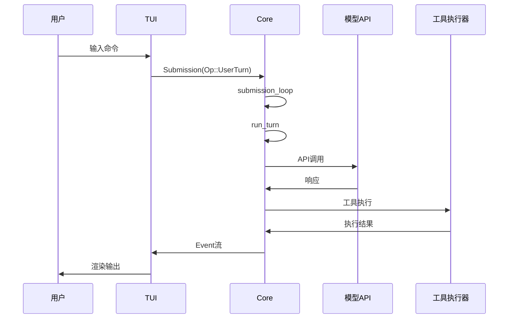

# Codex 系统设计文档

## 1. 系统概述

Codex 是 OpenAI 开发的 AI 编程助手 CLI 工具，基于 Rust 实现。它提供本地运行的智能代码助手功能，支持代码生成、调试、重构等开发任务。

### 核心特性

- 本地运行的 AI 编程助手
- 多模态交互（文本、代码、文件）
- 沙箱安全执行环境
- 可扩展的工具系统
- 多 Agent 协作能力

## 2. 核心架构

### SQ/EQ 队列对模式


- **Submission Queue (SQ)**: 入站队列，处理用户提交的操作
- **Event Queue (EQ)**: 出站队列，向外发送事件流

## 3. 核心组件

### 3.1 Codex 结构体

```rust
struct Codex {
    tx_sub: Sender<Submission>,    // 提交发送器
    rx_event: Receiver<Event>,     // 事件接收器
}
```

高层接口，提供异步通信通道对，封装核心功能。

### 3.2 Session 会话管理

```rust
struct Session {
    state: Mutex<SessionState>,    // 会话状态
    // 单线程运行任务
}
```

- 管理对话历史和上下文
- 保证线程安全的状态访问
- 处理会话生命周期

### 3.3 TurnContext 轮次上下文

```rust
struct TurnContext {
    model_info: ModelInfo,         // 模型信息
    sandbox_policy: SandboxPolicy, // 沙箱策略
    approval_policy: AskForApproval, // 审批策略
    cwd: PathBuf,                  // 当前工作目录
}
```

每轮对话的执行上下文，包含运行时配置。

### 3.4 McpConnectionManager MCP连接管理器

- 管理 Model Context Protocol 连接
- 处理外部服务集成
- 维护连接池和生命周期

### 3.5 AgentControl 多Agent控制面

- 协调多个 AI Agent 协作
- 管理 Agent 间通信
- 控制任务分发和结果聚合

### 3.6 Config 分层配置系统

```
MDM > System > User > Project > Session
```

配置优先级从高到低，支持配置继承和覆盖。

## 4. 数据流架构



### 关键流程

1. **用户输入** → `Submission(Op::UserTurn)`
2. **submission_loop** → 分发操作
3. **run_turn** → 处理模型交互
4. **模型API调用** → 获取AI响应
5. **工具执行** → 执行具体操作
6. **Event流** → 向外发送事件
7. **TUI渲染** → 用户界面更新

## 5. 安全模型

### 5.1 SandboxPolicy 沙箱策略

```rust
enum SandboxPolicy {
    ReadOnly,                                      // 只读访问
    WorkspaceWriteOnly { writable_roots: Vec<PathBuf> }, // 工作区写入（限定目录）
    DangerFullAccess,                              // 完全访问（危险）
}
```

渐进式权限模型，从严格限制到完全访问。`WorkspaceWriteOnly` 携带可写目录列表，精确控制写入范围。

### 5.2 AskForApproval 审批策略

```rust
enum AskForApproval {
    Never,              // 从不询问
    OnFailure,          // 失败时询问
    UnlessAllowListed,  // 除非在白名单
    Always,             // 总是询问
}
```

### 5.3 ExecPolicy 执行策略

- 基于自定义 `.codexpolicy` 格式解析器
- 使用前缀匹配规则（PrefixRule / PrefixPattern）
- 支持命令规则和网络规则
- 决策类型：Allow / Prompt / Forbidden

### 5.4 NetworkProxy 网络代理

- 域名白名单/黑名单机制
- 网络访问控制
- 安全隔离保护

## 6. 通信架构

### 6.1 Core ↔ TUI

```rust
// 直接 Event/Op 通信
Event::ResponseCreated { .. }
Op::UserTurn { .. }
```

### 6.2 Core ↔ AppServer

- **协议**: JSON-RPC
- **传输**: stdio/WebSocket
- **用途**: 应用服务器集成

### 6.3 Core ↔ MCP Servers

- **协议**: JSON-RPC
- **传输**: stdio/HTTP
- **用途**: 外部工具和服务集成

## 7. 存储层

### 7.1 SQLite 状态数据库

- 持久化会话状态
- 配置存储
- 历史记录管理

### 7.2 Rollout 文件

- 会话历史存储
- 对话记录回放
- 调试和审计支持

### 7.3 配置 TOML 文件

```toml
[model]
name = "gpt-4"

[sandbox]
policy = "WorkspaceWriteOnly"

[approval]
policy = "UnlessAllowListed"
```

分层配置文件，支持继承和覆盖。

## 8. 系统特性

### 8.1 异步架构

- 基于 Tokio 异步运行时
- 非阻塞 I/O 操作
- 高并发处理能力

### 8.2 模块化设计

- 清晰的组件边界
- 可插拔的工具系统
- 易于扩展和维护

### 8.3 安全优先

- 多层安全防护
- 沙箱隔离执行
- 权限最小化原则

### 8.4 可观测性

- 结构化日志记录
- 事件驱动监控
- 调试和诊断支持

## 9. 部署架构

### 9.1 本地部署

- 单机运行模式
- 本地文件系统访问
- 离线工作能力

### 9.2 集成模式

- IDE 插件集成
- CI/CD 流水线集成
- 开发工具链集成

## 10. 扩展性

### 10.1 工具扩展

- MCP 协议支持
- 自定义工具开发
- 第三方服务集成

### 10.2 Agent 扩展

- 多 Agent 协作框架
- 专业化 Agent 开发
- 任务分工和协调

---

*本文档描述了 Codex 系统的核心架构和设计理念，为开发者提供系统级理解和扩展指导。*
