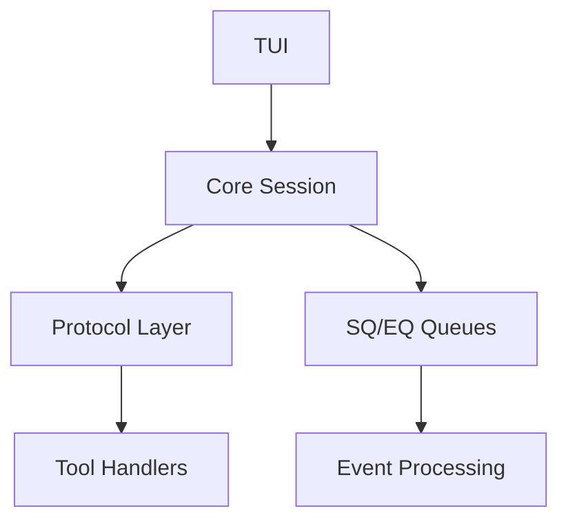

# AI开发指令规范

## 1. 项目理解指南

### 项目概述

- **项目名称**: OpenAI Codex CLI
- **架构类型**: Rust monorepo
- **核心模式**: SQ/EQ队列对异步通信
- **主要功能**: 本地运行的AI编程助手

### 关键组件

- **核心入口**: `codex-rs/core/src/codex.rs` (Session管理, ~9900行)
- **协议层**: `codex-rs/protocol/src/` (Event/Op定义)
- **TUI层**: `codex-rs/tui/src/` (终端界面)
- **工具层**: `codex-rs/core/src/tools/handlers/` (工具处理器)
- **配置层**: `codex-rs/core/src/config/` (配置管理)

### 架构模式



## 2. 开发工作流

### 代码修改后必须执行

```bash
# 格式化代码
just fmt

# 运行特定crate测试
cargo test -p codex-xxx

# 大变更前修复linter问题
just fix -p <project>
```

### 配置变更后执行

```bash
# ConfigToml变更后更新schema
just write-config-schema

# 依赖变更后更新锁文件
just bazel-lock-update
just bazel-lock-check
```

## 3. 代码修改指南

### 新增工具

**位置**: `codex-rs/core/src/tools/handlers/`

```rust
// 1. 创建handler文件
// 2. 实现ToolHandler trait
// 3. 在mod.rs中注册
```

### 新增协议事件

**位置**: `codex-rs/protocol/src/protocol.rs`

```rust
// 在EventMsg枚举中添加新变体
pub enum EventMsg {
    // 现有变体...
    NewEvent { /* 字段 */ },
}
```

### 新增配置项

**位置**: `codex-rs/core/src/config/types.rs`

```rust
// 在ConfigToml结构体中添加字段
#[derive(Deserialize, Serialize)]
pub struct ConfigToml {
    // 现有字段...
    pub new_field: Option<NewFieldType>,
}
```

### 新增Skill

**位置**: `.codex/skills/`

```markdown
<!-- 创建SKILL.md文件 -->
---
name: skill-name
description: 技能描述
when_to_use: 使用场景
---
```

### 新增MCP服务器

**位置**: `config.toml`

```toml
[mcp-servers.new_server]
command = "command"
args = ["arg1", "arg2"]
```

### 新增TUI组件

**位置**: `codex-rs/tui/src/`

```rust
// 1. 创建组件文件
// 2. 实现Widget trait
// 3. 添加快照测试
```

## 4. 安全注意事项

### 禁止修改

- **沙箱变量**: 不修改`CODEX_SANDBOX_*`相关代码
- **网络限制**: 沙箱环境下`CODEX_SANDBOX_NETWORK_DISABLED=1`

### 安全分级

```rust
// SandboxPolicy分级
ReadOnly < WorkspaceWriteOnly { writable_roots } < DangerFullAccess

// PolicyDecision（执行策略决策）
pub enum PolicyDecision {
    Allow,
    Prompt,
    Forbidden { reason: String },
}
```

### 网络控制

- 通过`NetworkProxy`控制网络访问
- 沙箱环境下网络功能受限

## 5. 测试策略

### 测试类型

- **单元测试**: 与实现在同一文件
- **快照测试**: TUI组件使用`insta`
- **集成测试**: 在`tests/`目录

### 测试命令

```bash
# 运行特定项目测试
cargo test -p codex-tui

# 更新快照
cargo insta accept -p codex-tui

# 避免使用--all-features (除非必要)
```

### 测试工具

- `pretty_assertions::assert_eq` 用于清晰diff
- `codex_utils_cargo_bin::cargo_bin` 用于二进制路径
- `core_test_support::responses` 用于端到端测试

## 6. 常见模式

### 异步编程

```rust
// tokio运行时
#[tokio::main]
async fn main() -> Result<()> { }

// async_channel通信
let (tx, rx) = async_channel::unbounded();
```

### 错误处理

```rust
// anyhow::Result
use anyhow::Result;

// 自定义Error枚举
#[derive(Debug, thiserror::Error)]
pub enum CustomError {
    #[error("错误描述")]
    Variant,
}
```

### 序列化

```rust
// serde配置
#[derive(Serialize, Deserialize)]
#[serde(rename_all = "camelCase")]
pub struct ApiType {
    field_name: String,
}
```

### 状态管理

```rust
// 共享状态
Arc<Mutex<T>>
// 或异步锁
tokio::sync::Mutex<T>
```

## 7. 代码风格

### Rust约定

- 使用`format!`内联变量: `format!("{name}")`
- 折叠if语句: `if let Some(x) = opt { if condition { } }`
- 方法引用优于闭包: `.map(String::from)`
- 穷尽匹配避免通配符

### TUI样式

```rust
// 使用Stylize trait
"text".red().bold()
"text".into() // 简单转换
vec![spans].into() // 构建Line
```

### 命名约定

- Crate名称: `codex-` 前缀
- 请求载荷: `*Params`
- 响应载荷: `*Response`
- 通知载荷: `*Notification`

## 8. 调试技巧

### 日志记录

```rust
use tracing::{debug, info, warn, error};

debug!("调试信息: {value}");
info!("一般信息");
warn!("警告信息");
error!("错误信息");
```

### 性能分析

- 使用`tokio-console`监控异步任务
- 使用`cargo flamegraph`分析性能热点

### 测试调试

```bash
# 运行单个测试
cargo test test_name -- --nocapture

# 显示测试输出
RUST_LOG=debug cargo test
```

---

**注意**: 本文档基于代码库分析生成，实际开发时请结合最新代码状态进行调整。
