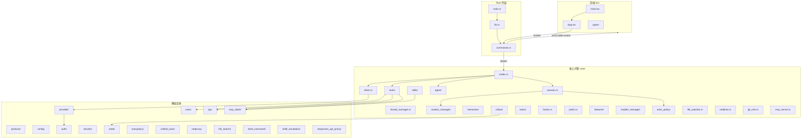

# 模块定义总览

> 生成时间：2026-03-19 | 基于项目最新代码

## 项目概况

Mosaic Desktop（`com.zimei.mosaic`）是基于 Tauri v2 + React 19 的桌面 AI 编程助手。后端 Rust 实现了完整的 AI Agent 引擎（代号 Codex），前端通过 Tauri IPC 通信。

- 总代码量：~48,000 行
- 关键文件：188 个
- 函数/方法：2,220 个
- 类/结构体/枚举：641 个

## 模块拓扑图

## 模块清单

| 模块路径 | 职责 | 核心类型 | 行数 |
|---------|------|---------|------|
| `commands.rs` | Tauri IPC 命令，桥接前后端 | `AppState`, `ThreadHandle`, `ThreadMeta`, `EventBridgePayload` | 349 |
| `core/codex.rs` | 引擎主循环，事件分发 | `Codex`, `CodexHandle` | 2,279 |
| `core/session.rs` | 会话状态管理 | `Session`, `TurnContext` | 827 |
| `core/client.rs` | LLM API 客户端 (SSE/WS) | `ModelClient`, `ModelClientSession` | 1,328 |
| `core/thread_manager.rs` | 多线程会话管理 | `ThreadManager`, `CodexThread` | 278 |
| `core/context_manager/` | 对话历史与 token 管理 | `ContextManager`, `TokenUsageBreakdown` | 728 |
| `core/tools/` | 工具注册、路由、执行 | `ToolRegistry`, `ToolRouter` | 2,500+ |
| `core/agent/` | 多智能体生成与控制 | `AgentControl`, `Guards` | 1,663 |
| `core/skills/` | 技能加载、注入、管理 | `SkillsManager`, `SkillMetadata` | 2,800+ |
| `core/memories/` | 长期记忆 (两阶段) | `ProviderContext`, `StageOneOutput` | 1,023 |
| `core/rollout/` | 会话持久化 (JSONL) | `RolloutRecorder`, `ThreadItem` | 1,373 |
| `core/tasks/` | 后台任务 | `TaskContext`, `RegularTask` | 250 |
| `core/exec_policy/` | 命令执行策略 | `ExecPolicyManager` | 865 |
| `core/models_manager/` | 模型列表与缓存 | `ModelsManager`, `ModelDescriptor` | 541 |
| `core/features/` | 特性开关 | `Features`, `FeatureSpec` | 464 |
| `protocol/` | 前后端通信协议 | `Event`, `EventMsg`, `Op` | 4,135 |
| `config/` | 分层配置系统 | `ConfigLayerStack`, `ConfigToml` | 2,270 |
| `provider/` | 模型提供商注册 | `ProviderRegistry`, `Provider` | 629 |
| `auth/` | 认证管理 | `AuthManager`, `CodexAuth` | 624 |
| `secrets/` | 密钥存储与脱敏 | `SecretsManager`, `SecretScope` | 748 |
| `state/` | SQLite 持久化 | `StateDb`, `LogDb` | 2,025 |
| `execpolicy/` | 策略引擎 (Starlark) | `Policy`, `PrefixRule` | 1,912 |
| `exec/sandbox.rs` | 命令沙箱 | `CommandExecutor`, `ExecResult` | 564 |
| `pty/` | 伪终端管理 | `SpawnedProcess`, `ProcessHandle` | 591 |
| `core/unified_exec/` | 统一命令执行 | `UnifiedExecProcessManager` | 1,765 |
| `netproxy/` | HTTP/SOCKS5 代理 | `NetworkProxy`, `NetworkPolicyDecider` | 467 |
| `file_search/` | 模糊文件搜索 | `FileSearchSession`, `FileMatch` | 472 |
| `shell_command/` | Shell 命令解析 | `ShellKind` | 341 |
| `shell_escalation/` | 权限提升 | `EscalationExecution` | 282 |
| `core/mcp_client/` | MCP 客户端 | `McpConnectionManager` | 1,122 |
| `core/mcp_server.rs` | MCP 服务端 | `McpServer`, `McpToolDescriptor` | 618 |
| `responses_api_proxy/` | API 反向代理 | `ProxyConfig` | 219 |
| `core/message_history.rs` | 对话历史持久化 | `HistoryEntry`, `HistoryPersistence` | — |
| `core/external_agent_config.rs` | 外部 Agent 配置迁移 | `ExternalAgentConfigService` | — |
| `core/network_policy_decision.rs` | 网络策略决策 | `NetworkPolicyDecision`, `BlockedRequest` | — |
| `core/shell.rs` | Shell 检测与管理 | `Shell`, `ShellType` | — |
| `core/shell_snapshot.rs` | Shell 环境快照 | `ShellSnapshot` | — |
| `core/state_db.rs` | 状态数据库 | `StateDb` | — |
| `core/turn_diff_tracker.rs` | Turn 变更追踪 | `TurnDiffTracker` | — |
| `core/text_encoding.rs` | 文本编码处理 | `bytes_to_string_smart` | — |

## 前端模块

| 文件 | 职责 |
|-----|------|
| `src/main.tsx` | React 入口，挂载根组件 |
| `src/App.tsx` | 主应用组件（当前为模板状态） |
| `src/types/events.ts` | 后端事件类型定义（608 行，60+ 事件变体），含共享基础类型（TokenUsage、RateLimitSnapshot、UserInput、ResponseItem、TurnItem 等） |
| `src/types/commands.ts` | Tauri IPC 命令参数/返回类型（CodexEventPayload、ThreadMeta、SubmitOpParams 等） |
| `src/types/file-search.ts` | 文件搜索结果类型（FileMatch） |
| `src/types/index.ts` | 类型统一导出（Event、EventMsg、ThreadMeta、FileMatch 等） |
