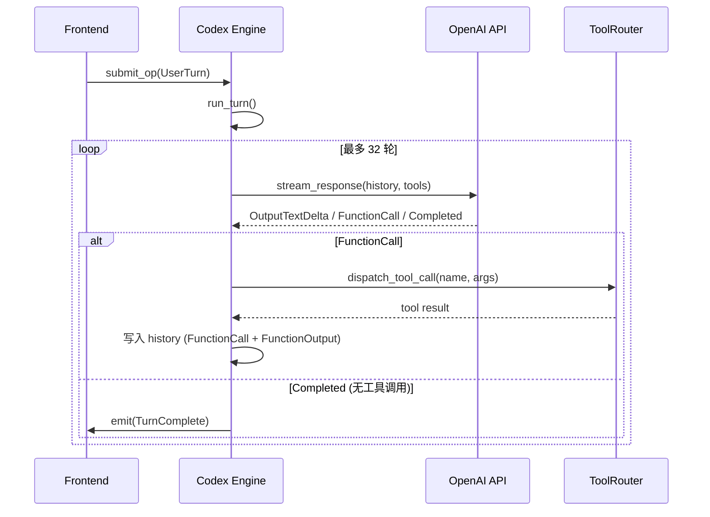

# 核心引擎 — Codex, Session, Client

## Codex (`core/codex.rs`)

Codex 是整个系统的中枢引擎，负责：

1. **事件循环** — 从 Submission Queue 接收前端操作，处理后向 Event Queue 发射事件
2. **Turn 调度** — 接收 `UserTurn` 后启动一轮对话 (`run_turn`)
3. **Agentic Loop** — 在 `run_turn` 中实现循环：stream → 检测 FunctionCall → dispatch_tool_call → 将结果写入 history → 继续 stream
4. **工具分发** — 通过 `dispatch_tool_call` 将模型请求的工具调用路由到 ToolRouter

### Agentic Loop 流程



### 关键方法

| 方法 | 说明 |
|------|------|
| `Codex::new()` | 创建引擎，接收 SQ/EQ channel + config + cwd |
| `Codex::run()` | 主事件循环，持续消费 Submission |
| `Codex::spawn()` | 静态方法，创建引擎并返回 `CodexHandle`（含 tx_sub + rx_event channel） |
| `run_turn()` | 执行一轮对话（含 agentic loop） |
| `dispatch_tool_call()` | 分发工具调用到 ToolRouter |
| `emit()` | 向 Event Queue 发射事件 |

## Session (`core/session.rs`)

会话状态容器，管理：

- **history** — 对话历史 (`Vec<ResponseInputItem>`)
- **model info** — 当前模型信息
- **turn context** — 当前 turn 的上下文覆盖
- **tool router** — 工具路由器引用
- **pending approvals** — 等待用户审批的请求

### 关键类型

- `Session` — 会话主结构
- `SessionState` — 会话状态枚举
- `TurnContext` — Turn 级别上下文
- `ModelInfo` — 模型元信息
- `PendingApproval` — 待审批项

## Client (`core/client.rs`)

OpenAI Responses API 客户端，支持：

- **SSE 流式** — HTTP Server-Sent Events
- **WebSocket 流式** — WebSocket 实时连接
- **多 Provider** — 通过 base_url 切换
- **认证** — Bearer token + 自定义 headers

### ResponseEvent 枚举

```rust
enum ResponseEvent {
    OutputTextDelta { delta: String },
    OutputItemDone { item: Value },
    FunctionCall { call_id, name, arguments },  // 工具调用
    ReasoningDelta { delta: String },
    Completed { token_usage, response_id },
    Failed { code, message },
}
```

### 关键函数

| 函数 | 说明 |
|------|------|
| `stream_response()` | 发起流式请求，返回 `Stream<ResponseEvent>` |
| `history_item_to_api()` | 将内部 history 转换为 API 格式 |

## 代码审查系统 (`core/review_prompts.rs`, `core/review_format.rs`)

代码审查功能通过 `review` Op 触发，支持对 Git diff 进行 AI 辅助审查。

| 模块 | 说明 |
|------|------|
| `review_prompts.rs` | 审查 prompt 构建 — `resolve_review_request()` 解析审查请求，`review_prompt()` 生成系统 prompt |
| `review_format.rs` | 审查输出格式化 — `render_review_output_text()` 将审查结果渲染为结构化文本，`format_review_findings_block()` 格式化发现项 |

### 关键类型

- `ResolvedReviewRequest` — 解析后的审查请求（包含 diff、文件列表等）
- `ReviewOutput` — 审查输出结构

## 自定义 Prompts (`core/custom_prompts.rs`)

管理用户自定义的 prompt 模板，支持从文件系统加载和列出。通过 `list_custom_prompts` Op 触发。