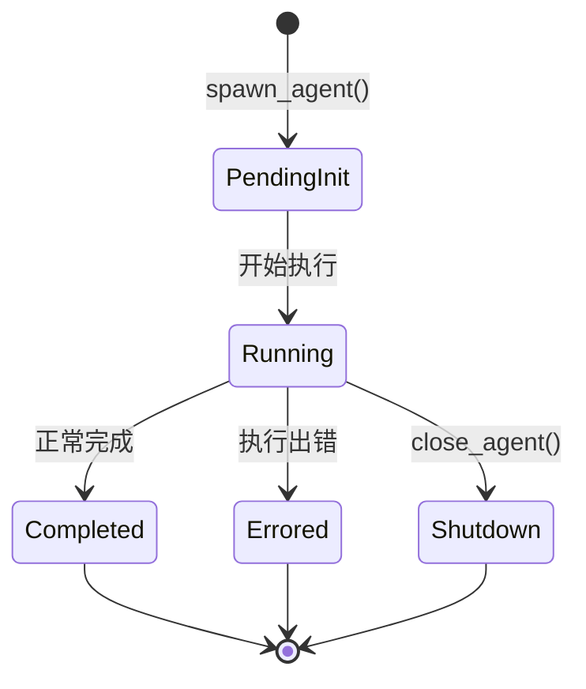

# 多 Agent 系统 (`core/agent/`)

## 概述

多 Agent 系统支持在单个 Codex 实例中并发运行多个 AI Agent，每个 Agent 拥有独立的线程、输入通道和生命周期。通过弱引用 (`Weak<AgentInstance>`) 避免循环引用，自动清理已终止的 Agent。

## 模块结构

| 文件 | 职责 |
|------|------|
| `control.rs` | `AgentControl` — 顶层控制器，管理 spawn/close/wait/send_input |
| `guards.rs` | RAII 守卫 — `SpawnSlotGuard`、`SpawnReservation`、`Guards` |
| `role.rs` | `AgentRoleConfig` — Agent 角色配置 (模型、指令、工具集) |
| `status.rs` | Agent 状态辅助函数 (`is_final`, `agent_status_from_event`) |

## 核心类型

### AgentInstance

```rust
struct AgentInstance {
    thread_id: String,        // UUID
    nickname: String,         // "agent-0", "agent-1", ...
    depth: usize,             // 递归深度
    forked: bool,             // 是否为独立分支
    cwd: PathBuf,             // 工作目录
    sandbox_policy: SandboxPolicy,
    status: Mutex<AgentStatus>,
    tx_input / rx_input,      // 输入通道
    resume_tx / resume_rx,    // 恢复信号通道
    result: Mutex<Option<Value>>,
}
```

### AgentControl

```rust
struct AgentControl {
    state: Mutex<ThreadManagerState>,  // 弱引用注册表
    active_count: Arc<Mutex<usize>>,   // 活跃计数
    max_recursion_depth: usize,        // 最大递归深度
    default_cwd: PathBuf,
    default_sandbox_policy: SandboxPolicy,
    tx_event: Sender<Event>,
}
```

### Agent 生命周期



### 关键 API

| 方法 | 说明 |
|------|------|
| `spawn_agent(options, depth)` | 创建新 Agent，返回 `(Arc<AgentInstance>, Guards)` |
| `send_input(agent_id, input)` | 向 Agent 发送用户输入 |
| `resume_agent(agent_id)` | 恢复暂停的 Agent |
| `wait(agent_id)` | 等待 Agent 完成并获取结果 |
| `close_agent(agent_id)` | 优雅关闭 Agent |
| `active_count()` | 当前活跃 Agent 数量 |

### 批量任务 (Batch Jobs)

支持从 CSV 文件读取行数据，以有界并发执行批量任务：

```rust
struct BatchJobConfig {
    csv_path: PathBuf,
    concurrency: usize,
}

async fn run_batch_jobs(config, job_fn) -> Vec<BatchResult>
```

## 安全机制

- **递归深度限制** — `max_recursion_depth` 防止无限嵌套
- **弱引用清理** — `prune_dead()` 自动清理已 drop 的 Agent
- **RAII 守卫** — `SpawnSlotGuard` 在 drop 时自动释放 spawn 槽位
