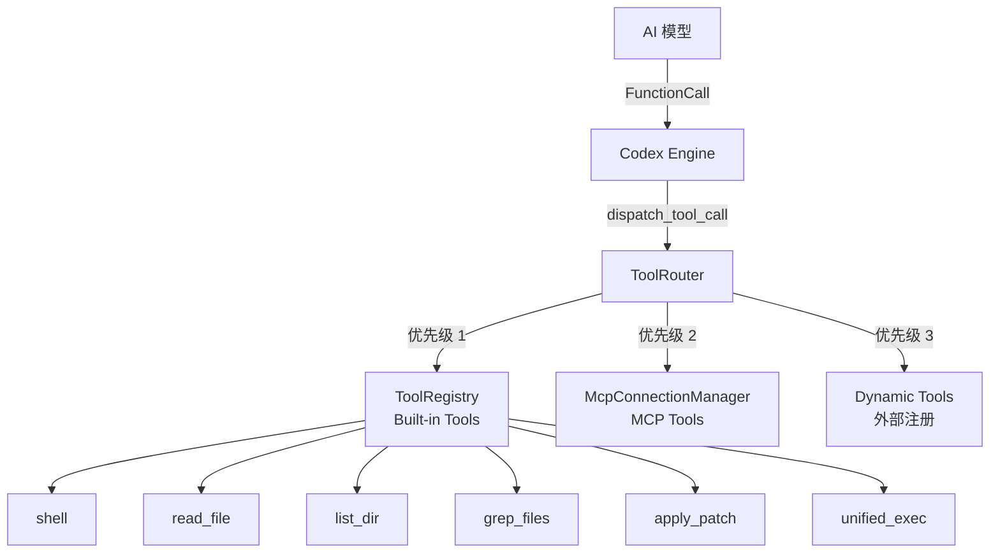

# 工具系统 (`core/tools/`)

## 概述

工具系统是 Mosaic 的核心能力层，让 AI 模型能够执行文件操作、Shell 命令、代码搜索等实际操作。采用三级路由架构：Built-in → MCP → Dynamic。

## 架构



## 核心 Trait

### ToolHandler

```rust
#[async_trait]
trait ToolHandler: Send + Sync {
    fn matches_kind(&self, kind: &ToolKind) -> bool;
    fn kind(&self) -> ToolKind;
    async fn handle(&self, args: Value) -> Result<Value, CodexError>;
    fn tool_spec(&self) -> Option<Value> { None }  // Responses API 工具定义
}
```

### ToolKind

```rust
enum ToolKind {
    Builtin(String),                        // "shell", "read_file" 等
    Mcp { server: String, tool: String },   // "mcp__server__tool"
    Dynamic(String),                        // 动态注册的工具
}
```

## ToolRouter

三级路由器，按优先级分发工具调用：

```rust
enum RouteResult {
    Handled(Result<Value, CodexError>),  // Built-in/MCP 直接处理
    DynamicTool(String),                 // 需要外部协议处理
    NotFound(String),                    // 未找到
}
```

关键方法：
- `route_tool_call(name, args)` — 路由工具调用
- `register_dynamic_tool(spec)` — 注册动态工具
- `collect_tool_specs()` — 收集所有工具定义发送给模型

## 内置工具

| 工具 | 文件 | 说明 |
|------|------|------|
| `shell` | `handlers/shell.rs` | 执行 Shell 命令 (command 数组, workdir, timeout) |
| `read_file` | `handlers/read_file.rs` | 读取文件内容 (path, offset, limit) |
| `list_dir` | `handlers/list_dir.rs` | 列出目录内容 (path, max_depth) |
| `grep_files` | `handlers/grep_files.rs` | 正则搜索文件 (pattern, path, include) |
| `apply_patch` | `handlers/apply_patch.rs` | 应用 unified diff 补丁 |
| `unified_exec` | `handlers/unified_exec.rs` | PTY 统一执行引擎 |
| `mcp` | `handlers/mcp.rs` | MCP 工具代理 |
| `dynamic` | `handlers/dynamic.rs` | 动态工具处理 |
| `multi_agents` | `handlers/multi_agents.rs` | 多 Agent 协作 |
| `js_repl` | `handlers/js_repl.rs` | JavaScript REPL |
| `plan` | `handlers/plan.rs` | 计划工具 |
| `view_image` | `handlers/view_image.rs` | 图片查看 |
| `search_tool_bm25` | `handlers/search_tool_bm25.rs` | BM25 文件搜索 |
| `presentation_artifact` | `handlers/presentation_artifact.rs` | 演示文稿 artifact |
| `request_user_input` | `handlers/request_user_input.rs` | 请求用户输入 |
| `test_sync` | `handlers/test_sync.rs` | 测试同步 |
| `shell_command` | `handlers/shell_command.rs` | Shell 命令（高级封装） |

## 基础设施模块

| 模块 | 说明 |
|------|------|
| `orchestrator.rs` | 工具编排 — 管理工具执行顺序和依赖 |
| `parallel.rs` | 并行执行 — 多工具并发调用 |
| `sandboxing.rs` | 沙箱执行 — 根据 SandboxPolicy 限制工具权限 |
| `network_approval.rs` | 网络审批 — 拦截需要网络访问的工具调用 |
| `context.rs` | 执行上下文 — 传递 cwd、sandbox 等信息 |
| `events.rs` | 事件发射 — 工具执行前后的事件通知 |
| `spec.rs` | 工具规格 — 工具定义和 schema |
| `router.rs` | 工具路由器 — `ToolRouter` 实现 |

### 运行时子模块 (`handlers/runtimes/`)

| 模块 | 说明 |
|------|------|
| `shell.rs` | Shell 运行时 — 命令执行的底层实现 |
| `apply_patch.rs` | 补丁运行时 — 补丁应用的底层实现 |
| `unified_exec.rs` | 统一执行运行时 — PTY/Pipe 执行封装 |
