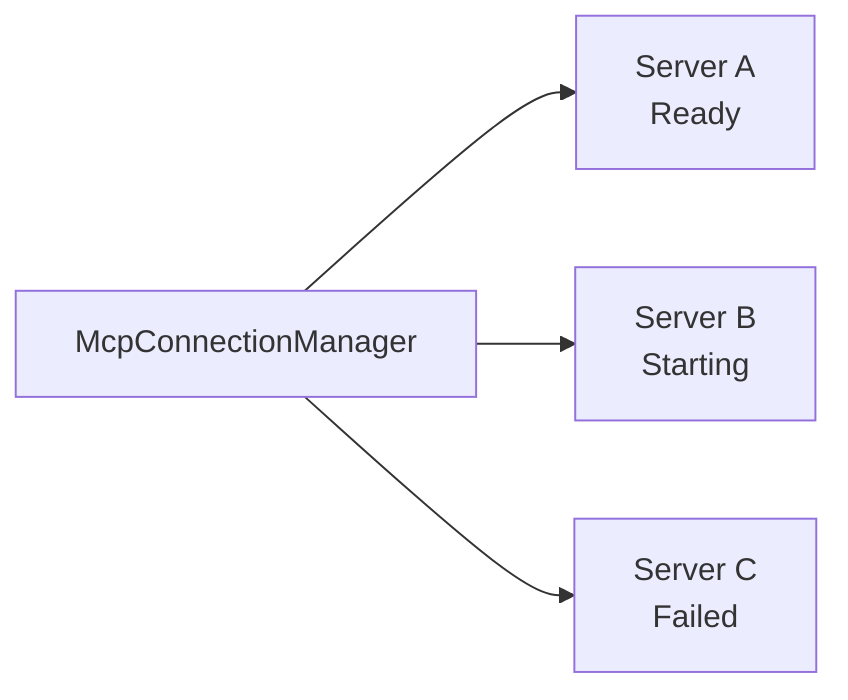

# MCP 客户端/服务端 (`core/mcp_client/`, `core/mcp_server.rs`)

## 概述

Mosaic 同时作为 MCP 客户端（连接外部 MCP 服务器获取工具）和 MCP 服务端（暴露自身能力给外部）。

## MCP 客户端 (`core/mcp_client/`)

### 模块结构

| 文件 | 职责 |
|------|------|
| `connection_manager.rs` | `McpConnectionManager` — 管理多个 MCP 服务器连接 |
| `tool_call.rs` | MCP 工具调用执行 |
| `auth.rs` | OAuth 认证流程 |
| `skill_dependencies.rs` | Skill 对 MCP 工具的依赖解析 |

### McpConnectionManager

关键能力：
- 并发管理多个 MCP 服务器连接
- 连接状态追踪 (`McpConnectionState`)
- 工具发现 (`McpToolInfo`)
- 自动重连

### 工具命名约定

MCP 工具使用双下划线分隔的命名格式：`mcp__{server}__{tool}`

例如：`mcp__filesystem__read_file`

## MCP 服务端 (`core/mcp_server.rs`)

`McpServer` 将 Mosaic 的能力暴露为 MCP 协议，允许外部客户端调用 Mosaic 的工具。

## 相关事件

| 事件 | 说明 |
|------|------|
| `McpStartupUpdate` | 服务器启动状态更新 |
| `McpStartupComplete` | 所有服务器启动完成 |
| `McpToolCallBegin` | MCP 工具调用开始 |
| `McpToolCallEnd` | MCP 工具调用结束 (含结果和耗时) |
| `McpListToolsResponse` | 工具列表响应 |
| `ElicitationRequest` | MCP 服务器请求用户输入 |
