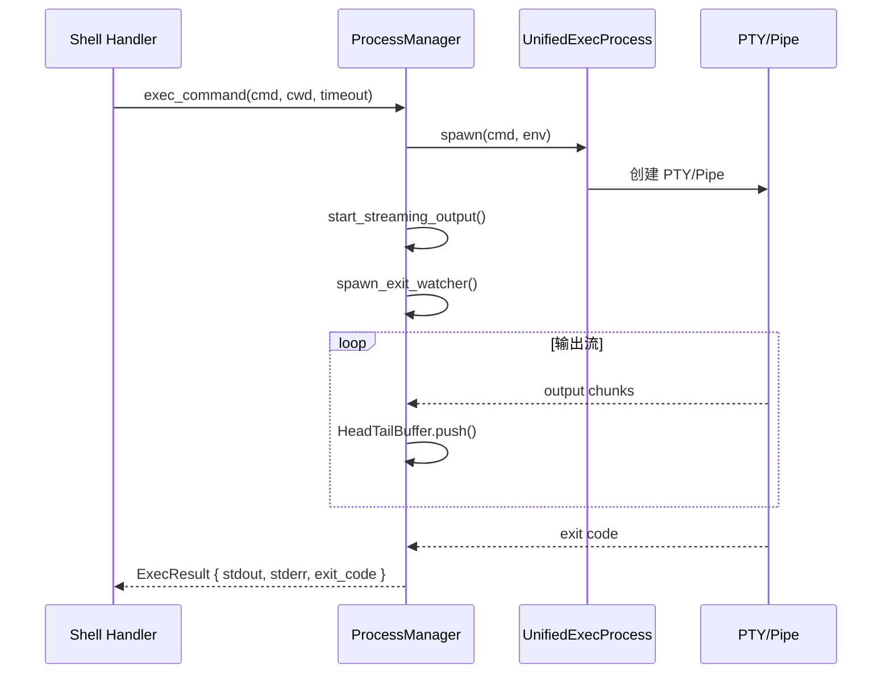
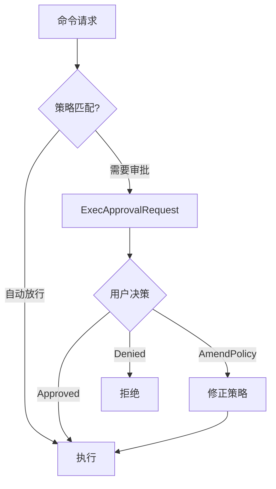

# 执行引擎 (`core/unified_exec/`, `pty/`, `exec_policy/`)

## 概述

执行引擎负责安全地运行 Shell 命令，支持 PTY（伪终端）和 Pipe 两种模式，并通过执行策略引擎控制命令权限。

## 统一执行引擎 (`core/unified_exec/`)

### 模块结构

| 文件 | 职责 |
|------|------|
| `process.rs` | `UnifiedExecProcess` — PTY/Pipe 进程抽象 |
| `process_manager.rs` | `UnifiedExecProcessManager` — 进程生命周期管理 |
| `async_watcher.rs` | 异步输出流监听 (后台 task 读 PTY → buffer) |
| `head_tail_buffer.rs` | `HeadTailBuffer` — 保留输出头尾，截断中间 |
| `errors.rs` | `UnifiedExecError` 错误类型 |

### 执行流程



### 关键类型

```rust
struct ExecResult {
    stdout: String,
    stderr: String,
    exit_code: i32,
    duration: Duration,
}

struct ProcessEntry {
    process: Arc<UnifiedExecProcess>,
    call_id: String,
}
```

## PTY 抽象层 (`pty/`)

| 文件 | 职责 |
|------|------|
| `pty.rs` | PTY 伪终端实现 (Unix) |
| `pipe.rs` | Pipe 管道实现 (跨平台 fallback) |
| `process.rs` | 进程管理 |
| `process_group.rs` | 进程组管理 (信号传播) |

## 执行策略引擎 (`execpolicy/`)

控制哪些命令可以自动执行、哪些需要用户审批。

| 文件 | 职责 |
|------|------|
| `parser.rs` | 策略文件解析 (TOML 格式) |
| `prefix_rule.rs` | 前缀匹配规则 (如 `["git", "status"]` 自动放行) |
| `network_rule.rs` | 网络访问规则 |
| `amend.rs` | 运行时策略修正 |
| `error.rs` | 策略错误类型 |

### 核心执行策略 (`core/exec_policy/`)

| 文件 | 职责 |
|------|------|
| `manager.rs` | `ExecPolicyManager` — 策略管理器 |
| `bash.rs` | Bash 命令解析和分类 |
| `heuristics.rs` | 安全启发式规则 (识别危险命令) |

### 审批流程


