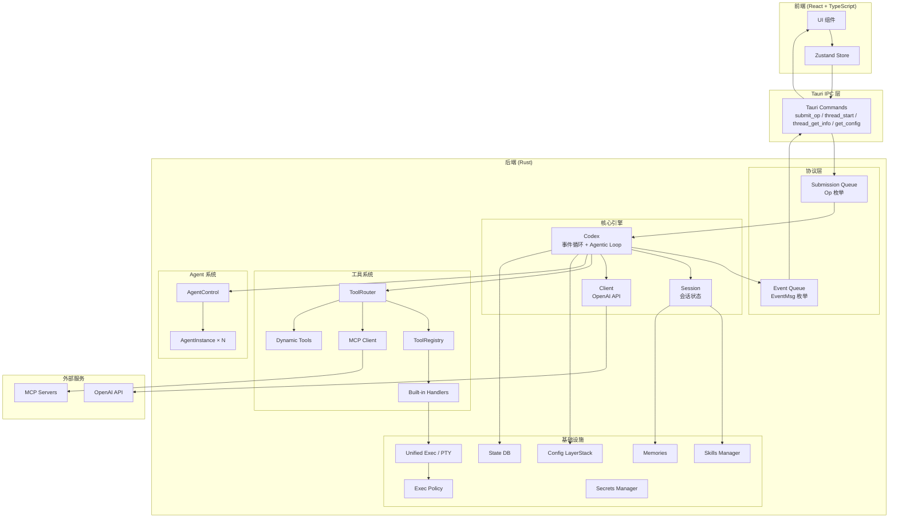
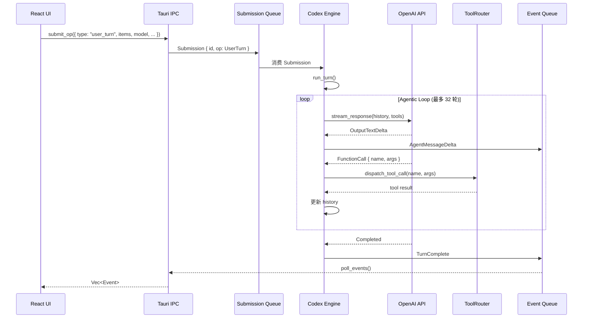
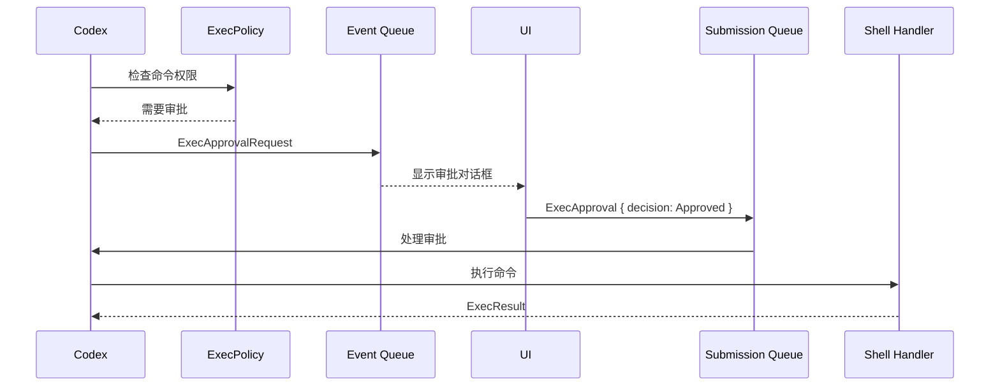
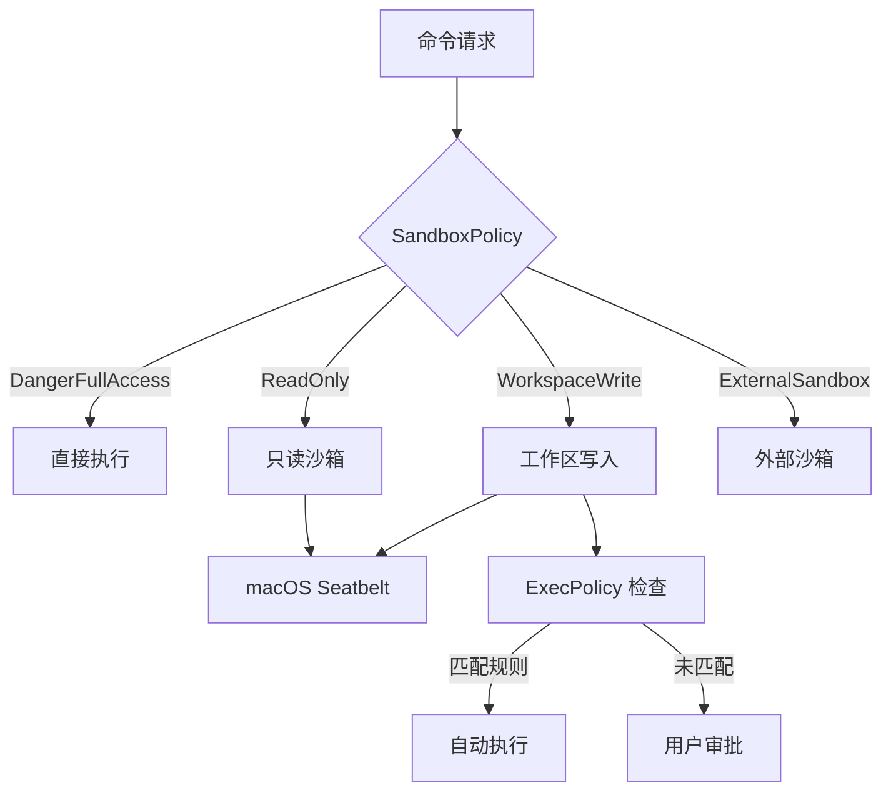

# 系统架构文档

## 整体架构

## 数据流

### 用户输入 → AI 响应

### 命令审批流程

## 并发模型

- **主事件循环** — Codex 在单个 tokio task 中运行，顺序处理 Submission
- **流式响应** — API 流通过 `futures::Stream` 异步消费
- **工具执行** — 工具调用在独立 tokio task 中执行
- **多 Agent** — 每个 AgentInstance 可在独立 task 中运行
- **PTY 监听** — 后台 task 持续读取 PTY 输出

## 安全架构

