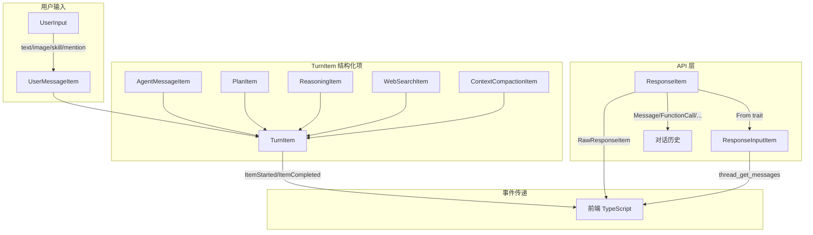

# 数据结构文档

本文档列出 `protocol/` 层定义的所有核心数据类型，这些类型构成前后端通信的契约。
以 Tauri 端 (Rust) 为权威来源，前端 TypeScript 类型与之保持同步。

---

## 错误类型 (`protocol/error.rs`)

### ErrorCode

```rust
enum ErrorCode {
    InvalidInput,           // 无效输入
    ToolExecutionFailed,    // 工具执行失败
    McpServerUnavailable,   // MCP 服务器不可用
    ConfigurationError,     // 配置错误
    SandboxViolation,       // 沙箱违规
    ApprovalDenied,         // 审批被拒
    SessionError,           // 会话错误
    InternalError,          // 内部错误
}
```

### CodexError

```rust
struct CodexError {
    code: ErrorCode,
    message: String,
    details: Option<Value>,  // 可选的结构化详情
}
```

---

## 沙箱策略 (`SandboxPolicy`)

```rust
enum SandboxPolicy {
    DangerFullAccess,                    // 无限制
    ReadOnly { access: ReadOnlyAccess }, // 只读
    ExternalSandbox { network_access },  // 外部沙箱
    WorkspaceWrite {                     // 工作区写入
        writable_roots: Vec<PathBuf>,
        read_only_access: ReadOnlyAccess,
        network_access: bool,
    },
}
```

---

## 用户输入 (`UserInput`)

```rust
// serde: tag = "type", rename_all = "snake_case"
enum UserInput {
    Text { text: String, text_elements: Vec<TextElement> },
    Image { image_url: String },
    LocalImage { path: PathBuf },
    Skill { name: String, path: PathBuf },
    Mention { name: String, path: String },
}
```

---

## 内容项 (`ContentItem`)

```rust
// serde: tag = "type", rename_all = "snake_case"
enum ContentItem {
    InputText { text: String },
    InputImage { image_url: String },
    OutputText { text: String },
}
```

---

## TurnItem — 结构化 Turn 项 (`protocol/items.rs`)

Turn 中的结构化消息项，通过 `ItemStarted` / `ItemCompleted` 事件传递给前端。

```rust
// serde: tag = "type"
enum TurnItem {
    UserMessage(UserMessageItem),
    AgentMessage(AgentMessageItem),
    Plan(PlanItem),
    Reasoning(ReasoningItem),
    WebSearch(WebSearchItem),
    ContextCompaction(ContextCompactionItem),
}
```

### UserMessageItem

```rust
struct UserMessageItem {
    id: String,
    content: Vec<UserInput>,
}
```

### AgentMessageItem

```rust
struct AgentMessageItem {
    id: String,
    content: Vec<AgentMessageContent>,
    phase: Option<MessagePhase>,       // Commentary | FinalAnswer
}

// serde: tag = "type"
enum AgentMessageContent {
    Text { text: String },
}
```

### PlanItem

```rust
struct PlanItem {
    id: String,
    text: String,
}
```

### ReasoningItem

```rust
struct ReasoningItem {
    id: String,
    summary_text: Vec<String>,
    raw_content: Vec<String>,
}
```

### WebSearchItem

```rust
struct WebSearchItem {
    id: String,
    query: String,
    action: WebSearchAction,
}
```

### ContextCompactionItem

```rust
struct ContextCompactionItem {
    id: String,   // 默认 UUID v4
}
```

---

## ResponseItem — 模型输出项 (`protocol/types.rs`)

API 返回的原始模型输出项。

```rust
// serde: tag = "type", rename_all = "snake_case"
enum ResponseItem {
    Message {
        id: Option<String>,
        role: String,
        content: Vec<ContentItem>,
        end_turn: Option<bool>,
        phase: Option<MessagePhase>,
    },
    Reasoning {
        id: String,
        summary: Vec<ReasoningSummaryItem>,
        content: Option<Vec<ReasoningContentItem>>,
        encrypted_content: Option<String>,
    },
    FunctionCall {
        id: Option<String>,
        name: String,
        arguments: String,
        call_id: String,
    },
    FunctionCallOutput {
        call_id: String,
        output: FunctionCallOutputPayload,
    },
    LocalShellCall {
        id: Option<String>,
        call_id: Option<String>,
        status: LocalShellStatus,
        action: LocalShellAction,
    },
    GhostSnapshot {
        ghost_commit: Value,
    },
    CustomToolCall {
        id: Option<String>,
        status: Option<String>,
        call_id: String,
        name: String,
        input: String,
    },
    CustomToolCallOutput {
        call_id: String,
        output: FunctionCallOutputPayload,
    },
    WebSearchCall {
        id: Option<String>,
        status: Option<String>,
        action: Option<WebSearchAction>,
    },
    Compaction {                        // alias: "compaction_summary"
        encrypted_content: String,
    },
    Other,                              // serde(other) 兜底
}
```

### ReasoningSummaryItem / ReasoningContentItem

```rust
// serde: tag = "type", rename_all = "snake_case"
enum ReasoningSummaryItem {
    SummaryText { text: String },
}

enum ReasoningContentItem {
    ReasoningText { text: String },
    Text { text: String },
}
```

### LocalShellStatus / LocalShellAction

```rust
enum LocalShellStatus { Completed, InProgress, Incomplete }

// serde: tag = "type", rename_all = "snake_case"
enum LocalShellAction {
    Exec(LocalShellExecAction),
}

struct LocalShellExecAction {
    command: Vec<String>,
    timeout_ms: Option<u64>,
    working_directory: Option<String>,
    env: Option<HashMap<String, String>>,
    user: Option<String>,
}
```

---

## 对话历史项 (`ResponseInputItem`)

发送回 API 的对话历史。

```rust
// serde: tag = "type", rename_all = "snake_case"
enum ResponseInputItem {
    Message {
        role: String,
        content: Vec<ContentItem>,
    },
    FunctionCall {
        call_id: String,
        name: String,
        arguments: String,
    },
    FunctionCallOutput {               // alias: "function_output"
        call_id: String,
        output: FunctionCallOutputPayload,
    },
    McpToolCallOutput {
        call_id: String,
        result: Result<CallToolResult, String>,
    },
    CustomToolCallOutput {
        call_id: String,
        output: FunctionCallOutputPayload,
    },
}
```

### FunctionCallOutputPayload

```rust
struct FunctionCallOutputPayload {
    body: FunctionCallOutputBody,
    success: Option<bool>,             // Rust 端为 Option<bool>
}

// body 可以是纯字符串或内容项数组
enum FunctionCallOutputBody {
    String(String),
    Items(Vec<FunctionCallOutputContentItem>),
}

enum FunctionCallOutputContentItem {
    InputText { text: String },
    InputImage { image_url: String },
}
```

> **注意**: 前端 TypeScript 中 `success` 定义为 `boolean`（非 optional），与 Rust 端 `Option<bool>` 存在差异。序列化时 `None` 会被省略。

---

## Agent 状态 (`AgentStatus`)

```rust
enum AgentStatus {
    PendingInit,              // 等待初始化
    Running,                  // 运行中
    Completed(Option<String>),// 已完成
    Errored(String),          // 出错
    Shutdown,                 // 已关闭
    NotFound,                 // 未找到
}
```

---

## 审批策略 (`AskForApproval`)

```rust
enum AskForApproval {
    UnlessTrusted,           // 仅信任命令自动放行
    OnFailure,               // (已废弃) 失败时审批
    OnRequest,               // 模型决定何时请求审批 (默认)
    Reject(RejectConfig),    // 细粒度拒绝控制
    Never,                   // 从不审批
}
```

---

## 审批决策 (`ReviewDecision`)

```rust
enum ReviewDecision {
    Approved,
    ApprovedExecpolicyAmendment { proposed_execpolicy_amendment },
    ApprovedForSession,
    NetworkPolicyAmendment { network_policy_amendment },
    Denied,
    Abort,
}
```

---

## 协作模式 (`CollaborationMode`)

```rust
struct CollaborationMode {
    mode: ModeKind,                    // Plan | Default
    settings: CollaborationModeSettings {
        model: String,
        reasoning_effort: Option<Effort>,  // Low | Medium | High
        developer_instructions: Option<String>,
    },
}
```

---

## Token 使用统计 (`TokenUsage`)

```rust
struct TokenUsage {
    input_tokens: i64,
    cached_input_tokens: i64,
    output_tokens: i64,
    reasoning_output_tokens: i64,
    total_tokens: i64,
}

struct TokenUsageInfo {
    total_token_usage: TokenUsage,
    last_token_usage: TokenUsage,
    model_context_window: Option<i64>,
}
```

---

## WebSearchAction

```rust
// serde: tag = "type", rename_all = "snake_case"
enum WebSearchAction {
    Search { query: Option<String>, queries: Option<Vec<String>> },
    OpenPage { url: Option<String> },
    FindInPage { url: Option<String>, pattern: Option<String> },
    Other,                             // serde(other) 兜底
}
```

---

## 动态工具 (`DynamicToolSpec`)

```rust
struct DynamicToolSpec {
    name: String,
    description: String,
    input_schema: Value,
}

struct DynamicToolCallRequest {
    call_id: String,
    turn_id: String,
    tool: String,
    arguments: Value,
}
```

---

## 文件变更 (`FileChange`)

```rust
enum FileChange {
    Add { content: String },
    Delete { content: String },
    Update { unified_diff: String, move_path: Option<PathBuf> },
}
```

---

## MCP 类型

```rust
struct McpInvocation { server: String, tool: String, arguments: Option<Value> }
struct CallToolResult { content: Option<Value>, is_error: Option<bool> }
enum McpStartupStatus { Starting, Ready, Failed { error }, Cancelled }
```

---

## 其他枚举类型

| 类型 | 变体 | 说明 |
|------|------|------|
| `Effort` | Low, Medium, High | 推理努力程度 |
| `ReasoningSummary` | Auto, Concise, Detailed, None | 推理摘要模式 |
| `Verbosity` | Low, Medium, High | 输出详细程度 |
| `WebSearchMode` | Disabled, Cached, Live | 网络搜索模式 |
| `SandboxMode` | ReadOnly, WorkspaceWrite, DangerFullAccess | 沙箱模式 (TOML 配置用) |
| `ModeKind` | Plan, Default | 协作模式类型 |
| `Personality` | None, Friendly, Pragmatic | Agent 人格 |
| `TrustLevel` | Trusted, Untrusted | 项目信任级别 |
| `TurnAbortReason` | Interrupted, Replaced, ReviewEnded | Turn 中止原因 |
| `ExecCommandSource` | Agent, UserShell, UnifiedExecStartup, UnifiedExecInteraction | 命令来源 |
| `ExecCommandStatus` | Completed, Failed, Declined | 命令执行状态 |
| `PatchApplyStatus` | Completed, Failed, Declined | Patch 应用状态 |
| `ElicitationAction` | Accept, Decline, Cancel | MCP 请求用户输入的决策 |
| `NetworkAccess` | Restricted, Enabled | 网络访问权限 |
| `MessagePhase` | Commentary, FinalAnswer | 消息阶段 |
| `LocalShellStatus` | Completed, InProgress, Incomplete | Shell 调用状态 |
| `ModelRerouteReason` | HighRiskCyberActivity | 模型重路由原因 |

---

## 前端 TypeScript 类型映射 (`src/types/events.ts`)

前端类型与 Rust 端一一对应，以下列出补充的前端专有类型：

### RateLimitSnapshot

```typescript
interface RateLimitWindow { limit: number; remaining: number; reset: string; }
interface CreditsSnapshot { remaining: number; granted: number; }
interface RateLimitSnapshot {
    limit_id?: string; limit_name?: string;
    primary?: RateLimitWindow; secondary?: RateLimitWindow;
    credits?: CreditsSnapshot;
}
```

### TextElement

```typescript
interface ByteRange { start: number; end: number; }
interface TextElement { byte_range: ByteRange; placeholder?: string; }
```

### ParsedCommand

```typescript
interface ParsedCommand { program: string; args: string[]; }
```

### 前端聊天状态类型 (`src/types/chat.ts`)

```typescript
type MessageRole = 'user' | 'agent';

interface ToolCallState {
    callId: string;
    type: 'exec' | 'mcp' | 'web_search' | 'patch';
    status: 'pending' | 'running' | 'completed' | 'failed';
    name: string;
    command?: string[];
    cwd?: string;
    output?: string;
    exitCode?: number;
    serverName?: string;
    toolName?: string;
    arguments?: unknown;
    result?: unknown;
}

interface ApprovalRequestState {
    callId: string;
    turnId: string;
    type: 'exec' | 'patch';
    command?: string[];
    cwd?: string;
    reason?: string;
    changes?: Record<string, unknown>;
}
```

---

## 数据流关系图


