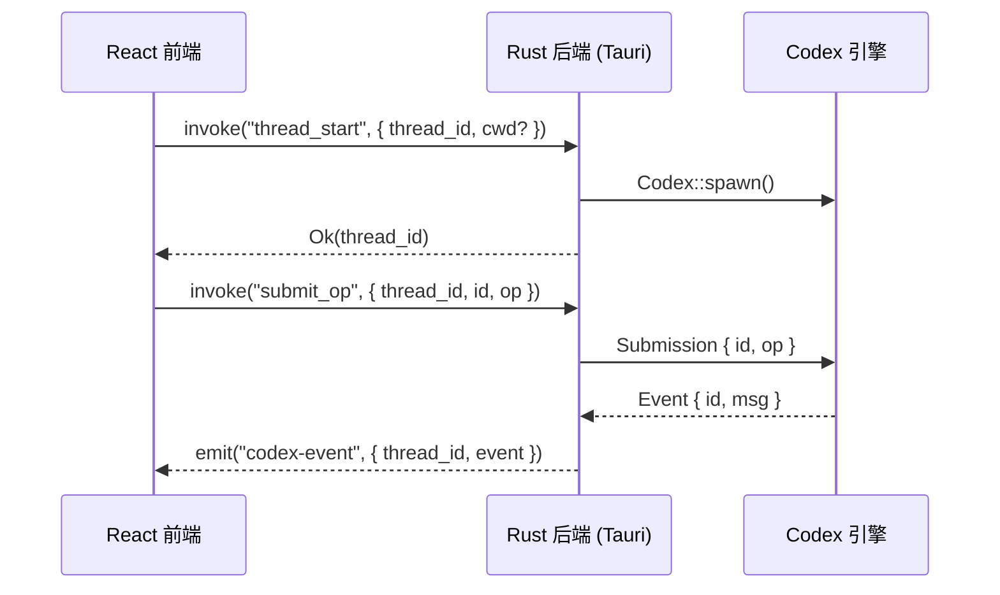

# API / 接口契约

> 基于最新代码生成，更新时间：2026-03-19

## 概览

Mosaic Desktop 的前后端通信基于 Tauri v2 IPC 机制，分为两个方向：



- **Commands (前端 → 后端)**：通过 `invoke()` 调用，请求-响应模式
- **Events (后端 → 前端)**：通过 Tauri `emit("codex-event")` 推送，事件桥模式

---

## 1. Tauri IPC Commands (前端 → 后端)

前端通过 `@tauri-apps/api/core` 的 `invoke()` 调用。所有命令返回 `Result<T, string>`。

### thread_start

启动一个新的会话线程。线程 ID 由服务端生成（UUID v4）。

```typescript
invoke('thread_start', {
  cwd?: string         // 工作目录，默认为进程 cwd
})
// 返回: string (服务端生成的 thread_id)
```

内部流程：
1. 生成 UUID v4 作为 thread_id
2. 克隆当前 ConfigLayerStack
3. 调用 `Codex::spawn(config, work_dir)` 创建引擎
4. 创建 `RolloutRecorder` 用于会话持久化（存储到 `~/.mosaic/`）
5. 启动 Event Bridge 后台任务（读取 EQ → 持久化 → emit 到前端）
6. 返回 thread_id

### thread_list

列出所有活跃线程 ID。

```typescript
invoke('thread_list')
// 返回: string[]
```

### thread_archive

归档（销毁）一个线程，发送 Shutdown 信号并清理元数据。

```typescript
invoke('thread_archive', {
  thread_id: string
})
// 返回: void
```

### thread_get_info

获取指定线程的元数据。

```typescript
invoke('thread_get_info', {
  thread_id: string
})
// 返回: ThreadMeta
```

```typescript
interface ThreadMeta {
  thread_id: string;
  cwd: string;
  model: string | null;           // session_configured 后填充
  model_provider_id: string | null;
  name: string | null;
  created_at: string;             // ISO 8601
  forked_from: string | null;
  rollout_path: string | null;    // JSONL 持久化文件路径
}
```

### thread_fork

从已有线程 fork 一个新线程（使用相同配置）。新线程 ID 由服务端生成。

```typescript
invoke('thread_fork', {
  source_thread_id: string,
  cwd?: string
})
// 返回: string (服务端生成的 new_thread_id)
```

### submit_op

向指定线程提交操作。

```typescript
invoke('submit_op', {
  thread_id: string,
  id: string,          // 操作唯一 ID
  op: Op               // JSON 序列化的 Op 枚举
})
// 返回: void
```

### fuzzy_file_search

模糊文件搜索（独立于线程，无需 thread_id）。

```typescript
invoke('fuzzy_file_search', {
  query: string,       // 搜索关键词
  roots: string[]      // 搜索根目录列表（至少一个）
})
// 返回: FileMatch[]
```

```typescript
interface FileMatch {
  score: number;
  path: string;
  root: string;
  indices?: number[];  // 匹配字符位置
}
```

### get_config

获取当前合并后的配置。

```typescript
invoke('get_config')
// 返回: JSON (合并后的 ConfigValue)
```

### update_config

更新会话级配置（TOML 格式）。

```typescript
invoke('update_config', {
  toml_content: string
})
// 返回: void
```

### get_cwd

获取当前工作目录。

```typescript
invoke('get_cwd')
// 返回: string
```

---

## 2. Event Bridge (后端 → 前端)

后端通过 Tauri 的 `emit("codex-event", payload)` 推送事件，前端通过 `listen("codex-event", callback)` 接收。

每个线程启动时会创建一个 `spawn_event_bridge` 后台任务，该任务：
1. 从 Event Queue 读取事件
2. 通过 `RolloutRecorder` 将事件持久化到 JSONL 文件（`~/.mosaic/` 下）
3. 拦截 `SessionConfigured` 事件更新 ThreadMeta（model、rollout_path）
4. 拦截 `ThreadNameUpdated` 事件更新线程名称
5. 通过 `app.emit("codex-event", payload)` 推送到前端

```typescript
interface CodexEventPayload {
  thread_id: string;
  event: Event;
}

interface Event {
  id: string;
  msg: EventMsg;
}
```

---

## 3. Submission Queue — Op 枚举 (前端 → 后端)

所有操作通过 `submit_op` 提交。`Op` 是 tagged union，序列化格式 `{ "type": "snake_case_variant", ...fields }`。

### 核心对话

| Op | 关键字段 | 说明 |
|----|---------|------|
| `user_turn` | items, cwd, model, approval_policy, sandbox_policy, effort?, summary?, service_tier?, collaboration_mode?, personality? | 发起一轮对话 |
| `user_input` | items, final_output_json_schema? | 旧版用户输入 |
| `user_input_answer` | id, response | 回答引擎的输入请求 |
| `interrupt` | — | 中断当前 turn |
| `shutdown` | — | 关闭引擎 |

### 审批

| Op | 关键字段 | 说明 |
|----|---------|------|
| `exec_approval` | id, turn_id?, decision, custom_instructions? | 命令执行审批 |
| `patch_approval` | id, decision, custom_instructions? | 补丁应用审批 |
| `resolve_elicitation` | server_name, request_id, decision | MCP 请求审批 |

### 上下文管理

| Op | 关键字段 | 说明 |
|----|---------|------|
| `override_turn_context` | cwd?, approval_policy?, sandbox_policy?, model?, effort?, summary?, service_tier?, collaboration_mode?, personality? | 覆盖当前 turn 上下文 |
| `compact` | — | 压缩上下文 |
| `undo` | — | 撤销上一步操作 |
| `thread_rollback` | num_turns | 回滚 N 个 turn |

### 动态工具

| Op | 关键字段 | 说明 |
|----|---------|------|
| `dynamic_tool_response` | id, response | 动态工具调用结果 |

### 历史记录

| Op | 关键字段 | 说明 |
|----|---------|------|
| `add_to_history` | text | 添加历史记录 |
| `get_history_entry_request` | offset, log_id | 获取历史条目 |

### MCP 管理

| Op | 关键字段 | 说明 |
|----|---------|------|
| `list_mcp_tools` | — | 列出 MCP 工具 |
| `refresh_mcp_servers` | config | 刷新 MCP 服务器连接 |

### 配置 & Skills

| Op | 关键字段 | 说明 |
|----|---------|------|
| `reload_user_config` | — | 重新加载用户配置 |
| `list_skills` | cwds?, force_reload? | 列出可用 Skills |
| `list_custom_prompts` | — | 列出自定义 Prompts |
| `list_remote_skills` | hazelnut_scope, product_surface, enabled? | 列出远程 Skills |
| `download_remote_skill` | hazelnut_id | 下载远程 Skill |

### 实时对话

| Op | 关键字段 | 说明 |
|----|---------|------|
| `realtime_conversation_start` | ConversationStartParams | 开始实时对话 |
| `realtime_conversation_audio` | ConversationAudioParams | 发送音频数据 |
| `realtime_conversation_text` | ConversationTextParams | 发送文本数据 |
| `realtime_conversation_close` | — | 关闭实时对话 |

### 代码审查

| Op | 关键字段 | 说明 |
|----|---------|------|
| `review` | review_request | 进入代码审查模式 |

### 其他

| Op | 关键字段 | 说明 |
|----|---------|------|
| `set_thread_name` | name | 设置线程名称 |
| `drop_memories` | — | 清除记忆 |
| `update_memories` | — | 更新记忆 |
| `run_user_shell_command` | command | 用户直接执行 Shell 命令 |
| `list_models` | — | 列出可用模型 |
| `clean_background_terminals` | — | 清理后台终端 |

---

## 4. Event Queue — EventMsg 枚举 (后端 → 前端)

`EventMsg` 是 tagged union，序列化格式 `{ "type": "snake_case_variant", ...fields }`。

### 错误 & 警告

| 事件 | 关键字段 | 说明 |
|------|---------|------|
| `error` | message, codex_error_info? | 错误 |
| `warning` | message | 警告 |
| `stream_error` | message, codex_error_info?, additional_details? | 流式错误 |
| `stream_info` | message | 流式信息 |

### Turn 生命周期

| 事件 | 关键字段 | 说明 |
|------|---------|------|
| `task_started` | turn_id, model_context_window?, collaboration_mode_kind | Turn 开始 |
| `task_complete` | turn_id, last_agent_message? | Turn 完成 |
| `turn_aborted` | turn_id?, reason | Turn 中止 (Interrupted / Replaced / ReviewEnded) |

### 会话管理

| 事件 | 关键字段 | 说明 |
|------|---------|------|
| `session_configured` | session_id, model, model_provider_id, cwd, mode, can_append, ... | 会话配置完成 |
| `thread_name_updated` | thread_id, thread_name? | 线程名称更新 |
| `token_count` | info?, rate_limits? | Token 使用统计 |
| `context_compacted` | — | 上下文已压缩 |
| `thread_rolled_back` | num_turns | 线程已回滚 |
| `model_reroute` | from_model, to_model, reason | 模型重路由 |

### Agent 消息（完整 & 流式）

| 事件 | 关键字段 | 说明 |
|------|---------|------|
| `agent_message` | message, phase? | 完整 Agent 消息 |
| `agent_message_delta` | delta | 流式文本增量 |
| `user_message` | message, images?, local_images, text_elements | 用户消息回显 |

### Agent 推理

| 事件 | 关键字段 | 说明 |
|------|---------|------|
| `agent_reasoning` | text | 完整推理文本 |
| `agent_reasoning_delta` | delta | 推理摘要增量 |
| `agent_reasoning_raw_content` | text | 原始推理内容 |
| `agent_reasoning_raw_content_delta` | delta | 原始推理增量 |
| `agent_reasoning_section_break` | item_id, summary_index | 推理段落分隔 |

### 结构化 Item 事件

| 事件 | 关键字段 | 说明 |
|------|---------|------|
| `item_started` | thread_id, turn_id, item: TurnItem | Item 开始 |
| `item_completed` | thread_id, turn_id, item: TurnItem | Item 完成 |
| `agent_message_content_delta` | thread_id, turn_id, item_id, delta | Agent 消息内容增量 |
| `plan_delta` | thread_id, turn_id, item_id, delta | 计划内容增量 |
| `reasoning_content_delta` | thread_id, turn_id, item_id, delta, summary_index | 推理内容增量 |
| `reasoning_raw_content_delta` | thread_id, turn_id, item_id, delta, content_index | 原始推理增量 |
| `raw_response_item` | item: ResponseItem | 原始响应 Item |

### 命令执行

| 事件 | 关键字段 | 说明 |
|------|---------|------|
| `exec_command_begin` | call_id, process_id?, turn_id, command, cwd, parsed_cmd, source | 命令开始执行 |
| `exec_command_output_delta` | call_id, delta, stream? | 命令输出增量 (Stdout/Stderr) |
| `terminal_interaction` | call_id, process_id, stdin | 终端交互输入 |
| `exec_command_end` | call_id, turn_id, command, stdout, stderr, exit_code, duration, status | 命令执行完成 |

### 审批请求

| 事件 | 关键字段 | 说明 |
|------|---------|------|
| `exec_approval_request` | call_id, approval_id?, turn_id, command, cwd, reason?, parsed_cmd | 请求审批命令执行 |
| `apply_patch_approval_request` | call_id, turn_id, changes, reason?, grant_root? | 请求审批补丁应用 |
| `request_user_input` | id, message, schema? | 请求用户输入 |
| `elicitation_request` | server_name, request_id, message, schema? | MCP 服务器请求用户输入 |

### 补丁

| 事件 | 关键字段 | 说明 |
|------|---------|------|
| `patch_apply_begin` | call_id, turn_id, auto_approved, changes | 补丁开始应用 |
| `patch_apply_end` | call_id, turn_id, stdout, stderr, success, changes, status | 补丁应用完成 |

### MCP

| 事件 | 关键字段 | 说明 |
|------|---------|------|
| `mcp_startup_update` | server, status | MCP 服务器启动状态更新 |
| `mcp_startup_complete` | ready, failed, cancelled | 所有 MCP 服务器启动完成 |
| `mcp_tool_call_begin` | call_id, invocation | MCP 工具调用开始 |
| `mcp_tool_call_end` | call_id, invocation, duration, result | MCP 工具调用完成 |
| `mcp_list_tools_response` | tools | MCP 工具列表响应 |

### Web 搜索

| 事件 | 关键字段 | 说明 |
|------|---------|------|
| `web_search_begin` | call_id | Web 搜索开始 |
| `web_search_end` | call_id, query, action | Web 搜索完成 |

### 动态工具

| 事件 | 关键字段 | 说明 |
|------|---------|------|
| `dynamic_tool_call_request` | call_id, turn_id, tool, arguments | 动态工具调用请求 |
| `dynamic_tool_call_response` | call_id, turn_id, tool, arguments, content_items, success, error? | 动态工具调用响应 |

### 撤销

| 事件 | 关键字段 | 说明 |
|------|---------|------|
| `undo_started` | message? | 撤销开始 |
| `undo_completed` | success, message? | 撤销完成 |

### Skills

| 事件 | 关键字段 | 说明 |
|------|---------|------|
| `list_skills_response` | skills | Skills 列表响应 |
| `list_remote_skills_response` | skills | 远程 Skills 列表响应 |
| `remote_skill_downloaded` | id, name, path | 远程 Skill 下载完成 |
| `skills_update_available` | — | Skills 有更新 |

### 代码审查

| 事件 | 关键字段 | 说明 |
|------|---------|------|
| `entered_review_mode` | ReviewRequest | 进入审查模式 |
| `exited_review_mode` | review_output? | 退出审查模式 |

### 计划

| 事件 | 关键字段 | 说明 |
|------|---------|------|
| `plan_update` | plan | 计划更新 |
| `turn_diff` | unified_diff | Turn 变更 diff |

### 历史 & Prompts

| 事件 | 关键字段 | 说明 |
|------|---------|------|
| `get_history_entry_response` | offset, log_id, entry? | 历史条目响应 |
| `list_custom_prompts_response` | custom_prompts | 自定义 Prompts 响应 |

### 实时对话

| 事件 | 关键字段 | 说明 |
|------|---------|------|
| `realtime_conversation_started` | session_id? | 实时对话已启动 |
| `realtime_conversation_realtime` | event | 实时对话事件 |
| `realtime_conversation_closed` | reason? | 实时对话已关闭 |

### 协作 Agent (Collab)

| 事件 | 关键字段 | 说明 |
|------|---------|------|
| `collab_agent_spawn_begin` | call_id, sender_thread_id, prompt | 协作 Agent 创建开始 |
| `collab_agent_spawn_end` | call_id, agents | 协作 Agent 创建完成 |
| `collab_agent_interaction_begin` | call_id, sender_thread_id, receiver_thread_id | 协作交互开始 |
| `collab_agent_interaction_end` | call_id, sender_thread_id, receiver_thread_id | 协作交互结束 |
| `collab_waiting_begin` | call_id, thread_id | 协作等待开始 |
| `collab_waiting_end` | call_id, thread_id | 协作等待结束 |
| `collab_close_begin` | call_id, thread_id | 协作关闭开始 |
| `collab_close_end` | call_id, thread_id | 协作关闭结束 |
| `collab_resume_begin` | call_id, thread_id | 协作恢复开始 |
| `collab_resume_end` | call_id, thread_id | 协作恢复结束 |

### 其他

| 事件 | 关键字段 | 说明 |
|------|---------|------|
| `shutdown_complete` | — | 引擎关闭完成 |
| `background_event` | message | 后台事件 |
| `deprecation_notice` | summary, details? | 弃用通知 |
| `conversation_path_response` | conversation_id, path | 对话路径响应 |
| `view_image_tool_call` | call_id, path | 查看图片工具调用 |

---

## 5. 核心数据类型

### UserInput (tagged: type)

```typescript
type UserInput =
  | { type: "text"; text: string; text_elements: TextElement[] }
  | { type: "image"; image_url: string }
  | { type: "local_image"; path: string }
  | { type: "skill"; name: string; path: string }
  | { type: "mention"; name: string; path: string };
```

### TurnItem (tagged: type)

```typescript
type TurnItem =
  | { type: "UserMessage"; id: string; content: UserInput[] }
  | { type: "AgentMessage"; id: string; content: AgentMessageContent[]; phase?: MessagePhase }
  | { type: "Plan"; id: string; text: string }
  | { type: "Reasoning"; id: string; summary_text: string[]; raw_content: string[] }
  | { type: "WebSearch"; id: string; query: string; action: WebSearchAction }
  | { type: "ContextCompaction"; id: string };
```

### ResponseItem (tagged: type)

```typescript
type ResponseItem =
  | { type: "message"; id: string; role: string; content: ContentItem[]; end_turn?: boolean; phase?: MessagePhase }
  | { type: "reasoning"; id: string; summary?: unknown[]; content?: unknown[]; encrypted_content?: string }
  | { type: "function_call"; id: string; name: string; arguments: string; call_id: string }
  | { type: "function_call_output"; call_id: string; output: FunctionCallOutputPayload }
  | { type: "local_shell_call"; id: string; call_id: string; status: LocalShellStatus; action: LocalShellAction }
  | { type: "custom_tool_call"; id: string; status: string; call_id: string; name: string; input: unknown }
  | { type: "custom_tool_call_output"; call_id: string; output: FunctionCallOutputPayload }
  | { type: "web_search_call"; id: string; status: string; action?: WebSearchAction }
  | { type: "ghost_snapshot"; ghost_commit: string }
  | { type: "compaction"; encrypted_content: string }
  | { type: "other" };
```

### TokenUsageInfo

```typescript
interface TokenUsageInfo {
  total_token_usage: TokenUsage;
  last_token_usage: TokenUsage;
  model_context_window: number | null;
}

interface TokenUsage {
  input_tokens: number;
  cached_input_tokens: number;
  output_tokens: number;
  reasoning_output_tokens: number;
  total_tokens: number;
}
```

### FileChange

```typescript
interface FileChange {
  old_path?: string;
  new_path?: string;
  additions: number;
  deletions: number;
  patch?: string;
}
```

### ParsedCommand

```typescript
interface ParsedCommand {
  program: string;
  args: string[];
}
```

### 枚举类型速查

| 类型 | 可选值 |
|------|--------|
| `MessagePhase` | `"Commentary"` \| `"FinalAnswer"` |
| `ModeKind` | `"Plan"` \| `"Default"` |
| `TurnAbortReason` | `"Interrupted"` \| `"Replaced"` \| `"ReviewEnded"` |
| `ExecCommandSource` | `"Agent"` \| `"UserShell"` \| `"UnifiedExecStartup"` \| `"UnifiedExecInteraction"` |
| `ExecCommandStatus` | `"completed"` \| `"failed"` \| `"declined"` |
| `PatchApplyStatus` | `"completed"` \| `"failed"` \| `"declined"` |
| `ExecOutputStream` | `"Stdout"` \| `"Stderr"` |
| `LocalShellStatus` | `"Completed"` \| `"InProgress"` \| `"Incomplete"` |
| `ModelRerouteReason` | `"high_risk_cyber_activity"` |

---

## 6. 前端类型定义文件索引

| 文件 | 内容 |
|------|------|
| `src/types/events.ts` | EventMsg 联合类型、所有事件 payload 接口、共享基础类型（TokenUsage、RateLimitSnapshot、UserInput、ResponseItem、TurnItem 等） |
| `src/types/commands.ts` | Tauri IPC command 参数/响应类型（CodexEventPayload、ThreadStartParams、ThreadForkParams、ThreadMeta、SubmitOpParams、FuzzyFileSearchParams） |
| `src/types/file-search.ts` | FileMatch 接口 |
| `src/types/index.ts` | 统一导出（Event、EventMsg、CodexEventPayload、ThreadStartParams、ThreadForkParams、ThreadMeta、SubmitOpParams、FuzzyFileSearchParams、FuzzyFileSearchResponse、FileMatch） |
