# Mosaic-Desktop vs codex-main 功能对比分析

> 生成时间：2026-03-13

## 一、Mosaic 已实现的模块

| 模块 | Mosaic 路径 | 对应 codex-main | 状态 |
|------|------------|----------------|------|
| 协议层 (Protocol) | `protocol/` (types, event, submission, error) | `codex-rs/protocol/` | ✅ 已实现 |
| 核心引擎 (Codex) | `core/codex.rs` (82KB) | `codex-rs/core/src/codex.rs` (380KB) | ⚠️ 部分实现 |
| 会话管理 (Session) | `core/session.rs` | `codex-rs/core/src/` | ✅ 已实现 |
| Agent 系统 | `core/agent.rs` | `codex-rs/core/src/agent/` | ✅ 已实现 |
| MCP 客户端 | `core/mcp_client.rs` | `codex-rs/rmcp-client/` | ✅ 已实现 |
| MCP 服务端 | `core/mcp_server.rs` | `codex-rs/mcp-server/` | ✅ 已实现 |
| 工具系统 (Tools) | `core/tools/` (router, handlers) | `codex-rs/core/src/tools/` | ✅ 已实现 |
| Skills 系统 | `core/skills.rs` | `codex-rs/skills/` | ✅ 已实现 |
| Patch 应用 | `core/patch.rs` | `codex-rs/apply-patch/` | ✅ 已实现 |
| Hooks 系统 | `core/hooks.rs` | `codex-rs/hooks/` | ✅ 已实现 |
| 上下文压缩 | `core/compact.rs` | `codex-rs/core/src/compact.rs` | ✅ 已实现 |
| 截断处理 | `core/truncation.rs` | `codex-rs/core/src/truncate.rs` | ✅ 已实现 |
| Realtime API | `core/realtime.rs` | `codex-rs/core/src/realtime_conversation.rs` | ✅ 已实现 |
| API 客户端 | `core/client.rs` | `codex-rs/core/src/client.rs` | ✅ 已实现 |
| 配置系统 | `config/` (toml_types, layer_stack, edit) | `codex-rs/config/` | ✅ 已实现 |
| 执行策略 | `execpolicy/` (parser, amend, prefix_rule, network_rule) | `codex-rs/execpolicy/` | ✅ 已实现 |
| 沙箱执行 | `exec/sandbox.rs` | `codex-rs/exec/` | ✅ 已实现 |
| 密钥管理 | `secrets/` (manager, sanitizer, backend) | `codex-rs/secrets/` | ✅ 已实现 |
| Shell 命令 | `shell_command/` | `codex-rs/shell-command/` | ✅ 已实现 |
| 网络代理 | `netproxy/proxy.rs` | `codex-rs/network-proxy/` | ✅ 已实现 |
| 状态持久化 | `state/` (db, memory, rollout) | `codex-rs/state/` | ✅ 已实现 |
| Provider 抽象 | `provider/` | `codex-rs/core/src/connectors.rs` | ✅ 已实现 |
| Tauri 命令层 | `commands.rs` | N/A (原项目是 TUI) | ✅ 已实现 |

## 二、缺失/遗漏的功能模块

```mermaid
graph TD
    A[codex-main 完整功能] --> B[Mosaic 已实现]
    A --> C[Mosaic 缺失]
    
    C --> C1[🔴 认证/登录系统<br/>login/ + auth.rs]
    C --> C2[🔴 Ollama/LMStudio 本地模型<br/>ollama/ + lmstudio/]
    C --> C3[🟡 ChatGPT 集成<br/>chatgpt/]
    C --> C4[🟡 Codex API 层<br/>codex-api/]
    C --> C5[🟡 Analytics/遥测<br/>otel/ + analytics_client.rs]
    C --> C6[🟡 文件搜索<br/>file-search/]
    C --> C7[🟡 Shell 权限提升<br/>shell-escalation/]
    C --> C8[🟡 Responses API 代理<br/>responses-api-proxy/]
    C --> C9[🟠 Artifact 系统<br/>artifact-spreadsheet/<br/>artifact-presentation/]
    C --> C10[🟠 Windows 沙箱<br/>windows-sandbox-rs/]
    C --> C11[🟠 Linux 沙箱<br/>linux-sandbox/]
    C --> C12[🟠 Cloud Tasks<br/>cloud-tasks/]
    C --> C13[🟠 Backend Client<br/>backend-client/]
    
    style C1 fill:#ff6b6b
    style C2 fill:#ff6b6b
    style C3 fill:#ffd93d
    style C4 fill:#ffd93d
    style C5 fill:#ffd93d
    style C6 fill:#ffd93d
    style C7 fill:#ffd93d
    style C8 fill:#ffd93d
    style C9 fill:#ffa500
    style C10 fill:#ffa500
    style C11 fill:#ffa500
    style C12 fill:#ffa500
    style C13 fill:#ffa500
```

### 🔴 高优先级缺失（核心功能）

1. **认证/登录系统** (`codex-rs/login/` + `core/src/auth.rs` 64KB)
   - OAuth 登录流程、PKCE、设备码认证
   - Keyring 密钥存储 (`keyring-store/`)
   - 目前没有用户认证机制

2. **本地模型支持** (`codex-rs/ollama/` + `codex-rs/lmstudio/`)
   - Ollama 客户端（模型拉取、本地推理）
   - LMStudio 客户端
   - `provider/` 可能只实现了 OpenAI 兼容 API，缺少本地模型适配

3. **核心引擎差距** — codex-main 的 `codex.rs` 是 380KB，Mosaic 是 82KB，约缺失 78% 的逻辑，可能包括：
   - 完整的 feature flags 系统 (`features.rs` 28KB)
   - 外部 Agent 配置 (`external_agent_config.rs` 32KB) ✅
   - 项目文档解析 (`project_doc.rs` 35KB)
   - 记忆系统 (`memories/` 目录)
   - 网络策略决策 (`network_policy_decision.rs`)
   - Turn diff 追踪 (`turn_diff_tracker.rs` 31KB)
   - 消息历史管理 (`message_history.rs` 20KB)

### 🟡 中优先级缺失（增强功能）

4. **ChatGPT 集成** (`codex-rs/chatgpt/`) — ChatGPT 任务连接器
5. **Codex API 层** (`codex-rs/codex-api/`) — SSE 端点、速率限制、认证
6. **遥测/可观测性** (`codex-rs/otel/`) — OpenTelemetry 指标和追踪
7. **文件搜索** (`codex-rs/file-search/`) — 模糊文件搜索能力
8. **Shell 权限提升** (`codex-rs/shell-escalation/`) — Unix 权限提升
9. **Responses API 代理** (`codex-rs/responses-api-proxy/`)

### 🟠 低优先级缺失（平台/云特性）

10. **Artifact 系统** — 电子表格 (`artifact-spreadsheet/`) 和演示文稿 (`artifact-presentation/`) 渲染
11. **Windows 沙箱** (`windows-sandbox-rs/`) — Windows 平台沙箱隔离
12. **Linux 沙箱** (`linux-sandbox/`) — Bubblewrap/Landlock 沙箱
13. **Cloud Tasks** (`cloud-tasks/` + `cloud-tasks-client/`) — 云端任务管理
14. **Backend Client** (`backend-client/`) — 后端服务通信

## 三、前端层面的差异

codex-main 是 TUI 终端应用（`codex-rs/tui/` 有 74 个源文件，包含 chatwidget、markdown 渲染、diff 渲染、语音输入等），Mosaic 是 Tauri + React 桌面应用。前端目前还是模板状态（只有 `App.tsx` 的 greet 示例），以下 UI 功能完全缺失：

- 聊天界面 / 消息渲染
- Markdown 流式渲染
- Diff 可视化
- 文件搜索 UI
- 配置/设置界面
- 会话恢复 (resume picker)
- 主题切换
- 语音输入
- 剪贴板粘贴处理
- Onboarding 引导流程

## 四、总结

| 维度 | 完成度 |
|------|--------|
| Rust 后端核心架构 | ~60% |
| 协议/类型定义 | ~70% |
| 工具/MCP 集成 | ~65% |
| 认证/安全 | ~20% |
| 本地模型支持 | 0% |
| 前端 UI | ~5% |
| 跨平台沙箱 | ~30%（仅 macOS seatbelt） |
| 可观测性/遥测 | 0% |

## 五、建议优先级

1. **前端 UI 基础框架** — 聊天界面、消息渲染、配置面板
2. **认证系统** — OAuth + Keyring 密钥存储
3. **本地模型支持** — Ollama / LMStudio 适配
4. **核心引擎补齐** — features、memories、project_doc 等缺失逻辑
