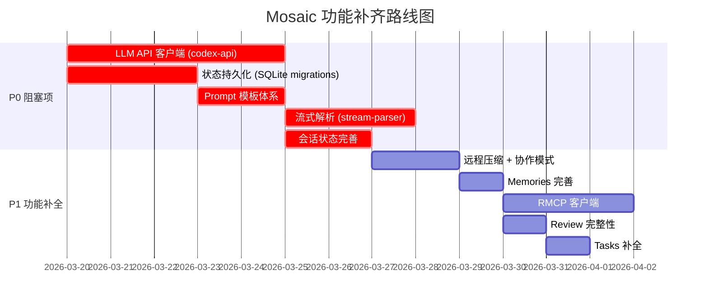

# Codex → Mosaic 核心能力对比分析报告

> 生成时间: 2026-03-19
> Codex 源码: `/Users/zhaojimo/Downloads/codex-main/codex-rs/`
> Mosaic 项目: `/Users/zhaojimo/Documents/git/Mosaic-Desktop/src-tauri/src/`

---

## 总览

```mermaid
graph LR
    subgraph Codex源码["Codex (codex-rs/) — 成熟产品"]
        C_CORE[core/] --> C_AGENT[agent/]
        C_CORE --> C_TOOLS[tools/]
        C_CORE --> C_MCP[mcp/ + mcp_connection_manager]
        C_CORE --> C_SKILLS[skills/]
        C_CORE --> C_TASKS[tasks/]
        C_CORE --> C_SESSION[state/ + rollout/]
        C_CORE --> C_MEMORIES[memories/]
        C_CORE --> C_CONTEXT[context_manager/]
        C_APP[app-server/] --> C_PROTO[app-server-protocol/]
        C_CLI[cli/ + tui/]
        C_EXEC[exec/ + execpolicy/]
        C_SANDBOX[linux-sandbox/ + windows-sandbox-rs/]
        C_NET[network-proxy/]
        C_API[codex-api/ + codex-client/]
        C_STATE_DB[state/ (SQLite migrations)]
        C_RMCP[rmcp-client/]
        C_MCP_SRV[mcp-server/]
    end

    subgraph Mosaic["Mosaic (src-tauri/src/) — 迁移中"]
        M_CORE[core/] --> M_AGENT[agent/]
        M_CORE --> M_TOOLS[tools/]
        M_CORE --> M_MCP[mcp_client/]
        M_CORE --> M_SKILLS[skills/]
        M_CORE --> M_TASKS[tasks/]
        M_CORE --> M_SESSION[session.rs + rollout/]
        M_CORE --> M_MEMORIES[memories/]
        M_CORE --> M_CONTEXT[context_manager/]
        M_CONFIG[config/]
        M_PROTO[protocol/]
        M_EXEC_MOD[exec/ + execpolicy/]
        M_PTY[pty/]
        M_STATE[state/]
        M_PROVIDER[provider/]
    end

    style Codex源码 fill:#e8f5e9
    style Mosaic fill:#fff3e0
```

---

## 1. 核心 AI 能力

| 能力 | Codex | Mosaic | 状态 |
|------|-------|--------|------|
| LLM API 客户端 (SSE/WebSocket) | `codex-api/` + `codex-client/` (完整 crate) | ❌ 缺失 | 🔴 **缺失** |
| Responses API 代理 | `responses-api-proxy/` | ❌ 缺失 | 🔴 **缺失** |
| 模型管理器 | `core/models_manager/` (cache, presets, collaboration_mode) | `core/models_manager/` (cache, manager, model_info) | 🟡 **缺少** model_presets, collaboration_mode_presets |
| 上下文管理 | `core/context_manager/` (history, normalize, updates, history_tests) | `core/context_manager/` (history, normalize, updates) | 🟢 基本对齐 |
| 上下文压缩 (Compact) | `core/compact.rs` + `compact_remote.rs` | `core/compact.rs` | 🟡 **缺少** compact_remote (远程压缩) |
| 截断策略 | `core/truncate.rs` | `core/truncation.rs` | 🟢 已有 |
| 流式解析 | `utils/stream-parser/` (独立 crate) | ❌ 缺失 | 🔴 **缺失** |
| Prompt 模板 | `core/templates/` (agents, collab, compact, memories, review 等) | `templates/memories/` 仅一个 | 🔴 **严重缺失** |
| 协作模式 | `core/templates/collaboration_mode/` (default, execute, plan, pair_programming) | ❌ 缺失 | 🔴 **缺失** |
| Realtime 对话 (语音) | `core/realtime_conversation.rs` + `codex-api/endpoint/realtime_websocket/` | `core/realtime.rs` | 🟡 需验证完整度 |
| Web 搜索 | `core/web_search.rs` | ❌ 缺失 | 🔴 **缺失** |
| Review 功能 | `core/review_format.rs` + `review_prompts.rs` + `core/tasks/review.rs` | `core/tasks/review.rs` | 🟡 **缺少** review_format, review_prompts |

---

## 2. Agent 系统

| 能力 | Codex | Mosaic | 状态 |
|------|-------|--------|------|
| Agent 核心 (control, guards, role, status) | `core/agent/` 完整 | `core/agent/` 完整 | 🟢 对齐 |
| 内置 Agent 定义 | `builtins/awaiter.toml` + `explorer.toml` | `builtins/explorer.toml` 仅一个 | 🟡 **缺少** awaiter.toml |
| Agent 名称池 | `agent/agent_names.txt` | ❌ 缺失 | 🟡 缺失 |
| 外部 Agent 配置 | `core/external_agent_config.rs` | `core/external_agent_config.rs` | 🟢 对齐 |
| 多 Agent 协作 | `core/tools/handlers/multi_agents.rs` + `agent_jobs.rs` | `core/tools/handlers/multi_agents.rs` + `agent_jobs.rs` | 🟢 对齐 |
| 层级 Agent 消息 | `core/hierarchical_agents_message.md` | ❌ 缺失 | 🟡 缺少 prompt 模板 |

---

## 3. Skills 系统

| 能力 | Codex | Mosaic | 状态 |
|------|-------|--------|------|
| Skills 核心 (loader, manager, model, render, injection) | `core/skills/` 完整 | `core/skills/` 完整 | 🟢 对齐 |
| Skills 权限 | `core/skills/permissions.rs` | `core/skills/permissions.rs` | 🟢 对齐 |
| 远程 Skills | `core/skills/remote.rs` | `core/skills/remote.rs` | 🟢 对齐 |
| 系统 Skills | `core/skills/system.rs` | `core/skills/system.rs` | 🟢 对齐 |
| Skills 独立 crate | `codex-rs/skills/` (build.rs + assets) | `core/skills/assets/` (内嵌) | 🟢 结构不同但功能等价 |
| 环境变量依赖 | `core/skills/env_var_dependencies.rs` | `core/skills/env_var_dependencies.rs` | 🟢 对齐 |

---

## 4. MCP (Model Context Protocol)

| 能力 | Codex | Mosaic | 状态 |
|------|-------|--------|------|
| MCP 客户端核心 | `core/mcp/` (auth, mod, skill_dependencies) | `core/mcp_client/` (auth, mod, skill_dependencies, connection_manager, tool_call) | 🟢 对齐 |
| MCP 连接管理 | `core/mcp_connection_manager.rs` | `core/mcp_client/connection_manager.rs` | 🟢 对齐 |
| MCP 工具调用 | `core/mcp_tool_call.rs` | `core/mcp_client/tool_call.rs` | 🟢 对齐 |
| MCP Server (对外暴露) | `codex-rs/mcp-server/` (独立 crate) | `core/mcp_server.rs` (单文件) | 🟡 **简化版** |
| RMCP 客户端 | `codex-rs/rmcp-client/` (OAuth, streamable HTTP) | ❌ 缺失 | 🔴 **缺失** |
| MCP 工具 handler | `core/tools/handlers/mcp.rs` + `mcp_resource.rs` | `core/tools/handlers/mcp.rs` + `mcp_resource.rs` | 🟢 对齐 |

---

## 5. 会话管理 (Session/Thread)

| 能力 | Codex | Mosaic | 状态 |
|------|-------|--------|------|
| 会话核心 | `core/state/` (mod, service, session, turn) | `core/session.rs` (单文件) | 🔴 **严重简化** |
| Thread 管理 | `core/thread_manager.rs` + `core/codex_thread.rs` | `core/thread_manager.rs` | 🟡 **缺少** codex_thread |
| Rollout 记录 | `core/rollout/` (完整: error, list, metadata, policy, recorder, session_index, truncation, tests) | `core/rollout/` (error, list, metadata, policy, recorder, session_index, truncation) | 🟢 基本对齐 |
| 状态持久化 (SQLite) | `codex-rs/state/` (18个 migration + runtime/) | `state/` (db, memories_db, memory, rollout) | 🔴 **严重缺失** — 无 migration 系统 |
| 消息历史 | `core/message_history.rs` | `core/message_history.rs` | 🟢 对齐 |
| Memories 系统 | `core/memories/` (mod, phase1, phase2, prompts, start, storage, citations, tests, usage) | `core/memories/` (mod, phase1, phase2, prompts, start, storage) | 🟡 **缺少** citations, tests, usage |
| Thread Fork/Archive | app-server-protocol 中完整定义 | `protocol/` 中有 thread_id | 🟡 需验证 |

---

## 6. 任务管理 (Tasks)

| 能力 | Codex | Mosaic | 状态 |
|------|-------|--------|------|
| 常规任务 | `core/tasks/regular.rs` | `core/tasks/regular.rs` | 🟢 对齐 |
| 压缩任务 | `core/tasks/compact.rs` | `core/tasks/compact.rs` | 🟢 对齐 |
| Review 任务 | `core/tasks/review.rs` | `core/tasks/review.rs` | 🟢 对齐 |
| Undo 任务 | `core/tasks/undo.rs` | `core/tasks/undo.rs` | 🟢 对齐 |
| Ghost Snapshot | `core/tasks/ghost_snapshot.rs` | ❌ 缺失 | 🟡 缺失 |
| User Shell 任务 | `core/tasks/user_shell.rs` | ❌ 缺失 | 🟡 缺失 |
| Cloud Tasks | `codex-rs/cloud-tasks/` + `cloud-tasks-client/` | ❌ 缺失 | 🔴 **缺失** (云端任务) |

---

## 7. 工具系统 (Tools)

| 能力 | Codex | Mosaic | 状态 |
|------|-------|--------|------|
| 工具路由/编排 | `tools/router.rs` + `orchestrator.rs` + `parallel.rs` | 同上 | 🟢 对齐 |
| Shell 执行 | `tools/handlers/shell.rs` + `runtimes/shell.rs` | 同上 | 🟢 对齐 |
| Apply Patch | `tools/handlers/apply_patch.rs` + `codex-rs/apply-patch/` (独立 crate) | `tools/handlers/apply_patch.rs` + `runtimes/apply_patch.rs` | 🟡 无独立 crate |
| Grep/Search | `tools/handlers/grep_files.rs` + `search_tool_bm25.rs` | 同上 | 🟢 对齐 |
| JS REPL | `tools/js_repl/` (kernel.js + meriyah) | `tools/js_repl/` | 🟡 需验证 JS 资源文件 |
| 工具注册表 | `tools/registry.rs` | ❌ 缺失 | 🟡 缺失 |
| 网络审批 | `tools/network_approval.rs` | `tools/network_approval.rs` | 🟢 对齐 |
| 沙箱 | `tools/sandboxing.rs` | `tools/sandboxing.rs` | 🟢 对齐 |
| View Image | `tools/handlers/view_image.rs` | `tools/handlers/view_image.rs` | 🟢 对齐 |
| Plan 工具 | `tools/handlers/plan.rs` | `tools/handlers/plan.rs` | 🟢 对齐 |

---

## 8. 基础设施缺失

| 模块 | Codex | Mosaic | 严重程度 |
|------|-------|--------|----------|
| App Server (WebSocket/HTTP) | `codex-rs/app-server/` (完整服务端) | ❌ 缺失 (依赖 Tauri IPC) | 🟡 架构差异 |
| App Server Protocol | `codex-rs/app-server-protocol/` (JSON Schema + TS 类型) | `protocol/` (简化版) | 🟡 |
| 认证系统 | `codex-rs/login/` (PKCE + device code) | `auth/` (mod + storage) | 🟡 简化 |
| 网络代理 | `codex-rs/network-proxy/` (MITM, SOCKS5, policy) | `netproxy/` (mod + proxy) | 🟡 简化 |
| 沙箱 (Linux) | `codex-rs/linux-sandbox/` (bwrap, landlock) | ❌ 缺失 | 🟡 桌面端可能不需要 |
| 沙箱 (Windows) | `codex-rs/windows-sandbox-rs/` | ❌ 缺失 | 🟡 |
| Seatbelt (macOS) | `core/seatbelt.rs` + `.sbpl` 策略文件 | `core/seatbelt.rs` | 🟡 需验证策略文件 |
| OTel 遥测 | `codex-rs/otel/` (完整 crate) | ❌ 缺失 | 🟡 |
| Secrets 管理 | `codex-rs/secrets/` (独立 crate) | `secrets/` (backend, manager, sanitizer) | 🟢 对齐 |
| TypeScript SDK | `sdk/typescript/` | ❌ 缺失 | 🟡 桌面端不需要 |
| Shell Tool MCP | `shell-tool-mcp/` | ❌ 缺失 | 🟡 |

---

## 9. 关键缺失汇总 (按优先级)

### 🔴 P0 — 阻塞核心功能

1. **LLM API 客户端** — 无 `codex-api/` 和 `codex-client/`，无法调用 AI 模型
2. **状态持久化** — 无 SQLite migration 系统，会话无法持久化
3. **Prompt 模板体系** — `templates/` 严重缺失，影响所有 AI 交互质量
4. **流式解析** — 无 `stream-parser`，无法处理 SSE 流式响应
5. **会话状态管理** — `state/` 从 4 个子模块简化为单文件，缺少 service/turn 层

### 🟡 P1 — 功能不完整

6. **远程压缩** — 缺少 `compact_remote.rs`
7. **协作模式** — 缺少 collaboration_mode 模板和 presets
8. **Memories 引用/用量** — 缺少 citations.rs, usage.rs
9. **RMCP 客户端** — 无法连接 streamable HTTP MCP 服务器
10. **Cloud Tasks** — 无云端任务能力
11. **Review 完整性** — 缺少 review_format, review_prompts
12. **Ghost Snapshot / User Shell** — tasks 子模块不完整

### 🟢 已对齐的核心模块

- Agent 系统 (control, guards, role, status)
- Skills 系统 (完整)
- MCP 客户端 (完整)
- Tools 系统 (大部分 handler 对齐)
- 基础 Tasks (regular, compact, review, undo)
- Context Manager
- Rollout 系统
- Exec Policy
- Unified Exec

---

## 10. 建议实施路线


