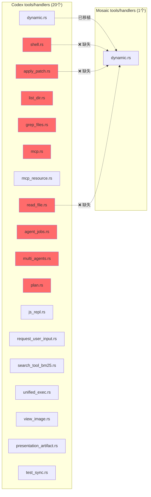

# Codex 源码 vs Mosaic-Desktop 模块对比分析

> 生成时间: 2026-03-16  
> 源项目: `/Users/zhaojimo/Downloads/codex-main/codex-rs/`  
> 当前项目: `/Users/zhaojimo/Documents/git/Mosaic-Desktop/src-tauri/src/`

---

## 1. 架构概览

```mermaid
graph TB
    subgraph Codex源项目["Codex 源项目 (多 crate workspace)"]
        C_CORE[core]
        C_PROTO[protocol]
        C_CONFIG[config]
        C_STATE[state]
        C_EXEC[exec]
        C_EXECPOLICY[execpolicy]
        C_SECRETS[secrets]
        C_SHELL_CMD[shell-command]
        C_SHELL_ESC[shell-escalation]
        C_NET_PROXY[network-proxy]
        C_RESP_PROXY[responses-api-proxy]
        C_FILE_SEARCH[file-search]
        C_APPLY_PATCH[apply-patch]
        C_HOOKS[hooks]
        C_LOGIN[login]
        C_CHATGPT[chatgpt]
        C_OLLAMA[ollama]
        C_LMSTUDIO[lmstudio]
        C_TUI[tui]
        C_CLI[cli]
        C_APP_SERVER[app-server]
        C_APP_PROTO[app-server-protocol]
        C_MCP_SERVER[mcp-server]
        C_RMCP[rmcp-client]
        C_OTEL[otel]
        C_OTHERS[其他 20+ crate]
    end

    subgraph Mosaic当前项目["Mosaic 当前项目 (单 crate + Tauri)"]
        M_CORE[core]
        M_PROTO[protocol]
        M_CONFIG[config]
        M_STATE[state]
        M_EXEC[exec]
        M_EXECPOLICY[execpolicy]
        M_SECRETS[secrets]
        M_SHELL_CMD[shell_command]
        M_SHELL_ESC[shell_escalation]
        M_NET_PROXY[netproxy]
        M_RESP_PROXY[responses_api_proxy]
        M_FILE_SEARCH[file_search]
        M_PROVIDER[provider]
        M_COMMANDS[commands]
    end

    C_CORE -.->|已移植| M_CORE
    C_PROTO -.->|部分移植| M_PROTO
    C_CONFIG -.->|部分移植| M_CONFIG
    C_STATE -.->|部分移植| M_STATE
    C_EXEC -.->|部分移植| M_EXEC
    C_LOGIN -.->|❌ 缺失| M_CORE
    C_CHATGPT -.->|❌ 缺失| M_CORE
    C_OLLAMA -.->|❌ 缺失| M_CORE
    C_TUI -.->|❌ 不适用| M_CORE
```

---

## 2. 顶层模块对比

| Codex crate | Mosaic 模块 | 状态 | 说明 |
|---|---|---|---|
| `core` | `core/` | ✅ 已实现 | 核心逻辑主体已移植 |
| `protocol` | `protocol/` | ⚠️ 部分 | 缺少 account, approvals, config_types, custom_prompts, dynamic_tools, items, mcp, models, num_format, openai_models, parse_command, plan_tool, request_user_input, user_input 等 |
| `config` | `config/` | ⚠️ 部分 | 缺少 cloud_requirements, config_requirements, constraint, diagnostics, fingerprint, merge, overrides, requirements_exec_policy, state |
| `state` | `state/` | ⚠️ 部分 | 有 db, memories_db, memory, rollout；缺少 extract, log_db, migrations, paths 等 |
| `exec` | `exec/` | ⚠️ 部分 | 仅有 sandbox.rs；缺少 cli, event_processor*, exec_events, lib 等 |
| `execpolicy` | `execpolicy/` | ✅ 基本完整 | 有 mod, amend, parser, network_rule, prefix_rule, error |
| `secrets` | `secrets/` | ✅ 基本完整 | 有 mod, manager, sanitizer, backend |
| `shell-command` | `shell_command/` | ⚠️ 部分 | 仅 mod.rs；缺少 bash, powershell, parse_command, shell_detect |
| `shell-escalation` | `shell_escalation/` | ✅ 已实现 | 单文件模块 |
| `network-proxy` | `netproxy/` | ⚠️ 部分 | 仅 proxy.rs；缺少 admin, certs, config, http_proxy 等 |
| `responses-api-proxy` | `responses_api_proxy/` | ✅ 已实现 | 单文件模块 |
| `file-search` | `file_search/` | ✅ 已实现 | 单文件模块 |
| `apply-patch` | `core/patch.rs` | ⚠️ 部分 | 合并为单文件；缺少 parser, seek_sequence, invocation |
| `hooks` | `core/hooks.rs` | ⚠️ 部分 | 合并为单文件；缺少 registry, types, user_notification |
| `login` | ❌ 缺失 | ❌ 缺失 | 设备码认证、PKCE、OAuth 服务器 |
| `chatgpt` | ❌ 缺失 | ❌ 缺失 | ChatGPT 集成客户端 |
| `ollama` | ❌ 缺失 | ❌ 缺失 | Ollama 本地模型客户端 |
| `lmstudio` | ❌ 缺失 | ❌ 缺失 | LM Studio 本地模型客户端 |
| `tui` | ❌ 不适用 | — | Mosaic 使用 React 前端替代 TUI |
| `cli` | ❌ 不适用 | — | Mosaic 使用 Tauri commands 替代 CLI |
| `app-server` | ❌ 缺失 | ❌ 缺失 | WebSocket/HTTP 应用服务器 |
| `app-server-protocol` | ❌ 缺失 | ❌ 缺失 | 应用服务器协议定义 |
| `mcp-server` | `core/mcp_server.rs` | ⚠️ 部分 | 合并为单文件 |
| `rmcp-client` | `core/mcp_client.rs` | ⚠️ 部分 | 合并为单文件 |
| `otel` | ❌ 缺失 | ❌ 缺失 | OpenTelemetry 可观测性 |
| `feedback` | ❌ 缺失 | ❌ 缺失 | 用户反馈收集 |
| `keyring-store` | ❌ 缺失 | ❌ 缺失 | 系统密钥链存储 |
| `ansi-escape` | ❌ 缺失 | — | TUI 相关，可能不需要 |
| `debug-client` | ❌ 缺失 | ❌ 缺失 | 调试客户端 |
| N/A | `provider/` | ✅ Mosaic 独有 | 模型提供商抽象层 |
| N/A | `commands.rs` | ✅ Mosaic 独有 | Tauri 命令接口 |

---

## 3. core 模块内部对比

### 3.1 Mosaic 已实现的 core 子模块

| 模块 | 文件 | 状态 |
|---|---|---|
| agent | agent.rs | ✅ |
| client | client.rs | ✅ |
| codex | codex.rs | ✅ |
| compact | compact.rs | ✅ |
| context_manager | context_manager/ (history, updates, normalize) | ✅ |
| exec_policy | exec_policy/ (manager, heuristics, bash) | ✅ |
| external_agent_config | external_agent_config.rs | ✅ |
| features | features/ (mod, legacy) | ✅ |
| file_watcher | file_watcher.rs | ✅ |
| git_info | git_info.rs | ✅ |
| hooks | hooks.rs | ✅ |
| mcp_client | mcp_client.rs | ✅ |
| mcp_server | mcp_server.rs | ✅ |
| memories | memories/ (storage, prompts, phase1, phase2, start) | ✅ |
| message_history | message_history.rs | ✅ |
| models_manager | models_manager/ (manager, cache, model_info) | ✅ |
| network_policy_decision | network_policy_decision.rs | ✅ |
| patch | patch.rs | ✅ |
| project_doc | project_doc.rs | ✅ |
| realtime | realtime.rs | ✅ |
| rollout | rollout/ (recorder, list, metadata, truncation, session_index, error) | ✅ |
| seatbelt | seatbelt.rs | ✅ |
| session | session.rs | ✅ |
| shell | shell.rs | ✅ |
| shell_snapshot | shell_snapshot.rs | ✅ |
| skills | skills.rs | ✅ |
| state_db | state_db.rs | ✅ |
| text_encoding | text_encoding.rs | ✅ |
| thread_manager | thread_manager.rs | ✅ |
| tools | tools/ (mod, router, handlers/dynamic) | ⚠️ 部分 |
| truncation | truncation.rs | ✅ |
| turn_diff_tracker | turn_diff_tracker.rs | ✅ |
| unified_exec | unified_exec/ (mod, process_manager) | ✅ |

### 3.2 Codex core 中存在但 Mosaic 缺失的模块

| 缺失模块 | 功能说明 | 重要性 |
|---|---|---|
| `tasks/` | 任务系统 (regular, compact, review, undo, ghost_snapshot, user_shell) | 🔴 高 |
| `apps/` | 应用渲染 (render_apps_section) | 🟡 中 |
| `instructions/` | 用户指令系统 (UserInstructions, SkillInstructions) | 🔴 高 |
| `sandboxing/` | 沙箱管理器 (CommandSpec, ExecRequest, SandboxManager) | 🔴 高 |
| `auth/` (目录) | 认证管理 (AuthManager, CodexAuth, storage) | 🔴 高 |
| `analytics_client.rs` | 分析客户端 | 🟢 低 |
| `api_bridge.rs` | API 桥接层 | 🟡 中 |
| `codex_delegate.rs` | Codex 委托处理 | 🟡 中 |
| `codex_thread.rs` | 线程配置快照 | 🟡 中 |
| `command_canonicalization.rs` | 命令规范化 | 🟡 中 |
| `commit_attribution.rs` | 提交归属 | 🟢 低 |
| `compact_remote.rs` | 远程压缩 | 🟡 中 |
| `config_loader/` | 配置加载器 | 🟡 中 |
| `connectors.rs` | 连接器抽象 | 🟡 中 |
| `contextual_user_message.rs` | 上下文用户消息 | 🟡 中 |
| `custom_prompts.rs` | 自定义提示词 | 🟡 中 |
| `default_client.rs` | 默认客户端实现 | 🟡 中 |
| `env.rs` | 环境变量管理 | 🟡 中 |
| `environment_context.rs` | 环境上下文 | 🟡 中 |
| `error.rs` | 统一错误类型 | 🔴 高 |
| `event_mapping.rs` | 事件映射 | 🟡 中 |
| `flags.rs` | 功能标志 | 🟡 中 |
| `function_tool.rs` | 函数工具定义 | 🟡 中 |
| `landlock.rs` | Linux Landlock 沙箱 | 🟢 低 (macOS) |
| `mcp_tool_call.rs` | MCP 工具调用 | 🟡 中 |
| `memory_trace.rs` | 内存追踪 | 🟢 低 |
| `mentions.rs` | @提及解析 | 🟡 中 |
| `model_provider_info.rs` | 模型提供商信息 | 🔴 高 |
| `network_proxy_loader.rs` | 网络代理加载 | 🟡 中 |
| `otel_init.rs` | OpenTelemetry 初始化 | 🟢 低 |
| `path_utils.rs` | 路径工具 | 🟡 中 |
| `personality_migration.rs` | 人格迁移 | 🟢 低 |
| `plugins.rs` | 插件系统 | 🟡 中 |
| `review_format.rs` | 代码审查格式 | 🟡 中 |
| `review_prompts.rs` | 代码审查提示词 | 🟡 中 |
| `safety.rs` | 安全检查 | 🔴 高 |
| `sandbox_tags.rs` | 沙箱标签 | 🟡 中 |
| `seatbelt_permissions.rs` | Seatbelt 权限扩展 | 🟡 中 |
| `session_prefix.rs` | 会话前缀 | 🟢 低 |
| `shell_detect.rs` | Shell 检测 | 🟡 中 |
| `spawn.rs` | 进程启动 | 🔴 高 |
| `state/` (目录) | 状态管理 (ActiveTurn, RunningTask, TaskKind) | 🔴 高 |
| `stream_events_utils.rs` | 流事件工具 | 🟡 中 |
| `terminal.rs` | 终端管理 | 🟢 低 |
| `test_support.rs` | 测试支持 | 🟢 低 |
| `token_data.rs` | Token 数据 | 🟡 中 |
| `turn_metadata.rs` | Turn 元数据 | 🟡 中 |
| `user_shell_command.rs` | 用户 Shell 命令 | 🟡 中 |
| `util.rs` | 通用工具 | 🟡 中 |
| `web_search.rs` | Web 搜索 | 🟡 中 |
| `windows_sandbox.rs` | Windows 沙箱 | 🟢 低 (macOS) |
| `windows_sandbox_read_grants.rs` | Windows 沙箱读权限 | 🟢 低 (macOS) |
| `client_common.rs` | 客户端公共逻辑 | 🟡 中 |

---

## 4. Tools Handler 对比 (严重缺失)

Mosaic 的 tools 系统严重不完整：
- 仅实现了 `dynamic.rs` (动态工具处理)
- 缺少全部 **17 个** 内置工具 handler
- 缺少 `context.rs`, `events.rs`, `orchestrator.rs`, `parallel.rs`, `registry.rs`, `spec.rs`, `sandboxing.rs`, `network_approval.rs`
- 缺少 `runtimes/` 目录 (shell, apply_patch, unified_exec 运行时)
- 缺少 `js_repl/` 目录 (JavaScript REPL)

---

## 5. Protocol 模块对比

| Codex protocol 文件 | Mosaic 对应 | 状态 |
|---|---|---|
| `lib.rs` | `mod.rs` | ⚠️ 结构不同 |
| `protocol.rs` | `event.rs` + `types.rs` | ⚠️ 部分 |
| `thread_id.rs` | `thread_id.rs` | ✅ |
| `account.rs` | ❌ | 缺失 - 账户类型 |
| `approvals.rs` | ❌ | 缺失 - 审批流程 |
| `config_types.rs` | ❌ | 缺失 - 配置类型 |
| `custom_prompts.rs` | ❌ | 缺失 - 自定义提示词 |
| `dynamic_tools.rs` | ❌ | 缺失 - 动态工具定义 |
| `items.rs` | ❌ | 缺失 - 协议项目 |
| `mcp.rs` | ❌ | 缺失 - MCP 协议类型 |
| `message_history.rs` | ❌ | 缺失 - 消息历史类型 |
| `models.rs` | ❌ | 缺失 - 模型定义 |
| `num_format.rs` | ❌ | 缺失 - 数字格式化 |
| `openai_models.rs` | ❌ | 缺失 - OpenAI 模型 |
| `parse_command.rs` | ❌ | 缺失 - 命令解析 |
| `plan_tool.rs` | ❌ | 缺失 - 计划工具 |
| `request_user_input.rs` | ❌ | 缺失 - 用户输入请求 |
| `user_input.rs` | ❌ | 缺失 - 用户输入类型 |
| N/A | `error.rs` | Mosaic 独有 |
| N/A | `submission.rs` | Mosaic 独有 |
| N/A | `roundtrip_tests.rs` | Mosaic 独有 |

---

## 6. 完全缺失的独立 crate

以下 Codex crate 在 Mosaic 中完全没有对应实现：

| Crate | 功能 | 重要性 |
|---|---|---|
| `login` | OAuth/设备码认证 (device_code_auth, pkce, server) | 🔴 高 |
| `chatgpt` | ChatGPT 集成 (apply_command, chatgpt_client, chatgpt_token, connectors) | 🔴 高 |
| `ollama` | Ollama 本地模型 (client, parser, pull, url) | 🟡 中 |
| `lmstudio` | LM Studio 本地模型 (client) | 🟡 中 |
| `app-server` | WebSocket/HTTP 应用服务器 | 🟡 中 |
| `app-server-protocol` | 应用服务器协议 | 🟡 中 |
| `otel` | OpenTelemetry 可观测性 | 🟢 低 |
| `feedback` | 用户反馈 | 🟢 低 |
| `keyring-store` | 系统密钥链 | 🟡 中 |
| `apply-patch` (独立) | Patch 解析/应用 (parser, seek_sequence, invocation) | 🔴 高 |
| `debug-client` | 调试客户端 | 🟢 低 |
| `codex-api` | Codex API 层 | 🟡 中 |
| `codex-client` | Codex 客户端 | 🟡 中 |
| `cloud-tasks` | 云任务 | 🟢 低 |
| `cloud-tasks-client` | 云任务客户端 | 🟢 低 |
| `cloud-requirements` | 云需求 | 🟢 低 |
| `backend-client` | 后端客户端 | 🟡 中 |
| `codex-backend-openapi-models` | OpenAPI 模型 | 🟢 低 |
| `stdio-to-uds` | stdio 到 Unix Domain Socket | 🟢 低 |
| `async-utils` | 异步工具 | 🟡 中 |
| `process-hardening` | 进程加固 | 🟡 中 |
| `skills` (独立 crate) | Skills 构建 | 🟡 中 |

---

## 7. 总结与优先级建议

### 🔴 高优先级 (影响核心功能)

1. **tasks/ 任务系统** — 源项目的任务调度核心，包含 regular/compact/review/undo/ghost_snapshot/user_shell 六种任务类型
2. **tools/handlers/** — 仅实现了 1/18 个工具处理器，缺少 shell、apply_patch、read_file、list_dir、grep_files 等核心工具
3. **sandboxing/** — 沙箱管理器，负责命令执行的安全隔离
4. **auth/** — 认证系统，包括 AuthManager 和 CodexAuth
5. **login crate** — OAuth 认证流程
6. **safety.rs + spawn.rs** — 安全检查和进程启动
7. **error.rs** — 统一错误类型定义
8. **model_provider_info.rs** — 模型提供商信息 (Ollama/LMStudio 端口、WireApi 等)
9. **state/ 目录** — ActiveTurn, RunningTask, TaskKind 等运行时状态

### 🟡 中优先级 (影响完整性)

1. **protocol 模块补全** — 缺少 15+ 个协议类型文件
2. **config 模块补全** — 缺少 requirements, diagnostics, merge 等
3. **tools 基础设施** — orchestrator, parallel, registry, spec, events, context
4. **chatgpt/ollama/lmstudio** — 多模型提供商支持
5. **instructions/** — 用户指令系统
6. **connectors.rs** — 连接器抽象
7. **mentions.rs** — @提及解析
8. **web_search.rs** — Web 搜索功能

### 🟢 低优先级 (可后续补充)

1. otel (可观测性)
2. feedback (用户反馈)
3. analytics_client (分析)
4. 云相关 crate (cloud-tasks 等)
5. Windows/Linux 特定沙箱
6. ansi-escape (TUI 相关)

### 统计

- Codex 源项目 core 模块: **~90+ 个 .rs 文件**
- Mosaic core 模块: **~50 个 .rs 文件**
- 覆盖率估算: **约 55%**
- 完全缺失的独立 crate: **20+**
- Tools handler 覆盖率: **1/18 (约 6%)**
