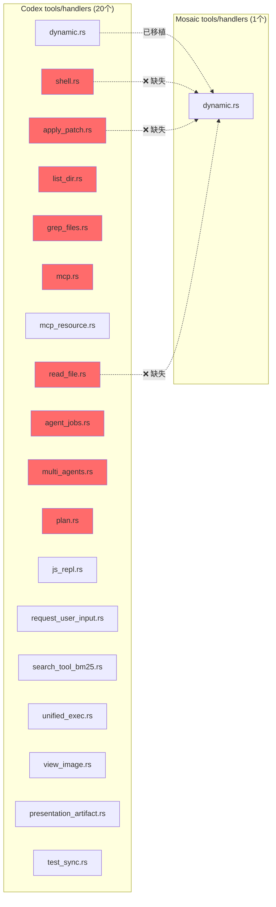
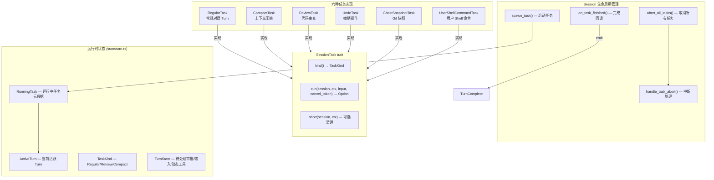
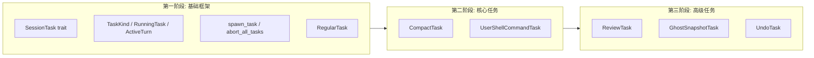
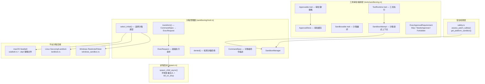

# Codex 源码 vs Mosaic-Desktop 模块对比分析

> 生成时间: 2026-03-16  
> 源项目: `/Users/zhaojimo/Downloads/codex-main/codex-rs/`  
> 当前项目: `/Users/zhaojimo/Documents/git/Mosaic-Desktop/src-tauri/src/`

---

## 1. 架构概览

```mermaid
graph TB
    subgraph Codex源项目["Codex 源项目 (多 crate workspace)"]
        C_CORE[core]
        C_PROTO[protocol]
        C_CONFIG[config]
        C_STATE[state]
        C_EXEC[exec]
        C_EXECPOLICY[execpolicy]
        C_SECRETS[secrets]
        C_SHELL_CMD[shell-command]
        C_SHELL_ESC[shell-escalation]
        C_NET_PROXY[network-proxy]
        C_RESP_PROXY[responses-api-proxy]
        C_FILE_SEARCH[file-search]
        C_APPLY_PATCH[apply-patch]
        C_HOOKS[hooks]
        C_LOGIN[login]
        C_CHATGPT[chatgpt]
        C_OLLAMA[ollama]
        C_LMSTUDIO[lmstudio]
        C_TUI[tui]
        C_CLI[cli]
        C_APP_SERVER[app-server]
        C_APP_PROTO[app-server-protocol]
        C_MCP_SERVER[mcp-server]
        C_RMCP[rmcp-client]
        C_OTEL[otel]
        C_OTHERS[其他 20+ crate]
    end

    subgraph Mosaic当前项目["Mosaic 当前项目 (单 crate + Tauri)"]
        M_CORE[core]
        M_PROTO[protocol]
        M_CONFIG[config]
        M_STATE[state]
        M_EXEC[exec]
        M_EXECPOLICY[execpolicy]
        M_SECRETS[secrets]
        M_SHELL_CMD[shell_command]
        M_SHELL_ESC[shell_escalation]
        M_NET_PROXY[netproxy]
        M_RESP_PROXY[responses_api_proxy]
        M_FILE_SEARCH[file_search]
        M_PROVIDER[provider]
        M_COMMANDS[commands]
    end

    C_CORE -.->|已移植| M_CORE
    C_PROTO -.->|部分移植| M_PROTO
    C_CONFIG -.->|部分移植| M_CONFIG
    C_STATE -.->|部分移植| M_STATE
    C_EXEC -.->|部分移植| M_EXEC
    C_LOGIN -.->|❌ 缺失| M_CORE
    C_CHATGPT -.->|❌ 缺失| M_CORE
    C_OLLAMA -.->|❌ 缺失| M_CORE
    C_TUI -.->|❌ 不适用| M_CORE
```



---

## 2. 顶层模块对比

| Codex crate | Mosaic 模块 | 状态 | 说明 |
|---|---|---|---|
| `core` | `core/` | ✅ 已实现 | 核心逻辑主体已移植 |
| `protocol` | `protocol/` | ⚠️ 部分 | 缺少 account, approvals, config_types, custom_prompts, dynamic_tools, items, mcp, models, num_format, openai_models, parse_command, plan_tool, request_user_input, user_input 等 |
| `config` | `config/` | ⚠️ 部分 | 缺少 cloud_requirements, config_requirements, constraint, diagnostics, fingerprint, merge, overrides, requirements_exec_policy, state |
| `state` | `state/` | ⚠️ 部分 | 有 db, memories_db, memory, rollout；缺少 extract, log_db, migrations, paths 等 |
| `exec` | `exec/` | ⚠️ 部分 | 仅有 sandbox.rs；缺少 cli, event_processor*, exec_events, lib 等 |
| `execpolicy` | `execpolicy/` | ✅ 基本完整 | 有 mod, amend, parser, network_rule, prefix_rule, error |
| `secrets` | `secrets/` | ✅ 基本完整 | 有 mod, manager, sanitizer, backend |
| `shell-command` | `shell_command/` | ⚠️ 部分 | 仅 mod.rs；缺少 bash, powershell, parse_command, shell_detect |
| `shell-escalation` | `shell_escalation/` | ✅ 已实现 | 单文件模块 |
| `network-proxy` | `netproxy/` | ⚠️ 部分 | 仅 proxy.rs；缺少 admin, certs, config, http_proxy 等 |
| `responses-api-proxy` | `responses_api_proxy/` | ✅ 已实现 | 单文件模块 |
| `file-search` | `file_search/` | ✅ 已实现 | 单文件模块 |
| `apply-patch` | `core/patch.rs` | ⚠️ 部分 | 合并为单文件；缺少 parser, seek_sequence, invocation |
| `hooks` | `core/hooks.rs` | ⚠️ 部分 | 合并为单文件；缺少 registry, types, user_notification |
| `login` | ❌ 缺失 | ❌ 缺失 | 设备码认证、PKCE、OAuth 服务器 |
| `chatgpt` | ❌ 缺失 | ❌ 缺失 | ChatGPT 集成客户端 |
| `ollama` | ❌ 缺失 | ❌ 缺失 | Ollama 本地模型客户端 |
| `lmstudio` | ❌ 缺失 | ❌ 缺失 | LM Studio 本地模型客户端 |
| `tui` | ❌ 不适用 | — | Mosaic 使用 React 前端替代 TUI |
| `cli` | ❌ 不适用 | — | Mosaic 使用 Tauri commands 替代 CLI |
| `app-server` | ❌ 缺失 | ❌ 缺失 | WebSocket/HTTP 应用服务器 |
| `app-server-protocol` | ❌ 缺失 | ❌ 缺失 | 应用服务器协议定义 |
| `mcp-server` | `core/mcp_server.rs` | ⚠️ 部分 | 合并为单文件 |
| `rmcp-client` | `core/mcp_client.rs` | ⚠️ 部分 | 合并为单文件 |
| `otel` | ❌ 缺失 | ❌ 缺失 | OpenTelemetry 可观测性 |
| `feedback` | ❌ 缺失 | ❌ 缺失 | 用户反馈收集 |
| `keyring-store` | ❌ 缺失 | ❌ 缺失 | 系统密钥链存储 |
| `ansi-escape` | ❌ 缺失 | — | TUI 相关，可能不需要 |
| `debug-client` | ❌ 缺失 | ❌ 缺失 | 调试客户端 |
| N/A | `provider/` | ✅ Mosaic 独有 | 模型提供商抽象层 |
| N/A | `commands.rs` | ✅ Mosaic 独有 | Tauri 命令接口 |

---

## 3. core 模块内部对比

### 3.1 Mosaic 已实现的 core 子模块

| 模块 | 文件 | 状态 |
|---|---|---|
| agent | agent.rs | ✅ |
| client | client.rs | ✅ |
| codex | codex.rs | ✅ |
| compact | compact.rs | ✅ |
| context_manager | context_manager/ (history, updates, normalize) | ✅ |
| exec_policy | exec_policy/ (manager, heuristics, bash) | ✅ |
| external_agent_config | external_agent_config.rs | ✅ |
| features | features/ (mod, legacy) | ✅ |
| file_watcher | file_watcher.rs | ✅ |
| git_info | git_info.rs | ✅ |
| hooks | hooks.rs | ✅ |
| mcp_client | mcp_client.rs | ✅ |
| mcp_server | mcp_server.rs | ✅ |
| memories | memories/ (storage, prompts, phase1, phase2, start) | ✅ |
| message_history | message_history.rs | ✅ |
| models_manager | models_manager/ (manager, cache, model_info) | ✅ |
| network_policy_decision | network_policy_decision.rs | ✅ |
| patch | patch.rs | ✅ |
| project_doc | project_doc.rs | ✅ |
| realtime | realtime.rs | ✅ |
| rollout | rollout/ (recorder, list, metadata, truncation, session_index, error) | ✅ |
| seatbelt | seatbelt.rs | ✅ |
| session | session.rs | ✅ |
| shell | shell.rs | ✅ |
| shell_snapshot | shell_snapshot.rs | ✅ |
| skills | skills.rs | ✅ |
| state_db | state_db.rs | ✅ |
| text_encoding | text_encoding.rs | ✅ |
| thread_manager | thread_manager.rs | ✅ |
| tools | tools/ (mod, router, handlers/dynamic) | ⚠️ 部分 |
| truncation | truncation.rs | ✅ |
| turn_diff_tracker | turn_diff_tracker.rs | ✅ |
| unified_exec | unified_exec/ (mod, process_manager) | ✅ |

### 3.2 Codex core 中存在但 Mosaic 缺失的模块

| 缺失模块 | 功能说明 | 重要性 |
|---|---|---|
| `tasks/` | 任务系统 — SessionTask trait + 6 种任务 (regular, compact, review, undo, ghost_snapshot, user_shell)，含 Session 生命周期管理 (~41KB)，详见 §8 | 🔴 高 |
| `apps/` | 应用渲染 (render_apps_section) | 🟡 中 |
| `instructions/` | 用户指令系统 (UserInstructions, SkillInstructions) | 🔴 高 |
| `sandboxing/` | 沙箱管理器 (CommandSpec, ExecRequest, SandboxManager) | 🔴 高 |
| `auth/` (目录) | 认证管理 (AuthManager, CodexAuth, storage) | 🔴 高 |
| `analytics_client.rs` | 分析客户端 | 🟢 低 |
| `api_bridge.rs` | API 桥接层 | 🟡 中 |
| `codex_delegate.rs` | Codex 委托处理 | 🟡 中 |
| `codex_thread.rs` | 线程配置快照 | 🟡 中 |
| `command_canonicalization.rs` | 命令规范化 | 🟡 中 |
| `commit_attribution.rs` | 提交归属 | 🟢 低 |
| `compact_remote.rs` | 远程压缩 | 🟡 中 |
| `config_loader/` | 配置加载器 | 🟡 中 |
| `connectors.rs` | 连接器抽象 | 🟡 中 |
| `contextual_user_message.rs` | 上下文用户消息 | 🟡 中 |
| `custom_prompts.rs` | 自定义提示词 | 🟡 中 |
| `default_client.rs` | 默认客户端实现 | 🟡 中 |
| `env.rs` | 环境变量管理 | 🟡 中 |
| `environment_context.rs` | 环境上下文 | 🟡 中 |
| `error.rs` | 统一错误类型 | 🔴 高 |
| `event_mapping.rs` | 事件映射 | 🟡 中 |
| `flags.rs` | 功能标志 | 🟡 中 |
| `function_tool.rs` | 函数工具定义 | 🟡 中 |
| `landlock.rs` | Linux Landlock 沙箱 | 🟢 低 (macOS) |
| `mcp_tool_call.rs` | MCP 工具调用 | 🟡 中 |
| `memory_trace.rs` | 内存追踪 | 🟢 低 |
| `mentions.rs` | @提及解析 | 🟡 中 |
| `model_provider_info.rs` | 模型提供商信息 | 🔴 高 |
| `network_proxy_loader.rs` | 网络代理加载 | 🟡 中 |
| `otel_init.rs` | OpenTelemetry 初始化 | 🟢 低 |
| `path_utils.rs` | 路径工具 | 🟡 中 |
| `personality_migration.rs` | 人格迁移 | 🟢 低 |
| `plugins.rs` | 插件系统 | 🟡 中 |
| `review_format.rs` | 代码审查格式 | 🟡 中 |
| `review_prompts.rs` | 代码审查提示词 | 🟡 中 |
| `safety.rs` | 安全检查 | 🔴 高 |
| `sandbox_tags.rs` | 沙箱标签 | 🟡 中 |
| `seatbelt_permissions.rs` | Seatbelt 权限扩展 | 🟡 中 |
| `session_prefix.rs` | 会话前缀 | 🟢 低 |
| `shell_detect.rs` | Shell 检测 | 🟡 中 |
| `spawn.rs` | 进程启动 | 🔴 高 |
| `state/` (目录) | 状态管理 (ActiveTurn, RunningTask, TaskKind) | 🔴 高 |
| `stream_events_utils.rs` | 流事件工具 | 🟡 中 |
| `terminal.rs` | 终端管理 | 🟢 低 |
| `test_support.rs` | 测试支持 | 🟢 低 |
| `token_data.rs` | Token 数据 | 🟡 中 |
| `turn_metadata.rs` | Turn 元数据 | 🟡 中 |
| `user_shell_command.rs` | 用户 Shell 命令 | 🟡 中 |
| `util.rs` | 通用工具 | 🟡 中 |
| `web_search.rs` | Web 搜索 | 🟡 中 |
| `windows_sandbox.rs` | Windows 沙箱 | 🟢 低 (macOS) |
| `windows_sandbox_read_grants.rs` | Windows 沙箱读权限 | 🟢 低 (macOS) |
| `client_common.rs` | 客户端公共逻辑 | 🟡 中 |

---

## 4. Tools Handler 对比 (严重缺失)



Mosaic 的 tools 系统严重不完整：
- 仅实现了 `dynamic.rs` (动态工具处理)
- 缺少全部 **17 个** 内置工具 handler
- 缺少 `context.rs`, `events.rs`, `orchestrator.rs`, `parallel.rs`, `registry.rs`, `spec.rs`, `sandboxing.rs`, `network_approval.rs`
- 缺少 `runtimes/` 目录 (shell, apply_patch, unified_exec 运行时)
- 缺少 `js_repl/` 目录 (JavaScript REPL)

---

## 5. Protocol 模块对比

| Codex protocol 文件 | Mosaic 对应 | 状态 |
|---|---|---|
| `lib.rs` | `mod.rs` | ⚠️ 结构不同 |
| `protocol.rs` | `event.rs` + `types.rs` | ⚠️ 部分 |
| `thread_id.rs` | `thread_id.rs` | ✅ |
| `account.rs` | ❌ | 缺失 - 账户类型 |
| `approvals.rs` | ❌ | 缺失 - 审批流程 |
| `config_types.rs` | ❌ | 缺失 - 配置类型 |
| `custom_prompts.rs` | ❌ | 缺失 - 自定义提示词 |
| `dynamic_tools.rs` | ❌ | 缺失 - 动态工具定义 |
| `items.rs` | ❌ | 缺失 - 协议项目 |
| `mcp.rs` | ❌ | 缺失 - MCP 协议类型 |
| `message_history.rs` | ❌ | 缺失 - 消息历史类型 |
| `models.rs` | ❌ | 缺失 - 模型定义 |
| `num_format.rs` | ❌ | 缺失 - 数字格式化 |
| `openai_models.rs` | ❌ | 缺失 - OpenAI 模型 |
| `parse_command.rs` | ❌ | 缺失 - 命令解析 |
| `plan_tool.rs` | ❌ | 缺失 - 计划工具 |
| `request_user_input.rs` | ❌ | 缺失 - 用户输入请求 |
| `user_input.rs` | ❌ | 缺失 - 用户输入类型 |
| N/A | `error.rs` | Mosaic 独有 |
| N/A | `submission.rs` | Mosaic 独有 |
| N/A | `roundtrip_tests.rs` | Mosaic 独有 |

---

## 6. 完全缺失的独立 crate

以下 Codex crate 在 Mosaic 中完全没有对应实现：

| Crate | 功能 | 重要性 |
|---|---|---|
| `login` | OAuth/设备码认证 (device_code_auth, pkce, server) | 🔴 高 |
| `chatgpt` | ChatGPT 集成 (apply_command, chatgpt_client, chatgpt_token, connectors) | 🔴 高 |
| `ollama` | Ollama 本地模型 (client, parser, pull, url) | 🟡 中 |
| `lmstudio` | LM Studio 本地模型 (client) | 🟡 中 |
| `app-server` | WebSocket/HTTP 应用服务器 | 🟡 中 |
| `app-server-protocol` | 应用服务器协议 | 🟡 中 |
| `otel` | OpenTelemetry 可观测性 | 🟢 低 |
| `feedback` | 用户反馈 | 🟢 低 |
| `keyring-store` | 系统密钥链 | 🟡 中 |
| `apply-patch` (独立) | Patch 解析/应用 (parser, seek_sequence, invocation) | 🔴 高 |
| `debug-client` | 调试客户端 | 🟢 低 |
| `codex-api` | Codex API 层 | 🟡 中 |
| `codex-client` | Codex 客户端 | 🟡 中 |
| `cloud-tasks` | 云任务 | 🟢 低 |
| `cloud-tasks-client` | 云任务客户端 | 🟢 低 |
| `cloud-requirements` | 云需求 | 🟢 低 |
| `backend-client` | 后端客户端 | 🟡 中 |
| `codex-backend-openapi-models` | OpenAPI 模型 | 🟢 低 |
| `stdio-to-uds` | stdio 到 Unix Domain Socket | 🟢 低 |
| `async-utils` | 异步工具 | 🟡 中 |
| `process-hardening` | 进程加固 | 🟡 中 |
| `skills` (独立 crate) | Skills 构建 | 🟡 中 |

---

## 7. 总结与优先级建议

### 🔴 高优先级 (影响核心功能)

1. **tasks/ 任务系统** — 源项目的任务调度核心，包含 regular/compact/review/undo/ghost_snapshot/user_shell 六种任务类型（详见下方 §8）
2. **tools/handlers/** — 仅实现了 1/18 个工具处理器，缺少 shell、apply_patch、read_file、list_dir、grep_files 等核心工具
3. **sandboxing/** — 沙箱管理器，负责命令执行的安全隔离（详见下方 §9）
4. **auth/** — 认证系统，包括 AuthManager 和 CodexAuth
5. **login crate** — OAuth 认证流程
6. **safety.rs + spawn.rs** — 安全检查和进程启动
7. **error.rs** — 统一错误类型定义
8. **model_provider_info.rs** — 模型提供商信息 (Ollama/LMStudio 端口、WireApi 等)
9. **state/ 目录** — ActiveTurn, RunningTask, TaskKind 等运行时状态

### 🟡 中优先级 (影响完整性)

1. **protocol 模块补全** — 缺少 15+ 个协议类型文件
2. **config 模块补全** — 缺少 requirements, diagnostics, merge 等
3. **tools 基础设施** — orchestrator, parallel, registry, spec, events, context
4. **chatgpt/ollama/lmstudio** — 多模型提供商支持
5. **instructions/** — 用户指令系统
6. **connectors.rs** — 连接器抽象
7. **mentions.rs** — @提及解析
8. **web_search.rs** — Web 搜索功能

### 🟢 低优先级 (可后续补充)

1. otel (可观测性)
2. feedback (用户反馈)
3. analytics_client (分析)
4. 云相关 crate (cloud-tasks 等)
5. Windows/Linux 特定沙箱
6. ansi-escape (TUI 相关)

### 统计

- Codex 源项目 core 模块: **~90+ 个 .rs 文件**
- Mosaic core 模块: **~50 个 .rs 文件**
- 覆盖率估算: **约 55%**
- 完全缺失的独立 crate: **20+**
- Tools handler 覆盖率: **1/18 (约 6%)**

---

## 8. tasks/ 任务系统详细分析

> 源路径: `codex-rs/core/src/tasks/`  
> Mosaic 对应: ❌ 完全缺失  
> 总代码量: ~41KB (7 个文件)

### 8.1 架构概览

tasks 系统是源项目的 **会话 Turn 调度核心**，负责将不同类型的用户操作封装为独立的异步任务，在 Session 上下文中统一管理其生命周期（启动、运行、取消、完成）。



### 8.2 核心 trait: `SessionTask`

```rust
#[async_trait]
pub(crate) trait SessionTask: Send + Sync + 'static {
    fn kind(&self) -> TaskKind;
    async fn run(
        self: Arc<Self>,
        session: Arc<SessionTaskContext>,
        ctx: Arc<TurnContext>,
        input: Vec<UserInput>,
        cancellation_token: CancellationToken,
    ) -> Option<String>;
    async fn abort(&self, session: Arc<SessionTaskContext>, ctx: Arc<TurnContext>) { /* no-op */ }
}
```

- `kind()`: 标识任务类型，用于遥测和 UI 展示
- `run()`: 异步执行主逻辑，返回 `Option<String>` 作为最终 agent 消息
- `abort()`: 可选的清理回调，在任务被取消后调用

### 8.3 六种任务类型详解

#### 8.3.1 RegularTask — 常规对话 (~2.6KB)

| 属性 | 说明 |
|---|---|
| TaskKind | `Regular` |
| 功能 | 执行标准的 LLM 对话 Turn（`run_turn`） |
| 特性 | 支持 WebSocket 预热（`with_startup_prewarm`），可在 Session 初始化时提前建立连接 |
| 依赖 | `ModelClient`, `ModelClientSession`, `Prompt`, `run_turn()` |

核心流程：
1. 取出预热的 `ModelClientSession`（如有）
2. 调用 `run_turn()` 执行完整的模型对话循环
3. 返回最终 agent 消息

#### 8.3.2 CompactTask — 上下文压缩 (~1.3KB)

| 属性 | 说明 |
|---|---|
| TaskKind | `Compact` |
| 功能 | 压缩对话历史以释放上下文窗口空间 |
| 策略 | 根据 provider 类型选择本地压缩或远程压缩 |
| 依赖 | `compact::run_compact_task()`, `compact_remote::run_remote_compact_task()` |

核心流程：
1. 检查 `should_use_remote_compact_task(&ctx.provider)`
2. 远程压缩 → `run_remote_compact_task()`
3. 本地压缩 → `run_compact_task()`
4. 始终返回 `None`（不产生 agent 消息）

#### 8.3.3 ReviewTask — 代码审查 (~9.4KB)

| 属性 | 说明 |
|---|---|
| TaskKind | `Review` |
| 功能 | 启动独立的子 Codex 会话执行代码审查 |
| 特性 | 禁用 Web 搜索和协作工具，使用专用审查 prompt，支持自定义审查模型 |
| 依赖 | `codex_delegate::run_codex_thread_one_shot()`, `review_format`, `review_prompts` |

核心流程：
1. 克隆配置并施加审查限制（禁用 WebSearch、Collab、设置 `AskForApproval::Never`）
2. 注入 `REVIEW_PROMPT` 作为 base_instructions
3. 通过 `run_codex_thread_one_shot()` 启动子 Codex 线程
4. `process_review_events()` 消费子线程事件流，过滤 AgentMessage delta
5. 从 `TurnComplete` 中解析 `ReviewOutputEvent`（JSON 结构化输出）
6. `exit_review_mode()` 发送 `ExitedReviewMode` 事件并记录审查结果到历史
7. abort 时也调用 `exit_review_mode(None)` 确保状态一致

#### 8.3.4 UndoTask — 撤销操作 (~4.1KB)

| 属性 | 说明 |
|---|---|
| TaskKind | `Regular` |
| 功能 | 恢复到最近的 Ghost Snapshot（Git 快照点） |
| 依赖 | `codex_git::restore_ghost_commit_with_options()` |

核心流程：
1. 发送 `UndoStarted` 事件
2. 从历史中逆序查找最近的 `ResponseItem::GhostSnapshot`
3. 在 blocking 线程池中执行 `restore_ghost_commit_with_options()`
4. 成功后从历史中移除该快照条目，替换整个历史
5. 发送 `UndoCompleted` 事件（含 success/message）

#### 8.3.5 GhostSnapshotTask — Git 快照 (~11KB)

| 属性 | 说明 |
|---|---|
| TaskKind | `Regular` |
| 功能 | 在 Turn 开始前捕获 Git 仓库的完整快照（ghost commit），用于后续 Undo |
| 特性 | 超时警告（240s）、大文件/目录过滤、Readiness gate 机制 |
| 依赖 | `codex_git::create_ghost_commit_with_report()`, `codex_utils_readiness::Token` |

核心流程：
1. 启动超时警告任务（240s 后提示用户检查 .gitignore）
2. 在 blocking 线程池中执行 `create_ghost_commit_with_report()`
3. 成功后记录 `ResponseItem::GhostSnapshot` 到对话历史
4. 生成大文件/目录警告（`format_snapshot_warnings`）
5. 通过 `tool_call_gate.mark_ready(token)` 通知 Readiness gate 快照完成
6. 支持取消（`cancellation_token`）

#### 8.3.6 UserShellCommandTask — 用户 Shell 命令 (~12.6KB)

| 属性 | 说明 |
|---|---|
| TaskKind | `Regular` |
| 功能 | 执行用户直接输入的 Shell 命令（`/shell` 或内联命令） |
| 模式 | `StandaloneTurn`（独立 Turn）/ `ActiveTurnAuxiliary`（附属于活跃 Turn） |
| 超时 | 1 小时 (`USER_SHELL_TIMEOUT_MS`) |
| 依赖 | `exec::execute_exec_env()`, `sandboxing::ExecRequest`, `parse_command()` |

核心流程：
1. StandaloneTurn 模式下发送 `TurnStarted` 事件
2. 使用用户默认 Shell 构建执行命令（支持 login shell）
3. 可选包装 shell snapshot（`maybe_wrap_shell_lc_with_snapshot`）
4. 发送 `ExecCommandBegin` 事件
5. 通过 `execute_exec_env()` 执行，使用 `DangerFullAccess` 沙箱策略
6. 支持 stdout 实时流式输出（`StdoutStream`）
7. 处理三种结果：取消 / 成功 / 错误
8. 发送 `ExecCommandEnd` 事件并持久化输出
9. `ActiveTurnAuxiliary` 模式下通过 `inject_response_items()` 注入到活跃 Turn

### 8.4 Session 生命周期管理 (mod.rs ~11KB)

#### `spawn_task<T: SessionTask>()`

```
abort_all_tasks(Replaced) → clear_connector_selection → 
tokio::spawn(task.run()) → on_task_finished() → 
register_new_active_task(RunningTask)
```

关键行为：
- 启动新任务前先取消所有现有任务（`TurnAbortReason::Replaced`）
- 任务在独立 tokio task 中运行，完成后自动调用 `on_task_finished()`
- 使用 `AbortOnDropHandle` 确保 task handle 被 drop 时自动 abort
- 记录 OTel 计时器用于 `codex.turn.e2e_duration_ms` 指标

#### `abort_all_tasks(reason)`

- 遍历所有 `RunningTask`，逐个调用 `handle_task_abort()`
- `Interrupted` 原因时额外调用 `close_unified_exec_processes()` 终止所有子进程

#### `handle_task_abort(task, reason)`

1. 取消 `CancellationToken`
2. 等待任务优雅退出（100ms 超时）
3. 超时后强制 abort handle
4. 调用 `task.abort()` 清理回调
5. `Interrupted` 时注入 `<turn_aborted>` 标记到历史和 rollout
6. 发送 `TurnAborted` 事件

### 8.5 运行时状态依赖 (state/turn.rs)

| 类型 | 说明 |
|---|---|
| `TaskKind` | 枚举: `Regular`, `Review`, `Compact` |
| `RunningTask` | 包含 `done: Notify`, `kind`, `task: Arc<dyn SessionTask>`, `cancellation_token`, `handle`, `turn_context`, `_timer` |
| `ActiveTurn` | 包含 `tasks: IndexMap<String, RunningTask>` 和 `turn_state: Arc<Mutex<TurnState>>` |
| `TurnState` | 管理 pending_approvals, pending_user_input, pending_dynamic_tools, pending_input |

### 8.6 Mosaic 移植建议



#### 移植优先级

| 优先级 | 任务 | 前置依赖 | 说明 |
|---|---|---|---|
| P0 | `SessionTask` trait + `mod.rs` 框架 | `state/turn.rs` (ActiveTurn, RunningTask, TaskKind, TurnState) | 所有任务的基础 |
| P0 | `RegularTask` | `run_turn()`, `ModelClient`, `ModelClientSession` | 最基本的对话能力 |
| P1 | `CompactTask` | `compact.rs`, `compact_remote.rs` | 长对话必需 |
| P1 | `UserShellCommandTask` | `exec`, `sandboxing`, `parse_command`, `user_shell_command` | `/shell` 命令支持 |
| P2 | `ReviewTask` | `codex_delegate`, `review_format`, `review_prompts`, `Constrained` | `/review` 功能 |
| P2 | `GhostSnapshotTask` | `codex_git` crate (外部依赖), `Readiness` gate | Undo 的前置条件 |
| P2 | `UndoTask` | `GhostSnapshotTask`, `codex_git::restore_ghost_commit` | `/undo` 功能 |

#### 关键外部依赖

- `codex_git` — Ghost commit 创建/恢复（Mosaic 完全缺失，需要实现或引入）
- `codex_utils_readiness` — Readiness gate 机制（GhostSnapshot 用于协调工具调用时序）
- `codex_async_utils` — `OrCancelExt` 取消扩展（UserShell 用于可取消执行）
- `codex_otel` — Timer 类型（可用 stub 替代）
- `codex_protocol` — 大量协议类型（`UserInput`, `ReviewOutputEvent`, `TurnAbortReason` 等）
- `indexmap` — `ActiveTurn.tasks` 使用有序 map

---

## 9. sandboxing/ 沙箱管理器详细分析

> 源路径: `codex-rs/core/src/sandboxing/mod.rs` + `safety.rs` + `spawn.rs` + `tools/sandboxing.rs`  
> Mosaic 对应: `core/tools/sandboxing.rs` (简化 stub)  
> 总代码量: ~46KB (4 个核心文件)

### 9.1 架构概览

源项目的沙箱体系由四层组成，从底层到高层分别是：平台沙箱后端 → 沙箱管理器 → 工具审批/编排层 → 安全检查层。



### 9.2 核心类型

#### CommandSpec — 可移植命令描述

```rust
pub struct CommandSpec {
    pub program: String,
    pub args: Vec<String>,
    pub cwd: PathBuf,
    pub env: HashMap<String, String>,
    pub expiration: ExecExpiration,
    pub sandbox_permissions: SandboxPermissions,
    pub additional_permissions: Option<PermissionProfile>,  // 动态权限扩展
    pub justification: Option<String>,
}
```

工具 handler 构建 `CommandSpec`，由 `SandboxManager.transform()` 转换为平台特定的 `ExecRequest`。

#### ExecRequest — 就绪执行请求

```rust
pub struct ExecRequest {
    pub command: Vec<String>,          // 最终命令行（可能被 seatbelt/landlock 包装）
    pub cwd: PathBuf,
    pub env: HashMap<String, String>,
    pub network: Option<NetworkProxy>,
    pub expiration: ExecExpiration,
    pub sandbox: SandboxType,          // None / MacosSeatbelt / LinuxSeccomp / WindowsRestrictedToken
    pub windows_sandbox_level: WindowsSandboxLevel,
    pub sandbox_permissions: SandboxPermissions,
    pub sandbox_policy: SandboxPolicy, // 最终生效的策略（可能已合并 additional_permissions）
    pub justification: Option<String>,
    pub arg0: Option<String>,          // Linux sandbox 需要覆盖 argv[0]
}
```

#### SandboxPolicy — 沙箱策略枚举

```
DangerFullAccess          — 完全绕过沙箱
ExternalSandbox           — 外部沙箱（如 Docker）
WorkspaceWrite            — 限制写入到 writable_roots + 可选网络
ReadOnly                  — 只读访问（FullAccess 或 Restricted readable_roots）
```

#### SandboxType — 平台沙箱类型

```
None                      — 不使用沙箱
MacosSeatbelt             — macOS sandbox-exec
LinuxSeccomp              — Linux Seccomp + Landlock/Bubblewrap
WindowsRestrictedToken    — Windows 受限令牌
```

### 9.3 SandboxManager 核心方法

#### `select_initial()` — 选择沙箱类型

根据 `SandboxPolicy`、`SandboxablePreference`（Auto/Require/Forbid）和平台能力决定使用哪种沙箱：

| Preference | DangerFullAccess | WorkspaceWrite/ReadOnly |
|---|---|---|
| Forbid | None | None |
| Require | 平台沙箱 (fallback None) | 平台沙箱 (fallback None) |
| Auto | None (除非有网络管控需求) | 平台沙箱 (fallback None) |

#### `transform()` — CommandSpec → ExecRequest

1. 合并 `additional_permissions` 到 `SandboxPolicy`（扩展 writable_roots / readable_roots）
2. 注入 `CODEX_SANDBOX_NETWORK_DISABLED=1` 环境变量（如果策略限制网络）
3. 根据 `SandboxType` 包装命令：
   - `MacosSeatbelt` → 前置 `/usr/bin/sandbox-exec` + seatbelt profile 参数
   - `LinuxSeccomp` → 前置 `codex-linux-sandbox` 可执行文件 + 策略参数
   - `WindowsRestrictedToken` → 命令不变（执行时在进程内分支）
   - `None` → 命令不变
4. 注入 `CODEX_SANDBOX=seatbelt` 环境变量（macOS）

#### `denied()` — 检测沙箱拒绝

调用 `exec::is_likely_sandbox_denied()` 检查输出是否包含沙箱拒绝特征（用于 escalate-on-failure 逻辑）。

### 9.4 tools/sandboxing.rs — 工具审批/编排层

这是沙箱系统与工具系统的桥接层，定义了三个核心 trait：

#### `Approvable<Req>` trait

```rust
trait Approvable<Req> {
    type ApprovalKey: Hash + Eq + Clone + Debug + Serialize;
    fn approval_keys(&self, req: &Req) -> Vec<Self::ApprovalKey>;
    fn should_bypass_approval(&self, policy, already_approved) -> bool;
    fn exec_approval_requirement(&self, req) -> Option<ExecApprovalRequirement>;
    fn wants_no_sandbox_approval(&self, policy) -> bool;
    fn start_approval_async(&mut self, req, ctx) -> BoxFuture<ReviewDecision>;
}
```

- 每个工具定义自己的审批键（shell 用命令字符串，apply_patch 用文件路径列表）
- `with_cached_approval()` 实现会话级审批缓存：所有键都已批准则跳过提示

#### `Sandboxable` trait

```rust
trait Sandboxable {
    fn sandbox_preference(&self) -> SandboxablePreference;  // Auto/Require/Forbid
    fn escalate_on_failure(&self) -> bool { true }          // 沙箱失败时是否升级
}
```

#### `ToolRuntime<Req, Out>` trait

```rust
trait ToolRuntime<Req, Out>: Approvable<Req> + Sandboxable {
    fn network_approval_spec(&self, req, ctx) -> Option<NetworkApprovalSpec>;
    async fn run(&mut self, req, attempt: &SandboxAttempt, ctx) -> Result<Out, ToolError>;
}
```

组合了审批和沙箱能力，是工具 handler 的完整执行接口。`orchestrator.rs` 使用此 trait 驱动 "尝试沙箱 → 失败 → 请求用户批准 → 无沙箱重试" 的完整流程。

#### ExecApprovalRequirement

```
Skip { bypass_sandbox, proposed_execpolicy_amendment }   — 无需审批
NeedsApproval { reason, proposed_execpolicy_amendment }  — 需要用户审批
Forbidden { reason }                                      — 禁止执行
```

`default_exec_approval_requirement()` 根据 `AskForApproval` 策略和 `SandboxPolicy` 决定默认审批需求。

### 9.5 safety.rs — 安全检查

| 函数 | 说明 |
|---|---|
| `get_platform_sandbox()` | 返回当前平台可用的沙箱类型 |
| `assess_patch_safety()` | 评估 apply_patch 操作的安全性 → `AutoApprove` / `AskUser` / `Reject` |
| `is_write_patch_constrained_to_writable_paths()` | 检查 patch 所有写入路径是否在 writable_roots 内 |

### 9.6 spawn.rs — 进程启动

| 组件 | 说明 |
|---|---|
| `CODEX_SANDBOX_NETWORK_DISABLED` | 环境变量，标记网络被沙箱禁用 |
| `CODEX_SANDBOX` | 环境变量，标记沙箱类型（如 `seatbelt`） |
| `StdioPolicy` | `RedirectForShellTool`（stdin=null, stdout/stderr=piped）/ `Inherit` |
| `spawn_child_async()` | 异步进程启动，支持 arg0 覆盖、env_clear、网络代理注入、kill_on_drop |

Linux 特有：`pre_exec` 中调用 `detach_from_tty()` + `set_parent_death_signal()` 确保父进程死亡时子进程也被终止。

### 9.7 Mosaic 当前状态 vs 源项目

| 组件 | 源项目 | Mosaic | 差距 |
|---|---|---|---|
| `SandboxManager` | 完整实现 (select_initial + transform + denied) | ❌ 缺失 | 核心缺失 |
| `CommandSpec` | 完整 (8 字段) | ❌ 缺失 | 核心缺失 |
| `ExecRequest` (sandboxing) | 完整 (11 字段) | ❌ 缺失 | 核心缺失 |
| `SandboxType` | 4 种 (None/Seatbelt/LinuxSeccomp/WindowsToken) | 简化为 2 种 (None/Default) | 需扩展 |
| `SandboxPolicy` | 4 种 (DangerFullAccess/ExternalSandbox/WorkspaceWrite/ReadOnly) | ❌ 缺失 | 核心缺失 |
| `ApprovalStore` | 基于 `ReviewDecision` + 会话缓存 | 简化版 (自定义 `ApprovalDecision`) | 需对齐 |
| `Approvable` trait | 完整 (approval_keys, bypass, exec_requirement, async approval) | ❌ 缺失 | 核心缺失 |
| `Sandboxable` trait | 完整 (preference + escalate_on_failure) | ❌ 缺失 | 核心缺失 |
| `ToolRuntime` trait | 完整 (Approvable + Sandboxable + network_approval + run) | 简化版 (仅 run + escalate) | 需重写 |
| `SandboxAttempt` | 完整 (sandbox + policy + manager + platform 参数) | 简化版 (仅 sandbox 字段) | 需扩展 |
| `ExecApprovalRequirement` | 3 种 + proposed_execpolicy_amendment | 简化版 (无 amendment) | 需扩展 |
| `safety.rs` | assess_patch_safety + get_platform_sandbox | ❌ 缺失 | 核心缺失 |
| `spawn.rs` | spawn_child_async + env 注入 + kill_on_drop + pre_exec | ❌ 缺失 | 核心缺失 |
| additional_permissions 合并 | 完整 (normalize + merge into policy) | ❌ 缺失 | 核心缺失 |
| 平台沙箱后端 | seatbelt + landlock + windows_sandbox | 仅 seatbelt.rs (部分) | 需补全 |

### 9.8 移植建议

```mermaid
graph LR
    subgraph Phase1["第一阶段: 核心框架"]
        P1A["SandboxType 扩展为 4 种"]
        P1B["SandboxPolicy 枚举"]
        P1C["CommandSpec + ExecRequest"]
        P1D["SandboxManager (select_initial + transform)"]
    end

    subgraph Phase2["第二阶段: 审批层"]
        P2A["对齐 ApprovalStore 到 ReviewDecision"]
        P2B["Approvable + Sandboxable trait"]
        P2C["ToolRuntime trait 重写"]
        P2D["SandboxAttempt 扩展"]
        P2E["ExecApprovalRequirement 扩展"]
    end

    subgraph Phase3["第三阶段: 安全 + 启动"]
        P3A["safety.rs (assess_patch_safety)"]
        P3B["spawn.rs (spawn_child_async)"]
        P3C["additional_permissions 合并逻辑"]
    end

    Phase1 --> Phase2 --> Phase3
```



#### 关键外部依赖

| 依赖 | 说明 | Mosaic 状态 |
|---|---|---|
| `codex_network_proxy::NetworkProxy` | 网络代理，注入到 env 和 ExecRequest | netproxy/ 部分实现 |
| `codex_protocol::models::SandboxPermissions` | UseDefault / WithAdditionalPermissions | ❌ 缺失 |
| `codex_protocol::models::PermissionProfile` | file_system.read/write 路径列表 | ❌ 缺失 |
| `codex_protocol::protocol::ReadOnlyAccess` | FullAccess / Restricted { readable_roots } | ❌ 缺失 |
| `codex_utils_absolute_path::AbsolutePathBuf` | 类型安全的绝对路径 | ❌ 缺失 |
| `codex_protocol::approvals::ExecPolicyAmendment` | 执行策略修正提案 | ❌ 缺失 |
| `codex_protocol::protocol::ReviewDecision` | 审批决策枚举 | ❌ 缺失 |
| seatbelt .sbpl 策略文件 | macOS 沙箱策略模板 (base + platform_defaults + network) | seatbelt.rs 部分实现 |
