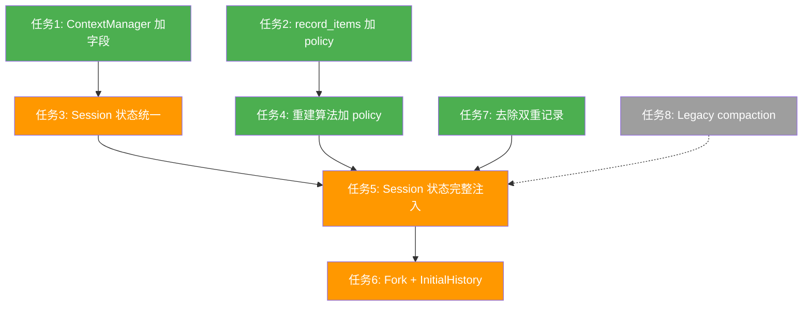

# Thread Resume 基础设施补齐：详细解决方案

本文档为 `infrastructure-gap-plan.md` 中列出的 8 项差距提供逐项的代码级解决方案。

---

## 第一层：ContextManager 扩展

### 任务 1：ContextManager 增加 `reference_context_item` 和 `token_info`

**文件**：`src-tauri/src/core/context_manager/history.rs`

**改动**：

```rust
// ── 修改 ContextManager 结构体 ──

use crate::core::rollout::policy::TurnContextItem;
use crate::protocol::types::TokenUsageInfo;

pub struct ContextManager {
    items: Vec<ResponseInputItem>,
    last_api_total_tokens: i64,
    // ↓ 新增
    token_info: Option<TokenUsageInfo>,
    reference_context_item: Option<TurnContextItem>,
}

// Default 实现中新增字段初始化为 None

// ── 新增方法 ──

impl ContextManager {
    pub fn token_info(&self) -> Option<&TokenUsageInfo> {
        self.token_info.as_ref()
    }

    pub fn set_token_info(&mut self, info: Option<TokenUsageInfo>) {
        self.token_info = info;
    }

    pub fn reference_context_item(&self) -> Option<&TurnContextItem> {
        self.reference_context_item.as_ref()
    }

    pub fn set_reference_context_item(&mut self, item: Option<TurnContextItem>) {
        self.reference_context_item = item;
    }
}
```

**测试**：在现有 `mod tests` 中增加：
- `set_and_get_token_info`
- `set_and_get_reference_context_item`

**验证**：`cargo test --lib -- context_manager`

---

### 任务 2：record_items 支持 item 级别截断策略

**背景**：
- Mosaic 已有 `TruncationPolicy`（`KeepRecent / KeepRecentTokens / AutoCompact`）— 这是**历史级别**策略，控制保留多少条消息
- codex-main 的 `TruncationPolicy`（`Bytes(usize) / Tokens(usize)`）— 这是**单条 item 级别**策略，控制单条 function_call_output 的最大长度
- 两者语义不同，不应混用

**方案**：在 `truncate_output_if_needed` 中参数化截断限制，而非引入新类型。

**文件**：`src-tauri/src/core/context_manager/history.rs`

**改动**：

```rust
// ── 现有常量改为默认值 ──
const DEFAULT_MAX_OUTPUT_BYTES: usize = 128 * 1024; // 128 KiB

// ── 新增 ItemTruncationPolicy ──
/// Per-item output truncation policy.
#[derive(Debug, Clone, Copy)]
pub enum ItemTruncationPolicy {
    /// Truncate to at most N bytes (UTF-8 safe).
    Bytes(usize),
    /// Truncate to at most N estimated tokens (~4 bytes/token).
    Tokens(usize),
}

impl ItemTruncationPolicy {
    fn max_bytes(&self) -> usize {
        match self {
            Self::Bytes(b) => *b,
            Self::Tokens(t) => t.saturating_mul(4),
        }
    }
}

impl Default for ItemTruncationPolicy {
    fn default() -> Self {
        Self::Bytes(DEFAULT_MAX_OUTPUT_BYTES)
    }
}

// ── 修改 record_items 签名 ──

impl ContextManager {
    /// Record items with explicit truncation policy.
    pub fn record_items_with_policy(
        &mut self,
        items: impl IntoIterator<Item = ResponseInputItem>,
        policy: ItemTruncationPolicy,
    ) {
        let max_bytes = policy.max_bytes();
        for item in items {
            if !is_api_item(&item) {
                continue;
            }
            let processed = truncate_output_with_limit(item, max_bytes);
            self.items.push(processed);
        }
    }

    /// Record items with default truncation (128 KiB).
    /// 保持向后兼容，现有调用方不需要改动。
    pub fn record_items(&mut self, items: impl IntoIterator<Item = ResponseInputItem>) {
        self.record_items_with_policy(items, ItemTruncationPolicy::default());
    }
}

// ── 修改截断函数 ──

fn truncate_output_with_limit(item: ResponseInputItem, max_bytes: usize) -> ResponseInputItem {
    match item {
        ResponseInputItem::FunctionCallOutput { call_id, output } => {
            let truncated = match &output.body {
                FunctionCallOutputBody::Text(s) if s.len() > max_bytes => {
                    FunctionCallOutputPayload {
                        body: FunctionCallOutputBody::Text(truncate_str(s, max_bytes)),
                        success: None,
                    }
                }
                _ => output,
            };
            ResponseInputItem::FunctionCallOutput { call_id, output: truncated }
        }
        other => other,
    }
}

// truncate_output_if_needed 改为调用 truncate_output_with_limit：
fn truncate_output_if_needed(item: ResponseInputItem) -> ResponseInputItem {
    truncate_output_with_limit(item, DEFAULT_MAX_OUTPUT_BYTES)
}
```

**测试**：增加 `truncate_with_custom_policy` 测试

**验证**：`cargo test --lib -- context_manager`

---

## 第二层：Session 状态统一

### 任务 3：将 SessionInternalState 的 history 迁移到 ContextManager

**选择方案 A**：将 `SessionInternalState.history` 从 `Vec<ResponseInputItem>` 改为 `ContextManager`，并合并 `state::session::SessionState` 的关键字段。

**理由**：方案 B（仅加 setter）会导致两套历史管理并存，后续维护成本更高。

**文件**：`src-tauri/src/core/session.rs`

**改动步骤**：

#### 3a. 修改 SessionInternalState

```rust
use crate::core::context_manager::history::ContextManager;
use crate::core::rollout::policy::TurnContextItem;
use crate::core::rollout::reconstruction::PreviousTurnSettings;
use crate::protocol::types::TokenUsageInfo;

pub struct SessionInternalState {
    /// Conversation history managed by ContextManager.
    pub history: ContextManager,                          // 改：Vec → ContextManager
    pub turn_active: bool,
    pub pending_approval: Option<PendingApproval>,
    pub turn_context: Option<TurnContext>,
    pub custom_instructions: Option<String>,
    pub exec_allow_list: Vec<Vec<String>>,
    // ↓ 从 state::SessionState 合并过来
    pub previous_turn_settings: Option<PreviousTurnSettings>,
    pub active_mcp_tool_selection: Option<Vec<String>>,
}
```

#### 3b. 修改 SessionInternalState::new()

```rust
impl SessionInternalState {
    pub fn new() -> Self {
        Self {
            history: ContextManager::new(),
            turn_active: false,
            pending_approval: None,
            turn_context: None,
            custom_instructions: None,
            exec_allow_list: Vec::new(),
            previous_turn_settings: None,
            active_mcp_tool_selection: None,
        }
    }
}
```

#### 3c. 迁移 Session 的历史操作方法

```rust
impl Session {
    // add_to_history：改为委托给 ContextManager
    pub async fn add_to_history(&self, items: Vec<ResponseInputItem>) {
        let mut state = self.state.lock().await;
        state.history.record_items(items);
    }

    // history：返回 raw_items 的克隆
    pub async fn history(&self) -> Vec<ResponseInputItem> {
        self.state.lock().await.history.raw_items().to_vec()
    }

    // history_len
    pub async fn history_len(&self) -> usize {
        self.state.lock().await.history.len()
    }

    // rollback：使用 ContextManager 的能力
    pub async fn rollback(&self, steps: usize) -> Result<(), CodexError> {
        let mut state = self.state.lock().await;
        let len = state.history.len();
        if steps > len {
            return Err(CodexError::new(
                ErrorCode::InvalidInput,
                format!("cannot rollback {steps} steps: history only has {len} entries"),
            ));
        }
        // ContextManager 没有 truncate(n)，需要取出 items 再截断
        let mut items = state.history.raw_items().to_vec();
        items.truncate(len - steps);
        state.history.replace(items);
        Ok(())
    }

    // compact_history：现有实现中 state.history = result.history 改为
    // state.history.replace(result.history)

    // ── 新增 setter/getter ──

    pub async fn set_reference_context_item(&self, item: Option<TurnContextItem>) {
        let mut state = self.state.lock().await;
        state.history.set_reference_context_item(item);
    }

    pub async fn set_token_info(&self, info: Option<TokenUsageInfo>) {
        let mut state = self.state.lock().await;
        state.history.set_token_info(info);
    }

    pub async fn set_previous_turn_settings(&self, settings: Option<PreviousTurnSettings>) {
        let mut state = self.state.lock().await;
        state.previous_turn_settings = settings;
    }

    pub async fn previous_turn_settings(&self) -> Option<PreviousTurnSettings> {
        self.state.lock().await.previous_turn_settings.clone()
    }

    pub async fn set_mcp_tool_selection(&self, tool_names: Vec<String>) {
        let mut state = self.state.lock().await;
        if tool_names.is_empty() {
            state.active_mcp_tool_selection = None;
        } else {
            let mut selected = Vec::new();
            let mut seen = std::collections::HashSet::new();
            for name in tool_names {
                if seen.insert(name.clone()) {
                    selected.push(name);
                }
            }
            state.active_mcp_tool_selection = Some(selected);
        }
    }
}
```

#### 3d. 修改 compact_history 中的历史赋值

```rust
// 原：state.history = result.history;
// 改：
state.history.replace(result.history);
```

#### 3e. 修改 codex.rs 中的 add_to_history 调用

`codex.rs` 中 `session.add_to_history(vec![...])` 调用不需要改动 — `add_to_history` 内部已改为走 `ContextManager::record_items`。

**影响范围扫描**：
- `session.rs`：`add_to_history`、`history`、`history_len`、`rollback`、`compact_history` — 全部需要适配
- `codex.rs`：`add_to_history` 调用 — 签名不变，无需改动
- `commands.rs`：无直接操作 session history — 无需改动

**测试**：
- 现有 `session.rs` 的 `mod tests` 需要适配（history 从 Vec 变为 ContextManager）
- 运行 `cargo test --lib -- session`

**验证**：`cargo check` + `cargo test --lib`

---

## 第三层：Resume/Fork 逻辑完善

### 任务 4：重建算法注入 ItemTruncationPolicy

**文件**：`src-tauri/src/core/rollout/reconstruction.rs`

**改动**：

```rust
use crate::core::context_manager::history::ItemTruncationPolicy;

pub fn reconstruct_history_from_rollout(
    rollout_items: &[RolloutItem],
    item_truncation: ItemTruncationPolicy,    // 新增参数
) -> RolloutReconstruction {
    // ... 反向扫描不变 ...

    // 正向重放中：
    RolloutItem::ResponseItem(response_item) => {
        let input_item: ResponseInputItem = response_item.clone().into();
        history.record_items_with_policy(
            std::iter::once(input_item),
            item_truncation,                  // 使用传入的策略
        );
    }
    // ...
}
```

**调用方修改**（`codex.rs`）：

```rust
let reconstruction = reconstruct_history_from_rollout(
    &rh.history,
    ItemTruncationPolicy::default(),  // 或从 config 中读取
);
```

**测试**：现有测试传入 `ItemTruncationPolicy::default()`

---

### 任务 5：Session 状态完整注入

**文件**：`src-tauri/src/core/codex.rs`

**改动**：在 `run_with_history` 中，替换当前的简单注入：

```rust
if let Some(rh) = resumed_history {
    let reconstruction = reconstruct_history_from_rollout(
        &rh.history,
        ItemTruncationPolicy::default(),
    );

    // 1. 模型一致性检查（已有）
    if let Some(ref prev) = reconstruction.previous_turn_settings {
        if prev.model != current_model {
            self.emit(EventMsg::Warning(WarningEvent { ... })).await;
        }
    }

    // 2. 注入 previous_turn_settings（新增）
    session.set_previous_turn_settings(reconstruction.previous_turn_settings).await;

    // 3. 注入 reference_context_item（新增）
    session.set_reference_context_item(reconstruction.reference_context_item).await;

    // 4. 注入历史（改进：走 ContextManager）
    if !reconstruction.history.is_empty() {
        session.add_to_history(reconstruction.history).await;
    }

    // 5. 恢复 token 信息（新增）
    if let Some(token_info) = reconstruction.last_token_info {
        session.set_token_info(Some(token_info)).await;
    }

    // 6. 恢复 MCP 工具选择（新增）
    if let Some(tools) = extract_mcp_tool_selection_from_rollout(&rh.history) {
        session.set_mcp_tool_selection(tools).await;
    }
}
```

**新增函数**（`codex.rs` 或 `reconstruction.rs`）：

```rust
/// 从 rollout 中提取最后的 MCP 工具选择状态。
///
/// 扫描 ResponseItem::FunctionCall 中名为 "search_bm25" 的调用，
/// 从其对应的 FunctionCallOutput 中解析 active_selected_tools 字段。
fn extract_mcp_tool_selection_from_rollout(
    rollout_items: &[RolloutItem],
) -> Option<Vec<String>> {
    let mut search_call_ids = std::collections::HashSet::new();
    let mut active_selected_tools: Option<Vec<String>> = None;

    for item in rollout_items {
        let RolloutItem::ResponseItem(response_item) = item else { continue };
        match response_item {
            ResponseItem::FunctionCall { name, call_id, .. }
                if name == "search_bm25" =>
            {
                search_call_ids.insert(call_id.clone());
            }
            ResponseItem::FunctionCallOutput { call_id, output } => {
                if !search_call_ids.contains(call_id) { continue; }
                let Some(content) = output.text_content() else { continue };
                let Ok(payload) = serde_json::from_str::<serde_json::Value>(content) else { continue };
                let Some(tools) = payload.get("active_selected_tools")
                    .and_then(|v| v.as_array()) else { continue };
                let Some(tools) = tools.iter()
                    .map(|v| v.as_str().map(str::to_string))
                    .collect::<Option<Vec<_>>>() else { continue };
                active_selected_tools = Some(tools);
            }
            _ => {}
        }
    }
    active_selected_tools
}
```

**RolloutReconstruction 修改**：`last_token_count: Option<i64>` 改为 `last_token_info: Option<TokenUsageInfo>`

```rust
// reconstruction.rs 反向扫描中：
if last_token_info.is_none() {
    if let RolloutItem::EventMsg(EventMsg::TokenCount(tc)) = item {
        if let Some(ref info) = tc.info {
            last_token_info = Some(info.clone());
        }
    }
}
```

---

### 任务 6：Fork 独立后处理 + InitialHistory 枚举

**文件**：新建 `src-tauri/src/core/initial_history.rs`

```rust
use crate::core::rollout::policy::RolloutItem;
use crate::core::rollout::recorder::ResumedHistory;

/// 会话初始历史的三种来源。
#[derive(Debug, Clone)]
pub enum InitialHistory {
    /// 全新会话，无历史。
    New,
    /// 从已有 rollout 恢复（保留原 thread_id）。
    Resumed(ResumedHistory),
    /// 从已有 rollout 分叉（创建新 thread_id，可截断）。
    Forked(Vec<RolloutItem>),
}
```

**文件**：`src-tauri/src/core/rollout/truncation.rs`（新建）

```rust
use crate::core::rollout::policy::RolloutItem;
use crate::protocol::event::EventMsg;
use crate::protocol::types::ResponseInputItem;

/// 返回 rollout 中用户消息的位置索引（考虑 rollback）。
pub fn user_message_positions(items: &[RolloutItem]) -> Vec<usize> {
    let mut positions = Vec::new();
    for (idx, item) in items.iter().enumerate() {
        match item {
            RolloutItem::ResponseItem(resp) => {
                let input: ResponseInputItem = resp.clone().into();
                if matches!(&input, ResponseInputItem::Message { role, .. } if role == "user") {
                    positions.push(idx);
                }
            }
            RolloutItem::EventMsg(EventMsg::ThreadRolledBack(rb)) => {
                let n = rb.num_turns as usize;
                let new_len = positions.len().saturating_sub(n);
                positions.truncate(new_len);
            }
            _ => {}
        }
    }
    positions
}

/// 截断 rollout 到第 n 条用户消息之前（0-based）。
/// n = usize::MAX 表示不截断。
pub fn truncate_before_nth_user_message(
    items: &[RolloutItem],
    n: usize,
) -> Vec<RolloutItem> {
    if n == usize::MAX {
        return items.to_vec();
    }
    let positions = user_message_positions(items);
    if positions.len() <= n {
        return Vec::new();
    }
    items[..positions[n]].to_vec()
}
```

**文件**：`src-tauri/src/core/codex.rs`

修改 `spawn_with_history` 和 `run_with_history` 接受 `InitialHistory`：

```rust
pub async fn spawn_with_history(
    config: ConfigLayerStack,
    cwd: PathBuf,
    initial_history: InitialHistory,
) -> Result<CodexHandle, CodexError> { ... }

async fn run_with_history(&self, initial_history: InitialHistory) -> Result<(), CodexError> {
    // ...
    match initial_history {
        InitialHistory::New => {
            // 现有的新会话逻辑
        }
        InitialHistory::Resumed(rh) => {
            // 现有的 resume 逻辑（任务 5 的完整注入）
        }
        InitialHistory::Forked(rollout_items) => {
            // 1. 重建历史（同 Resume）
            let reconstruction = reconstruct_history_from_rollout(
                &rollout_items, ItemTruncationPolicy::default(),
            );
            // 2. 注入所有状态（同 Resume）
            session.set_previous_turn_settings(reconstruction.previous_turn_settings).await;
            session.set_reference_context_item(reconstruction.reference_context_item).await;
            if !reconstruction.history.is_empty() {
                session.add_to_history(reconstruction.history).await;
            }
            if let Some(info) = reconstruction.last_token_info {
                session.set_token_info(Some(info)).await;
            }
            if let Some(tools) = extract_mcp_tool_selection_from_rollout(&rollout_items) {
                session.set_mcp_tool_selection(tools).await;
            }
            // 3. Fork 特有：不追加 initial context（Mosaic 当前无此概念，预留）
        }
    }
}
```

**文件**：`src-tauri/src/commands.rs`

修改 `thread_fork`：

```rust
pub async fn thread_fork(
    app: AppHandle,
    state: State<'_, AppState>,
    source_thread_id: String,
    nth_user_message: Option<usize>,  // 新增：截断点
    cwd: Option<String>,
) -> Result<String, String> {
    // 加载源 rollout
    let source_rollout_path = ...;
    let resumed = RolloutRecorder::get_rollout_history(&rollout_path).await...;

    // 截断
    let nth = nth_user_message.unwrap_or(usize::MAX);
    let forked_items = truncate_before_nth_user_message(&resumed.history, nth);
    let initial_history = if forked_items.is_empty() {
        InitialHistory::New
    } else {
        InitialHistory::Forked(forked_items)
    };

    // spawn
    let handle = Codex::spawn_with_history(config, work_dir, initial_history).await...;
    // ...
}
```

---

## 第四层：边缘修复

### 任务 7：去除 UserMessage/AgentMessage 双重记录

**文件**：`src-tauri/src/core/rollout/reconstruction.rs`

**改动**：在正向重放中删除 `EventMsg::UserMessage` 和 `EventMsg::AgentMessage` 分支。

```rust
// 删除这两个分支：
// RolloutItem::EventMsg(EventMsg::UserMessage(user_msg)) => { ... }
// RolloutItem::EventMsg(EventMsg::AgentMessage(agent_msg)) => { ... }
```

**前提**：确认所有用户/助手消息都通过 `RolloutItem::ResponseItem` 路径记录。如果存在只有 `EventMsg::UserMessage` 而没有对应 `ResponseItem` 的情况（例如旧 rollout），则需要保留作为 fallback。

**验证方法**：检查 `spawn_event_bridge` 中是否对每条 UserMessage/AgentMessage 都同时写入了 ResponseItem。如果是，则可以安全删除。如果不是，需要在 `spawn_event_bridge` 中补充 ResponseItem 写入后再删除。

---

### 任务 8：Legacy compaction 精确重建

**优先级**：P2（低）— 仅影响旧格式 rollout

**文件**：`src-tauri/src/core/rollout/reconstruction.rs`

**改动**：将 legacy compaction 分支从简单文本摘要改为精确重建。

```rust
RolloutItem::Compacted(compacted) if compacted.replacement_history.is_none() => {
    // 收集当前历史中的用户消息
    let user_messages: Vec<String> = history.raw_items().iter()
        .filter_map(|item| match item {
            ResponseInputItem::Message { role, content, .. } if role == "user" => {
                content.iter().find_map(|c| match c {
                    ContentItem::InputText { text } | ContentItem::OutputText { text } => {
                        Some(text.clone())
                    }
                    _ => None,
                })
            }
            _ => None,
        })
        .collect();

    // 重建：保留最近的用户消息（token 预算内）+ 摘要
    let mut rebuilt = Vec::new();
    let summary = format!("{SUMMARY_PREFIX}\n{}", compacted.message);
    // 添加最近的用户消息（从后往前，token 预算 1000）
    let max_tokens = 1000usize;
    let mut remaining = max_tokens;
    let mut selected: Vec<String> = Vec::new();
    for msg in user_messages.iter().rev() {
        let tokens = msg.len() / 4;
        if tokens <= remaining {
            selected.push(msg.clone());
            remaining = remaining.saturating_sub(tokens);
        } else {
            break;
        }
    }
    selected.reverse();
    for msg in &selected {
        rebuilt.push(ResponseInputItem::text_message("user", msg.clone()));
    }
    rebuilt.push(ResponseInputItem::text_message("user", summary));
    history.replace(rebuilt);
}
```

---

## 执行顺序与验证检查点



每个任务完成后的验证检查点：

| 检查点 | 命令 |
|--------|------|
| 编译通过 | `cargo check` |
| 相关测试通过 | `cargo test --lib -- context_manager session reconstruction state_db roundtrip truncation` |
| 无回归 | `cargo test --lib` |
| TS 无新错误 | `npx tsc --noEmit` |

## 风险与缓解

| 风险 | 缓解措施 |
|------|---------|
| 任务 3 改动面大，可能引入回归 | 逐方法迁移，每迁移一个方法就跑一次 `cargo test` |
| `add_to_history` 语义变化（Vec::extend → ContextManager::record_items 会过滤非 API item） | 检查所有调用方，确认不会丢失必要的 item |
| `rollback` 实现变复杂（ContextManager 无 truncate） | 给 ContextManager 加 `truncate(n)` 方法 |
| 任务 7 删除 EventMsg 分支可能导致旧 rollout 丢失消息 | 先验证 spawn_event_bridge 是否对所有消息都写入了 ResponseItem |
| `state::session::SessionState` 变成死代码 | 任务 3 完成后评估是否删除或保留为独立模块 |
