# AI 交互组件工作计划

> 版本：1.0 | 创建时间：2026-03-26

## 阶段概览

```mermaid
gantt
    title AI 交互组件实现计划
    dateFormat X
    axisFormat %s

    section 阶段一：基础设施
    安装依赖 & Streamdown 封装       :a1, 0, 1
    新增 Store (approval/clarification) :a2, 1, 2
    扩展 useCodexEvent 事件处理       :a3, 2, 3

    section 阶段二：基础组件
    共享组件 (Avatar/StatusBadge)     :b1, 3, 4
    TaskStarted/Completed 指示器     :b2, 4, 5
    ThinkingPanel 思考面板           :b3, 5, 6

    section 阶段三：工具调用组件
    WebSearchCard 网络搜索           :c1, 6, 7
    McpToolCallCard MCP 调用         :c2, 7, 8
    CodeExecutionBlock 代码执行       :c3, 8, 9

    section 阶段四：审批与差异组件
    ApprovalRequestCard 审批卡片     :d1, 9, 10
    CodeDiffBlock 代码差异           :d2, 10, 11
    ClarificationCard 澄清卡片      :d3, 11, 12

    section 阶段五：集成
    Message.tsx 重构 + Streamdown    :e1, 12, 13
    MessageList.tsx 重构             :e2, 13, 14
    全局样式调整                     :e3, 14, 15
```

## 详细步骤

### 阶段一：基础设施（步骤 1-3）

#### 步骤 1：安装依赖 & Streamdown 封装
- 安装 `@streamdown/code` 和 `@streamdown/cjk`
- 创建 `src/components/chat/shared/StreamdownRenderer.tsx`
- 在 `global.css` 中引入 `streamdown/styles.css`
- 添加必要的样式覆盖以适配 MUI 主题

#### 步骤 2：新增 Store
- 创建 `src/stores/approvalStore.ts`
  - `approvals: Map<string, ApprovalRequestState>`
  - `addApproval` / `removeApproval` / `clearAll`
- 创建 `src/stores/clarificationStore.ts`
  - `requests: Map<string, ClarificationState>`
  - `addRequest` / `removeRequest`
- 在 `src/types/chat.ts` 中新增 `ClarificationState` 类型

#### 步骤 3：扩展 useCodexEvent
- 处理 `exec_approval_request` → `approvalStore.addApproval`
- 处理 `apply_patch_approval_request` → `approvalStore.addApproval`
- 处理 `request_user_input` → `clarificationStore.addRequest`
- 在 `task_started` 时清空 approval 和 clarification store

### 阶段二：基础组件（步骤 4-6）

#### 步骤 4：共享组件
- 创建 `src/components/chat/shared/` 目录
- `AgentAvatar.tsx` — 渐变蓝色头像 (从 Message.tsx 提取)
- `UserAvatar.tsx` — 白色边框头像 (从 Message.tsx 提取)
- `StatusBadge.tsx` — 状态标签 (已完成/运行中/失败)

#### 步骤 5：任务指示器
- `src/components/chat/indicators/TaskStartedIndicator.tsx`
  - 灰色分隔线 + "任务开始" 标签 + 图标
- `src/components/chat/indicators/TaskCompletedIndicator.tsx`
  - 绿色分隔线 + "任务完成" 标签 + 图标

#### 步骤 6：思考面板
- `src/components/chat/agent/ThinkingPanel.tsx`
  - 可折叠的 `
` 风格面板
  - 浅灰背景 `#f8fafc`，边框 `#e2e8f0`
  - 展开/折叠箭头图标
  - 显示推理文本内容

### 阶段三：工具调用组件（步骤 7-9）

#### 步骤 7：网络搜索卡片
- `src/components/chat/agent/WebSearchCard.tsx`
  - 蓝色图标背景 `#eff6ff`
  - 标题 "网络搜索" + 搜索查询文本
  - 状态标签 (已完成/运行中)

#### 步骤 8：MCP 工具调用卡片
- `src/components/chat/agent/McpToolCallCard.tsx`
  - 橙色图标背景 `#fff7ed`
  - 标题 "MCP 工具调用" + 调用详情
  - 状态标签

#### 步骤 9：代码执行终端块
- `src/components/chat/agent/CodeExecutionBlock.tsx`
  - 深色终端风格 `#0f172a`
  - macOS 风格窗口按钮 (红/黄/绿)
  - 文件名标题栏
  - 等宽字体代码内容
  - 绿色提示符 `$` + 蓝色命令文本
  - 复制按钮
  - 使用 Streamdown 渲染代码内容

### 阶段四：审批与差异组件（步骤 10-12）

#### 步骤 10：执行审批卡片
- `src/components/chat/agent/ApprovalRequestCard.tsx`
  - 暖黄色背景 `#fffbeb`，边框 `rgba(253,230,138,0.5)`
  - 警告图标 + "需要执行审批" 标题
  - 描述文本
  - "批准执行" (实心按钮) + "拒绝" (描边按钮)
  - 连接 approvalStore 和 submitOp

#### 步骤 11：代码差异块
- `src/components/chat/agent/CodeDiffBlock.tsx`
  - 浅灰背景 `#f2f4f6`
  - 文件名标题栏 + "更新" 标签
  - 等宽字体差异内容
  - 红色删除行 `#fef2f2` + 绿色新增行 `#ecfdf5`
  - 解析 unified diff 格式
  - 使用 Streamdown 渲染 diff 代码

#### 步骤 12：需要澄清卡片
- `src/components/chat/agent/ClarificationCard.tsx`
  - 蓝色背景 `#f0f7ff`，边框 `rgba(124,185,232,0.3)`
  - 图标 + "需要澄清" 标题
  - 问题文本（支持加粗关键词）
  - 右上角装饰图案
  - 连接 clarificationStore

### 阶段五：集成（步骤 13-15）

#### 步骤 13：Message.tsx 重构
- 将 `AgentMessage` 的纯文本渲染替换为 `<StreamdownRenderer>`
- 在 Agent 消息中按顺序渲染各子组件
- 根据 streamingTurn 状态决定 `isStreaming` prop
- 保留 UserMessage 的现有渲染逻辑（调整样式匹配设计稿）

#### 步骤 14：MessageList.tsx 重构
- 在消息流开头插入 `<TaskStartedIndicator>`（当 turn 开始时）
- 在消息流结尾插入 `<TaskCompletedIndicator>`（当 turn 完成时）
- 将流式 agent 消息也使用 `<StreamdownRenderer>` 渲染
- 集成 approvalStore 和 clarificationStore 的数据

#### 步骤 15：全局样式调整
- 更新 `src/styles/global.css` 引入 streamdown 样式
- 确保 Streamdown 渲染的 Markdown 与 MUI 主题协调
- 调整代码块、表格等元素的样式覆盖
- 更新 `src/components/chat/index.ts` 导出新组件

## 文件变更清单

### 新增文件
| 文件路径 | 说明 |
|---------|------|
| `src/components/chat/shared/StreamdownRenderer.tsx` | Streamdown 封装 |
| `src/components/chat/shared/AgentAvatar.tsx` | Agent 头像 |
| `src/components/chat/shared/UserAvatar.tsx` | 用户头像 |
| `src/components/chat/shared/StatusBadge.tsx` | 状态标签 |
| `src/components/chat/indicators/TaskStartedIndicator.tsx` | 任务开始指示器 |
| `src/components/chat/indicators/TaskCompletedIndicator.tsx` | 任务完成指示器 |
| `src/components/chat/agent/ThinkingPanel.tsx` | 思考面板 |
| `src/components/chat/agent/WebSearchCard.tsx` | 网络搜索卡片 |
| `src/components/chat/agent/McpToolCallCard.tsx` | MCP 工具调用卡片 |
| `src/components/chat/agent/CodeExecutionBlock.tsx` | 代码执行终端块 |
| `src/components/chat/agent/ApprovalRequestCard.tsx` | 执行审批卡片 |
| `src/components/chat/agent/CodeDiffBlock.tsx` | 代码差异块 |
| `src/components/chat/agent/ClarificationCard.tsx` | 需要澄清卡片 |
| `src/stores/approvalStore.ts` | 审批状态管理 |
| `src/stores/clarificationStore.ts` | 澄清请求状态管理 |

### 修改文件
| 文件路径 | 说明 |
|---------|------|
| `src/components/chat/Message.tsx` | 重构，集成 Streamdown 和子组件 |
| `src/components/chat/MessageList.tsx` | 重构，添加指示器和新 store |
| `src/components/chat/index.ts` | 更新导出 |
| `src/hooks/useCodexEvent.ts` | 扩展事件处理 |
| `src/types/chat.ts` | 新增类型定义 |
| `src/types/index.ts` | 更新导出 |
| `src/styles/global.css` | 引入 streamdown 样式 |
| `package.json` | 新增依赖 |

### 可删除文件
| 文件路径 | 说明 |
|---------|------|
| `src/components/chat/ToolCallDisplay.tsx` | 被新的细分组件替代 |
| `src/components/chat/ApprovalRequest.tsx` | 被 ApprovalRequestCard 替代 |
