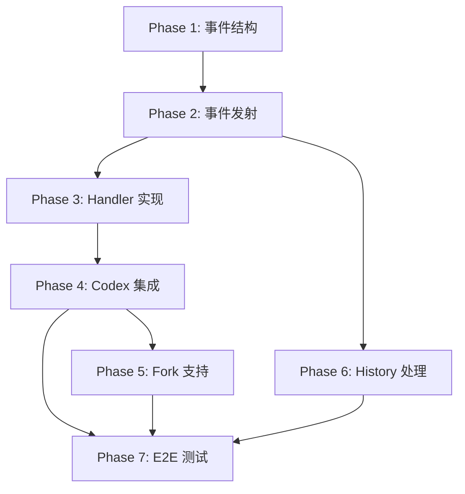

# Collab (Multi-Agent) 功能移植计划

> 源码参考: `/Users/zhaojimo/Downloads/codex-main`
> 目标项目: Mosaic-Desktop

## 现状分析

### Mosaic 已有的基础设施 (✅ 可直接复用)

| 模块 | 文件 | 行数 | 状态 |
|------|------|------|------|
| `AgentControl` | `core/agent/control.rs` | 900 | ✅ spawn/send_input/resume/wait/close 已实现 |
| `Guards` | `core/agent/guards.rs` | 356 | ✅ spawn slot 预留、nickname 分配已实现 |
| `AgentRoleConfig` | `core/agent/role.rs` | 314 | ✅ role 解析、built-in/user-defined 已实现 |
| `agent_status_from_event` | `core/agent/status.rs` | 78 | ✅ 事件到状态映射已实现 |
| `BatchJobConfig/run_batch_jobs` | `core/agent/control.rs` | ~80 | ✅ CSV 批量任务已实现 |
| `MultiAgentHandler` (骨架) | `tools/handlers/multi_agents.rs` | 137 | ⚠️ 参数解析完成，handler 全部返回 stub |
| `Collab 事件类型` | `protocol/event.rs` | ~100 | ⚠️ 事件结构已定义但字段简化 |
| `ThreadManager` | `core/thread_manager.rs` | 278 | ✅ start/remove/list/subscribe 已实现 |
| `Codex` (引擎) | `core/codex.rs` | 2690 | ✅ spawn/run/handle_op 已实现 |
| `Session` | `core/session.rs` | 883 | ✅ turn 管理、history、config 已实现 |
| `thread_history` (builder) | `core/thread_history.rs` | 741 | ✅ 已从 codex-main 迁移 |

### 需要移植的差异 (codex-main → Mosaic)

| 差异 | codex-main | Mosaic | 工作量 |
|------|-----------|--------|--------|
| `multi_agents.rs` handler 实现 | 2149 行完整实现 | 137 行 stub | **大** |
| Collab 事件结构完善 | 含 sender/receiver/prompt/status | 简化版只有 call_id | **中** |
| `AgentControl` 事件发射 | spawn/close 发射 Collab 事件 | 无事件发射 | **中** |
| `thread_history.rs` Collab handler | 处理 12 种 Collab 事件 | 未处理 | **小** |
| `Codex.spawn_agent` 集成 | Session 中调用 AgentControl | 未集成 | **中** |
| `ThreadManager.fork_thread` | 支持 fork 历史到子 agent | 未实现 | **中** |
| 工具注册 | collab 工具注册到 ToolRouter | 未注册 | **小** |

## 分批执行计划

### Phase 1: 完善 Collab 事件结构 ✅ 已完成

**目标**: 让 Mosaic 的 Collab 事件结构与 codex-main 完全一致

**文件变更**:
- `src-tauri/src/protocol/event.rs` — 更新 Collab 事件结构体字段
- `src-tauri/src/protocol/types.rs` — 如需新增类型

**具体工作**:
1. 对齐 `CollabAgentSpawnBeginEvent` 字段 (添加 sender_thread_id, prompt)
2. 对齐 `CollabAgentSpawnEndEvent` 字段 (添加 sender_thread_id, new_thread_id, status 等)
3. 对齐 `CollabAgentInteractionBegin/EndEvent` 字段
4. 对齐 `CollabWaiting/Close/ResumeBegin/EndEvent` 字段
5. 确保 serde 序列化与 codex-main 一致
6. 更新 `roundtrip_tests.rs` 中的 proptest

**验证**: `cargo test --lib -- protocol::roundtrip_tests`

---

### Phase 2: AgentControl 事件发射 ⏳ 合并到 Phase 4

**目标**: spawn/close/send_input/resume/wait 操作发射对应的 Collab 事件

**文件变更**:
- `src-tauri/src/core/agent/control.rs` — 在各方法中发射事件

**具体工作**:
1. `spawn_agent` → 发射 `CollabAgentSpawnBeginEvent` + `CollabAgentSpawnEndEvent`
2. `send_input` → 发射 `CollabAgentInteractionBeginEvent` + `CollabAgentInteractionEndEvent`
3. `close_agent` → 发射 `CollabCloseBeginEvent` + `CollabCloseEndEvent`
4. `resume_agent` → 发射 `CollabResumeBeginEvent` + `CollabResumeEndEvent`
5. `wait` → 发射 `CollabWaitingBeginEvent` + `CollabWaitingEndEvent`

**验证**: `cargo test --lib -- core::agent::control::tests`

---

### Phase 3: MultiAgentHandler 完整实现 ✅ 已完成

**目标**: 将 stub handler 替换为完整实现，接入 AgentControl

**文件变更**:
- `src-tauri/src/core/tools/handlers/multi_agents.rs` — 完整实现 5 个工具 handler

**具体工作**:
1. handler 需要持有 `Arc<AgentControl>` 引用
2. `spawn_agent` handler:
   - 参数验证 (message/items 互斥、非空检查)
   - 调用 `AgentControl::spawn_agent`
   - 构建 `SpawnAgentResult` 返回
3. `send_input` handler:
   - 参数验证 (id 格式、message/items 互斥)
   - 调用 `AgentControl::send_input`
4. `resume_agent` handler:
   - 调用 `AgentControl::resume_agent`
5. `wait` handler:
   - timeout 范围验证 (已有)
   - 调用 `AgentControl::wait` 带超时
   - 返回 agent 状态列表
6. `close_agent` handler:
   - 调用 `AgentControl::close_agent`

**验证**: 新增单元测试 + `cargo test --lib -- tools::handlers::multi_agents`

---

### Phase 4: Codex 引擎集成 ✅ 已完成

**目标**: 将 AgentControl 集成到 Codex 引擎的 turn 执行流程中

**文件变更**:
- `src-tauri/src/core/codex.rs` — 在 Codex 中创建和持有 AgentControl
- `src-tauri/src/core/tools/router.rs` — 注册 collab 工具到 ToolRouter

**具体工作**:
1. `Codex::new` 中创建 `AgentControl` 实例
2. `Codex::spawn` 中将 `AgentControl` 传递给 `MultiAgentHandler`
3. `ToolRouter` 注册 `MultiAgentHandler`
4. 工具规格定义 (spawn_agent/send_input/wait/close_agent/resume_agent)
5. Feature flag: `Feature::MultiAgent` 控制工具可见性

**验证**: `cargo test --lib -- core::codex::tests`

---

### Phase 5: ThreadManager fork 支持 ✅ 已完成

**目标**: 支持 fork 父线程历史到子 agent

**文件变更**:
- `src-tauri/src/core/thread_manager.rs` — 添加 `fork_thread` 方法
- `src-tauri/src/core/agent/control.rs` — spawn_agent 的 fork 模式

**具体工作**:
1. `ThreadManager::fork_thread` — 复制 rollout 历史到新线程
2. `AgentControl::spawn_agent` fork 模式 — 调用 fork_thread
3. fork 后注入 spawn output 到父线程历史

**验证**: `cargo test --lib -- core::thread_manager`

---

### Phase 6: thread_history Collab 事件处理 ✅ 已完成

**目标**: rollout 重放时正确还原 Collab 工具调用

**文件变更**:
- `src-tauri/src/protocol/items.rs` — 添加 `CollabToolCallItem` 类型
- `src-tauri/src/core/thread_history.rs` — 添加 Collab 事件 handler
- `src/types/events.ts` — 前端类型
- `src/components/chat/Message.tsx` — 前端渲染

**具体工作**:
1. 新增 `CollabToolCallItem` (id, tool, status, sender, receivers, prompt)
2. handler: `CollabAgentSpawnEnd` → upsert `CollabToolCallItem`
3. handler: `CollabAgentInteractionEnd` → upsert
4. handler: `CollabWaitingEnd` → upsert
5. handler: `CollabCloseEnd` → upsert
6. handler: `CollabResumeEnd` → upsert
7. 前端 `TurnItem` 添加 `CollabToolCall` 变体
8. `Message.tsx` 渲染 Collab 工具调用卡片

**验证**: `cargo test --lib -- core::thread_history::tests` + 前端测试

---

### Phase 7: 端到端测试 + Rollout 持久化 ✅ 已完成

**目标**: 确保 Collab 事件正确持久化到 rollout 并可重放

**文件变更**:
- `src-tauri/src/core/rollout/policy.rs` — 确认 Collab 事件在 Extended 模式下持久化
- 新增集成测试

**具体工作**:
1. 确认 `is_extended_event` 包含所有 Collab End 事件
2. 编写集成测试: spawn → send_input → wait → close 完整流程
3. 验证 rollout 文件包含正确的 Collab 事件
4. 验证 `thread_get_messages` 返回正确的 Collab items

**验证**: 集成测试 + 手动验证

---

## 依赖关系

## 风险与注意事项

1. **Collab 事件结构变更** — Phase 1 会修改事件序列化格式，需要确保不破坏现有 rollout 文件的反序列化（使用 `#[serde(default)]`）
2. **AgentControl 线程安全** — 所有方法通过 `Mutex<ThreadManagerState>` 保护，但 handler 中的异步等待需要注意死锁
3. **Feature flag** — codex-main 使用 `Feature::MultiAgent` 控制，Mosaic 的 `Features` 中已有 `collab` 别名
4. **前端渲染** — Collab 工具调用的 UI 可以先用简单文本展示，后续再优化
