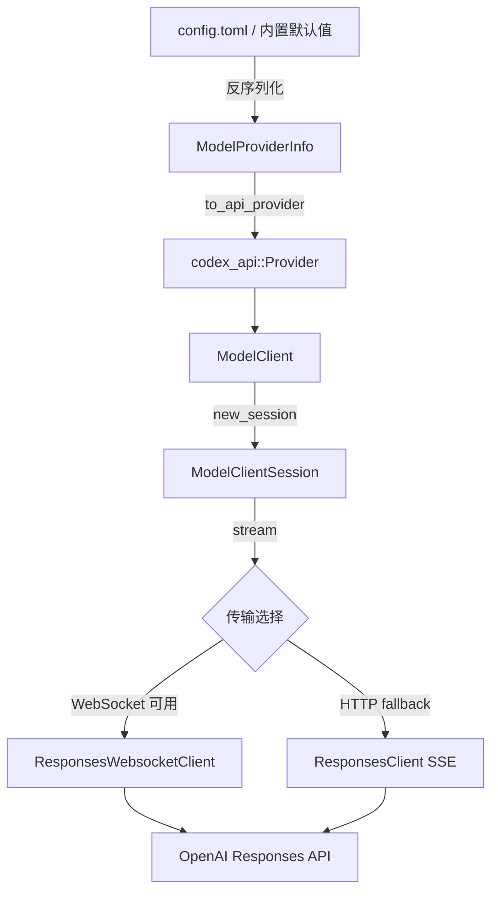

# Provider 实现文档

> 源码路径：`codex-rs/codex-api/src/provider.rs` · `codex-rs/core/src/model_provider_info.rs` · `codex-rs/core/src/client.rs`

---

## 概述

Codex 的 Provider 系统分为两层：

| 层级 | 类型 | 职责 |
|------|------|------|
| API 层 | `codex_api::Provider` | HTTP 端点配置、URL 构建、请求构造 |
| Core 层 | `ModelProviderInfo` | Provider 定义、认证、配置序列化 |

`ModelProviderInfo` 是面向用户的配置结构（可写入 `config.toml`），通过 `to_api_provider()` 转换为底层 `Provider` 供 HTTP 客户端使用。

---

## 核心类型

### `Provider`（`codex-api/src/provider.rs`）

HTTP 端点的运行时表示，持有发起请求所需的全部信息。

```rust
pub struct Provider {
    pub name: String,
    pub base_url: String,
    pub query_params: Option<HashMap<String, String>>,
    pub headers: HeaderMap,
    pub retry: RetryConfig,
    pub stream_idle_timeout: Duration,
}
```

**方法：**

| 方法 | 说明 |
|------|------|
| `url_for_path(path)` | 拼接 base_url + path，自动附加 query_params |
| `build_request(method, path)` | 构造带默认 headers 的 `Request` 对象 |
| `is_azure_responses_endpoint()` | 检测是否为 Azure OpenAI 端点 |
| `websocket_url_for_path(path)` | 将 http/https scheme 转换为 ws/wss |

---

### `RetryConfig`（`codex-api/src/provider.rs`）

Provider 级别的重试策略配置。

```rust
pub struct RetryConfig {
    pub max_attempts: u64,
    pub base_delay: Duration,
    pub retry_429: bool,   // 是否重试限流响应
    pub retry_5xx: bool,   // 是否重试服务端错误
    pub retry_transport: bool, // 是否重试传输层错误
}
```

通过 `to_policy()` 转换为 `codex-client` 的 `RetryPolicy`。

---

### `ModelProviderInfo`（`core/src/model_provider_info.rs`）

用户可配置的 Provider 定义，支持 TOML 序列化/反序列化。

```rust
pub struct ModelProviderInfo {
    pub name: String,
    pub base_url: Option<String>,
    pub env_key: Option<String>,              // API Key 环境变量名
    pub env_key_instructions: Option<String>, // 获取 Key 的说明
    pub experimental_bearer_token: Option<String>, // 直接指定 Bearer Token（不推荐）
    pub wire_api: WireApi,                    // 协议类型（目前仅 Responses）
    pub query_params: Option<HashMap<String, String>>,
    pub http_headers: Option<HashMap<String, String>>,
    pub env_http_headers: Option<HashMap<String, String>>, // 从环境变量读取的 headers
    pub request_max_retries: Option<u64>,
    pub stream_max_retries: Option<u64>,
    pub stream_idle_timeout_ms: Option<u64>,
    pub requires_openai_auth: bool,   // 是否需要 OpenAI 登录认证
    pub supports_websockets: bool,    // 是否支持 WebSocket 传输
}
```

**关键方法：**

| 方法 | 说明 |
|------|------|
| `to_api_provider(auth_mode)` | 转换为运行时 `Provider`，根据 auth_mode 选择默认 base_url |
| `api_key()` | 从环境变量读取 API Key，未设置时返回错误 |
| `request_max_retries()` | 有效重试次数（默认 4，上限 100） |
| `stream_max_retries()` | 流式重连次数（默认 5，上限 100） |
| `stream_idle_timeout()` | 流空闲超时（默认 300 秒） |
| `is_openai()` | 判断是否为内置 OpenAI provider |

---

### `WireApi`（`core/src/model_provider_info.rs`）

Provider 使用的 API 协议类型。

```rust
pub enum WireApi {
    Responses, // OpenAI Responses API（/v1/responses），当前唯一支持的协议
}
```

> **注意：** `wire_api = "chat"`（Chat Completions API）已于近期移除，配置此值会返回带迁移指引的错误。

---

## 内置 Provider

通过 `built_in_model_providers()` 获取，包含三个开箱即用的 provider：

### OpenAI（`openai`）

```toml
# 无需在 config.toml 中配置，默认启用
# 可通过环境变量覆盖端点：
# OPENAI_BASE_URL=https://your-proxy.com/v1
```

- 认证：需要 OpenAI 登录（`requires_openai_auth = true`）
- 支持 WebSocket 传输
- 自动附加 `OpenAI-Organization` 和 `OpenAI-Project` 请求头（从同名环境变量读取）

### Ollama（`ollama`）

```toml
# 默认端口 11434，可通过环境变量覆盖：
# CODEX_OSS_PORT=11434
# CODEX_OSS_BASE_URL=http://localhost:11434/v1
```

- 无需认证
- 不支持 WebSocket

### LM Studio（`lmstudio`）

```toml
# 默认端口 1234
# CODEX_OSS_PORT=1234
# CODEX_OSS_BASE_URL=http://localhost:1234/v1
```

- 无需认证
- 不支持 WebSocket

---

## 自定义 Provider 配置

在 `~/.codex/config.toml` 的 `[model_providers.<id>]` 下添加：

### Azure OpenAI

```toml
[model_providers.azure]
name = "Azure"
base_url = "https://<resource>.openai.azure.com/openai"
env_key = "AZURE_OPENAI_API_KEY"
query_params = { api-version = "2025-04-01-preview" }
```

### 自定义兼容端点

```toml
[model_providers.my_provider]
name = "My Provider"
base_url = "https://api.example.com/v1"
env_key = "MY_API_KEY"
http_headers = { "X-Custom-Header" = "value" }
env_http_headers = { "X-Token" = "MY_TOKEN_ENV_VAR" }
request_max_retries = 3
stream_max_retries = 5
stream_idle_timeout_ms = 120000
```

### 完整字段说明

| 字段 | 类型 | 默认值 | 说明 |
|------|------|--------|------|
| `name` | string | 必填 | 显示名称 |
| `base_url` | string | OpenAI 默认端点 | API 基础 URL |
| `env_key` | string | — | 存储 API Key 的环境变量名 |
| `env_key_instructions` | string | — | 获取 Key 的用户提示 |
| `wire_api` | `"responses"` | `"responses"` | 协议类型 |
| `query_params` | map | — | 附加到所有请求的 URL 参数 |
| `http_headers` | map | — | 固定请求头 |
| `env_http_headers` | map | — | 从环境变量读取值的请求头 |
| `request_max_retries` | u64 | 4 | 请求失败最大重试次数（上限 100） |
| `stream_max_retries` | u64 | 5 | 流断开最大重连次数（上限 100） |
| `stream_idle_timeout_ms` | u64 | 300000 | 流空闲超时（毫秒） |
| `requires_openai_auth` | bool | false | 是否需要 OpenAI 账号登录 |
| `supports_websockets` | bool | false | 是否支持 WebSocket 传输 |

---

## Azure 端点检测

`Provider::is_azure_responses_endpoint()` 通过以下规则自动识别 Azure 端点：

1. provider `name` 为 `"azure"`（大小写不敏感）
2. base_url 包含以下任一特征：
   - `openai.azure.`
   - `cognitiveservices.azure.`
   - `aoai.azure.`
   - `azure-api.`
   - `azurefd.`
   - `windows.net/openai`

Azure 端点会在请求体中设置 `store: true`（Responses API 要求）。

---

## 运行时客户端：`ModelClient`

`ModelClient`（`core/src/client.rs`）是 session 级别的 API 客户端，持有 `ModelProviderInfo` 并在每次请求时通过 `to_api_provider()` 解析为运行时 `Provider`。

### 传输策略

```
stream() 调用
  ├── 若 supports_websockets && 未禁用 WebSocket
  │     ├── 尝试 WebSocket 传输（V1 或 V2）
  │     └── 失败时 fallback 到 HTTP SSE（session 级别永久切换）
  └── HTTP SSE（Responses API）
```

### WebSocket 版本

| 版本 | Beta Header | 特性 |
|------|-------------|------|
| V1 | `responses_websockets=2026-02-04` | 支持 `response.append` 增量请求 |
| V2 | `responses_websockets=2026-02-06` | 支持 `previous_response_id` 增量请求，支持 prewarm |

版本由 feature flag 或 model 的 `prefer_websockets` 字段决定：
- `ResponsesWebsocketsV2` feature → V2
- `ResponsesWebsockets` feature → V1
- model `prefer_websockets = true` → V2（默认）

### Prewarm 机制（V2 专属）

V2 在实际请求前发送 `generate=false` 的预热请求，建立 WebSocket 连接并获取 `previous_response_id`，使后续请求可复用连接，降低首 token 延迟。

---

## 认证流程

```
ModelClient::current_client_setup()
  ├── AuthManager::auth() → Option<CodexAuth>
  ├── ModelProviderInfo::to_api_provider(auth_mode)
  │     └── 若 ChatGPT auth → base_url = "https://chatgpt.com/backend-api/codex"
  │         否则 → base_url = "https://api.openai.com/v1"（或用户配置值）
  └── auth_provider_from_auth() → CoreAuthProvider（Bearer token 注入）
```

401 响应处理：若存在 `UnauthorizedRecovery`（ChatGPT token 刷新），自动刷新后重试一次。

---

## 请求头约定

| 请求头 | 来源 | 说明 |
|--------|------|------|
| `Authorization: Bearer <token>` | 认证层 | API Key 或 ChatGPT token |
| `originator` | `default_client` | 客户端标识（如 `codex_cli_rs`） |
| `User-Agent` | `default_client` | 包含版本、OS、终端信息 |
| `x-codex-beta-features` | `ModelClient` | 逗号分隔的 beta feature 列表 |
| `x-codex-turn-state` | `ModelClientSession` | 粘性路由 token（turn 内复用） |
| `x-codex-turn-metadata` | `ModelClientSession` | 可观测性元数据 |
| `x-openai-subagent` | `ModelClient` | 子 agent 标识（review/compact 等） |
| `OpenAI-Organization` | `ModelProviderInfo` | 从 `OPENAI_ORGANIZATION` 环境变量读取 |
| `OpenAI-Project` | `ModelProviderInfo` | 从 `OPENAI_PROJECT` 环境变量读取 |
| `x-openai-internal-codex-residency` | `default_client` | 数据驻留要求（us） |

---

## 数据流图


