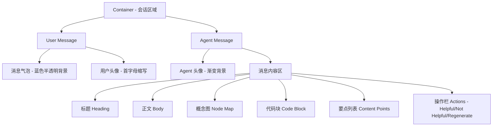
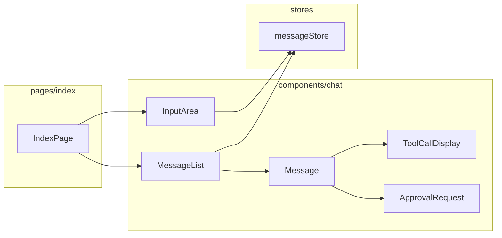
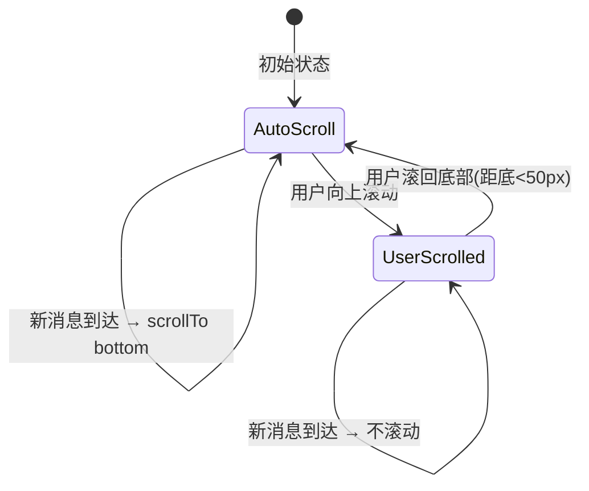
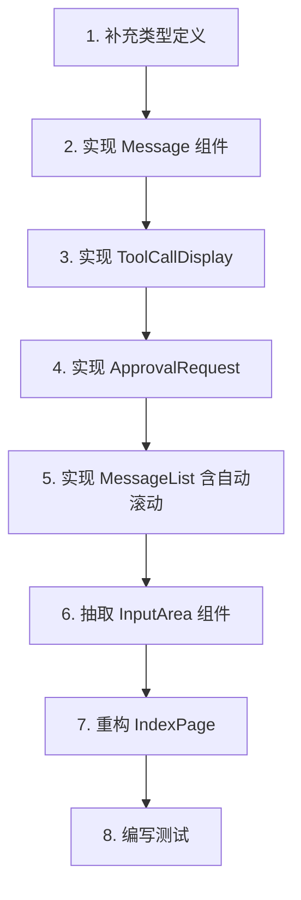

# 会话组件实现方案

> 版本：1.0 | 创建时间：2026-03-24

## 1. 需求概述

基于 Figma 设计稿 (node-id: 50-1318)，实现完整的会话（Chat）组件体系，包括：

- **MessageList** — 消息列表容器，支持流式输出时自动滚动，用户手动滚动后暂停自动跟随
- **Message** — 独立消息气泡组件，支持用户消息和 Agent 消息两种角色
- **InputArea** — 从 IndexPage 中抽取的独立输入框组件
- **ToolCallDisplay** — 工具调用展示（函数调用、命令执行、MCP 工具等）
- **ApprovalRequest** — 用户操作授权组件（exec_approval、patch_approval）

## 2. 设计分析（来自 Figma）



### 设计 Token（从 Figma 提取）

| Token | 值 | 用途 |
|-------|-----|------|
| 用户气泡背景 | `rgba(141,178,255,0.2)` | 用户消息背景 |
| Agent 气泡背景 | `#ffffff` | Agent 消息背景 |
| Agent 气泡边框 | `rgba(192,199,207,0.05)` | Agent 消息边框 |
| Agent 气泡阴影 | `0px 8px 30px rgba(0,0,0,0.04)` | Agent 消息阴影 |
| Agent 头像渐变 | `linear-gradient(135deg, #005bc1, #8db2ff)` | Agent 头像 |
| 主文字色 | `#191c1e` | 标题 |
| 次文字色 | `#41484e` | 正文 |
| 辅助文字色 | `#94a3b8` | 操作按钮文字 |
| 代码块背景 | `#0f172a` | 代码区域 |
| 代码文字色 | `#93c5fd` | 代码文字 |
| 圆角-气泡 | `16px~24px` | 消息气泡 |
| 间距-消息间 | `40px` | 消息之间 |

## 3. 组件架构



## 4. 核心技术方案

### 4.1 流式输出自动滚动

这是本需求的核心难点。需要满足：
1. 新消息到达时，视窗自动滚动到底部
2. 滚动过程平滑，不产生抖动
3. 用户手动向上滚动后，停止自动跟随
4. 用户滚回底部后，恢复自动跟随

**实现策略：**



- 使用 `useRef` 跟踪滚动容器
- 监听 `scroll` 事件，判断是否在底部附近（阈值 50px）
- 使用 `scrollTop` 直接赋值而非 `scrollIntoView`，避免 smooth 动画导致的抖动
- 流式 delta 更新时，仅在 `isAtBottom` 为 true 时执行滚动

### 4.2 Message 组件设计

Message 组件根据 `TurnItem.type` 渲染不同内容：

| TurnItem.type | 渲染内容 |
|---------------|---------|
| `UserMessage` | 用户气泡 + 头像 |
| `AgentMessage` | Agent 气泡 + Markdown 渲染 + 操作栏 |
| `Reasoning` | 折叠的推理过程 |
| `Plan` | 计划展示 |
| `WebSearch` | 搜索状态展示 |

Message 内部还需处理 `EventMsg` 中的工具调用相关事件：

| 事件类型 | 对应组件 |
|---------|---------|
| `exec_command_begin/end` | ToolCallDisplay (命令执行) |
| `mcp_tool_call_begin/end` | ToolCallDisplay (MCP 工具) |
| `exec_approval_request` | ApprovalRequest (命令授权) |
| `apply_patch_approval_request` | ApprovalRequest (补丁授权) |

### 4.3 InputArea 组件

从 IndexPage 中提取输入区域为独立组件，支持：
- 多行文本输入（textarea）
- 附件按钮（Paperclip, FileText, Mic, Image）
- 发送按钮（渐变背景，根据输入状态变化）
- Enter 发送，Shift+Enter 换行
- 对外暴露 `onSend(text: string)` 回调

### 4.4 类型补充

需要在 `types/` 下补充以下类型：

```typescript
// types/chat.ts — 会话组件专用类型

/** 工具调用状态 */
export interface ToolCallState {
  callId: string;
  type: 'exec' | 'mcp' | 'web_search' | 'patch';
  status: 'pending' | 'running' | 'completed' | 'failed';
  name: string;
  // exec 相关
  command?: string[];
  cwd?: string;
  output?: string;
  exitCode?: number;
  // mcp 相关
  serverName?: string;
  toolName?: string;
  arguments?: unknown;
  result?: unknown;
}

/** 审批请求状态 */
export interface ApprovalRequestState {
  callId: string;
  turnId: string;
  type: 'exec' | 'patch';
  // exec
  command?: string[];
  cwd?: string;
  reason?: string;
  // patch
  changes?: Record<string, unknown>;
}
```

## 5. 文件清单

| 文件路径 | 说明 | 操作 |
|---------|------|------|
| `src/types/chat.ts` | 会话组件类型 | 新建 |
| `src/types/index.ts` | 导出新类型 | 修改 |
| `src/components/chat/Message.tsx` | 消息气泡组件 | 新建 |
| `src/components/chat/MessageList.tsx` | 消息列表（含自动滚动） | 新建 |
| `src/components/chat/InputArea.tsx` | 输入框组件 | 新建 |
| `src/components/chat/ToolCallDisplay.tsx` | 工具调用展示 | 新建 |
| `src/components/chat/ApprovalRequest.tsx` | 授权请求组件 | 新建 |
| `src/components/chat/index.ts` | 统一导出 | 新建 |
| `src/pages/index/IndexPage.tsx` | 使用新组件重构 | 修改 |
| `src/__tests__/unit/components/Message.test.tsx` | Message 单元测试 | 新建 |
| `src/__tests__/unit/components/MessageList.test.tsx` | MessageList 单元测试 | 新建 |
| `src/__tests__/unit/components/InputArea.test.tsx` | InputArea 单元测试 | 新建 |

## 6. 实施步骤



## 7. 自动滚动详细设计

```typescript
// 核心逻辑伪代码
function useAutoScroll(deps: unknown[]) {
  const containerRef = useRef<HTMLDivElement>(null);
  const isAtBottomRef = useRef(true);

  // 监听滚动，判断是否在底部
  const handleScroll = () => {
    const el = containerRef.current;
    if (!el) return;
    const threshold = 50;
    isAtBottomRef.current = 
      el.scrollHeight - el.scrollTop - el.clientHeight < threshold;
  };

  // 依赖变化时，如果在底部则滚动
  useEffect(() => {
    if (isAtBottomRef.current) {
      const el = containerRef.current;
      if (el) el.scrollTop = el.scrollHeight;
    }
  }, deps);

  return { containerRef, handleScroll };
}
```

关键点：
- 使用 `scrollTop = scrollHeight` 而非 `scrollIntoView({ behavior: 'smooth' })`
- `smooth` 行为在高频 delta 更新时会导致动画队列堆积，产生抖动
- 直接赋值 `scrollTop` 是瞬时的，不会抖动
- 通过 `isAtBottomRef`（ref 而非 state）避免不必要的重渲染

## 8. 风险与注意事项

1. **Streamdown 渲染**：Agent 消息使用 Streamdown 进行 Markdown 流式渲染，需确保与自动滚动逻辑配合
2. **性能**：大量消息时需考虑虚拟列表（后续优化，当前阶段不实现）
3. **MUI 样式**：项目使用 Emotion CSS-in-JS（MUI 内置），不使用 Tailwind，Figma 生成的 Tailwind 代码需转换为 MUI `sx` prop
4. **图标**：统一使用 lucide-react，不使用 Figma 中的 SVG 图标资源
