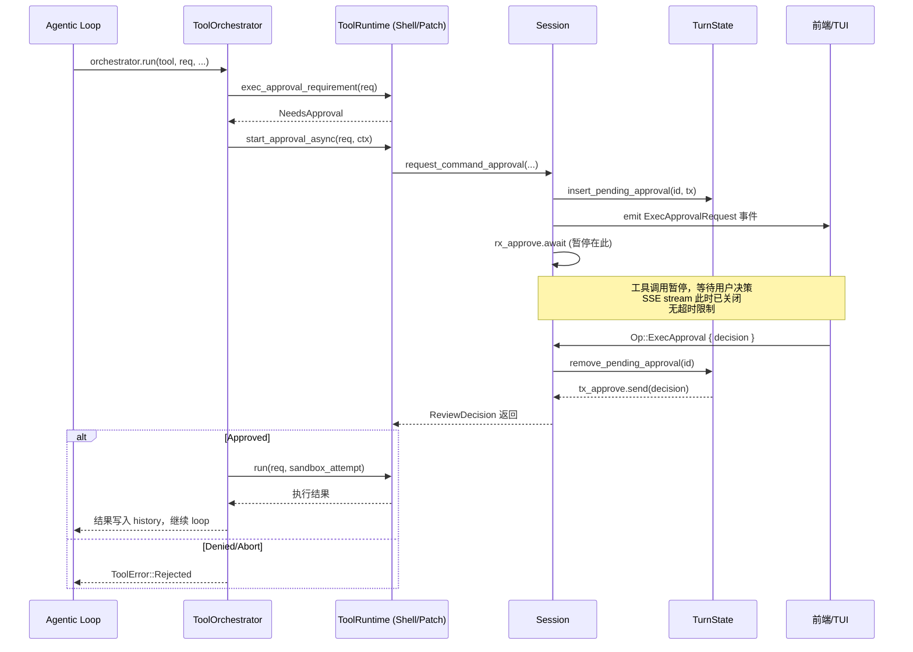
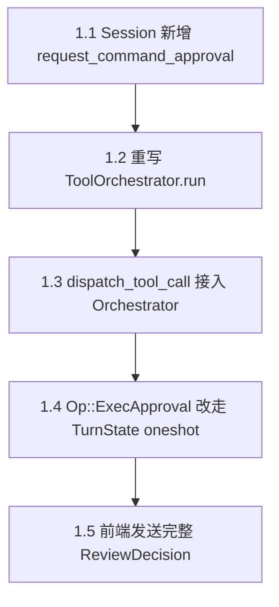
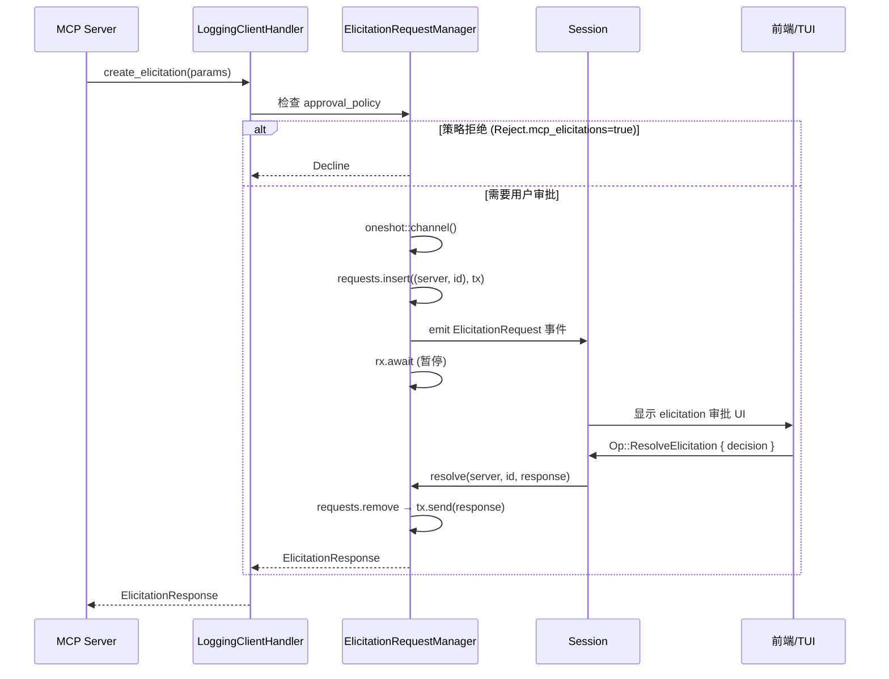

# AI 会话审批系统接入方案

## 1. 现状分析

### 1.1 Mosaic 当前状态

审批系统处于"骨架已搭建、但未接入实际执行链路"的状态：

| 层 | 状态 | 说明 |
|---|---|---|
| 数据结构 | ✅ 已有 | `PendingApproval`、`ApprovalStore`、`ReviewDecision`、`AskForApproval` |
| 事件类型 | ✅ 已有 | `ExecApprovalRequestEvent`、`ApplyPatchApprovalRequestEvent` |
| 前端 UI | ✅ 已有 | `ApprovalRequest.tsx` + `approvalStore` + `useCodexEvent` 监听 |
| Op 处理 | ⚠️ 半成品 | `Op::ExecApproval` / `Op::PatchApproval` 有处理逻辑，但 Approved 分支标注 `// TODO` |
| Agentic Loop 接入 | ❌ 未接入 | 工具调用直接执行，不经过审批判断 |
| 审批等待机制 | ❌ 缺失 | 没有 oneshot channel 暂停/恢复机制 |

### 1.2 源项目（codex-main）的实现

源项目的审批是一个完整的 **async 暂停/恢复** 机制：



核心设计要点：

1. **oneshot channel 暂停**：`request_command_approval` 创建 `oneshot::channel()`，将 `tx` 存入 `TurnState`，然后 `rx.await` 暂停当前 async task
2. **审批在工具调用内部完成**：`ToolOrchestrator::run()` 内部调用 `start_approval_async().await`，审批通过后直接继续执行工具，不需要"重新执行"
3. **SSE stream 已关闭**：审批发生在 stream 消费完毕后的工具调用阶段，与 API 连接无关
4. **无超时**：oneshot channel 没有超时，理论上可以无限等待
5. **缓存机制**：`with_cached_approval` 支持 `ApprovedForSession` 缓存，同类命令不再重复询问
6. **Trait 抽象**：`Approvable` + `Sandboxable` + `ToolRuntime` 三个 trait 组合，每个工具自定义审批逻辑

## 2. 差距分析

### 2.1 需要新增的核心机制

| 机制 | 源项目 | Mosaic 现状 | 差距 |
|---|---|---|---|
| oneshot channel 暂停/恢复 | `TurnState.pending_approvals: HashMap<String, oneshot::Sender<ReviewDecision>>` | `TurnState` 结构已有，但未在生产代码中使用 | 需要在工具调用链路中接入 |
| `ToolOrchestrator` 编排 | 完整实现：approval → sandbox → attempt → retry | 空壳，`NeedsApproval` 直接 auto-approve | 需要重写 |
| `ToolRuntime` trait 体系 | `Approvable` + `Sandboxable` + `ToolRuntime` | `ToolHandler` trait 只有 `handle()` 方法 | 需要扩展或新增 trait |
| `start_approval_async` | 每个 runtime 实现，调用 `session.request_command_approval` | 不存在 | 需要实现 |
| `with_cached_approval` | 基于 `ApprovalStore` 的缓存 | `ApprovalStore` 已有但未使用 | 需要接入 |
| `notify_approval` | 从 `TurnState` 取出 `tx` 并 `send(decision)` | `Op::ExecApproval` 处理逻辑已有但走的是 `Session::pending_approval`（未使用的旧路径） | 需要改为走 `TurnState` 的 oneshot channel |

### 2.2 需要修改的现有代码

| 文件 | 修改内容 |
|---|---|
| `core/codex.rs` agentic loop | `dispatch_tool_call` 需要经过 `ToolOrchestrator` |
| `core/codex.rs` `handle_op` | `Op::ExecApproval` / `Op::PatchApproval` 改为通过 `TurnState` 的 oneshot channel 通知 |
| `core/tools/orchestrator.rs` | 从空壳重写为完整编排逻辑 |
| `core/tools/sandboxing.rs` | 扩展 trait 体系 |
| `core/tools/handlers/*.rs` | 各 handler 实现 `Approvable` trait |
| `core/session.rs` | 新增 `request_command_approval` / `request_patch_approval` 方法 |
| 前端 `ApprovalRequest.tsx` | 扩展决策选项（ApprovedForSession 等） |
| 前端 `useSubmitOp.ts` / commands | 发送 `Op::ExecApproval` 时携带完整 `ReviewDecision` |

## 3. 实现方案

### 3.1 分阶段实施

#### Phase 1：核心暂停/恢复机制（最小可用）

目标：让命令执行和补丁应用能够暂停等待用户审批，审批后继续执行。



改动清单：

**1.1 `core/session.rs`** — 新增审批请求方法

```rust
// 新增方法，参考源项目 Session::request_command_approval
pub async fn request_command_approval(
    &self,
    turn_id: &str,
    call_id: String,
    command: Vec<String>,
    cwd: PathBuf,
    reason: Option<String>,
) -> ReviewDecision {
    let (tx, rx) = oneshot::channel();
    // 将 tx 存入 TurnState（已有的 insert_pending_approval）
    // 发射 ExecApprovalRequestEvent
    // rx.await 暂停
    rx.await.unwrap_or_default()
}
```

**1.2 `core/tools/orchestrator.rs`** — 重写编排逻辑

从当前的空壳改为：
- 检查 `ExecApprovalRequirement`
- `NeedsApproval` 时调用 `session.request_command_approval().await`
- 根据 `ReviewDecision` 决定执行或拒绝
- 执行工具并返回结果

**1.3 `core/codex.rs`** — agentic loop 接入

`dispatch_tool_call` 中，对需要审批的工具（shell/exec/patch）通过 `ToolOrchestrator` 调用，而非直接 `route_tool_call`。

**1.4 `core/codex.rs`** — `handle_op` 修改

```rust
Op::ExecApproval { id, decision, .. } => {
    // 改为：从 TurnState 取出 oneshot::Sender，发送 decision
    // 而非当前的 Session::pending_approval 路径
    let entry = active_turn.turn_state.lock().await
        .remove_pending_approval(&id);
    if let Some(tx) = entry {
        tx.send(decision).ok();
    }
}
```

**1.5 前端修改**

`ApprovalRequest.tsx` 的 `onDecision` 回调需要发送完整的 `ReviewDecision` 枚举值（而非简单的 `'approve' | 'deny'` 字符串）。

#### Phase 2：审批缓存 + ExecPolicy 持久化

目标：支持 `ApprovedForSession` 缓存和 `.codexpolicy` 持久化。

- 接入 `with_cached_approval`（已有 `ApprovalStore`）
- `ApprovedExecpolicyAmendment` 决策时写入 `.codexpolicy`
- 前端增加 "Always Allow" 按钮

#### Phase 3：Sandbox 集成

目标：审批与沙箱策略联动。

- `SandboxManager` 完整实现
- 首次在沙箱中执行 → 失败 → 请求审批 → 无沙箱重试
- macOS seatbelt / Linux landlock 集成

### 3.2 实现成本评估

| Phase | 涉及文件数 | 新增代码量（估） | 修改代码量（估） | 工时（人天） |
|---|---|---|---|---|
| Phase 1 | 5-6 个 Rust + 2 个 TS | ~300 行 | ~200 行 | 3-5 天 |
| Phase 2 | 2-3 个 Rust + 1 个 TS | ~100 行 | ~50 行 | 1-2 天 |
| Phase 3 | 5+ 个 Rust | ~500+ 行 | ~100 行 | 5-8 天 |

Phase 1 是最小可用方案，Phase 2 是体验优化，Phase 3 是安全加固。

### 3.3 风险点

| 风险 | 影响 | 缓解措施 |
|---|---|---|
| oneshot channel 的 sender 被 drop（turn 被中断） | rx.await 返回 Err，工具调用失败 | 已有 `clear_pending()` 清理机制；失败时返回 `Denied` 默认值 |
| 用户长时间不操作 | 工具调用 async task 一直挂起，占用内存 | 可选：增加超时机制（如 30 分钟），超时自动 Deny |
| 并行工具调用中部分需要审批 | 多个审批请求同时弹出 | 前端 `approvalStore` 已支持 Map 存储多个审批；源项目也是这样处理的 |
| 前端与 Rust 端 `ReviewDecision` 枚举不同步 | 前端发送的决策 Rust 端无法反序列化 | 共享类型定义，前端 TS 类型与 Rust serde 保持一致 |

## 4. 关键代码对照

### 4.1 审批等待（源项目 vs Mosaic 目标）

**源项目** `codex-main/codex-rs/core/src/codex.rs:2663`：
```rust
pub async fn request_command_approval(...) -> ReviewDecision {
    let (tx_approve, rx_approve) = oneshot::channel();
    // 存入 TurnState
    ts.insert_pending_approval(effective_approval_id, tx_approve);
    // 发射事件
    self.send_event(turn_context, event).await;
    // 暂停等待
    rx_approve.await.unwrap_or_default()
}
```

**Mosaic 目标**：在 `core/session.rs` 中实现相同逻辑。`TurnState` 和 `insert_pending_approval` 已经存在且结构一致，可直接使用。

### 4.2 审批通知（源项目 vs Mosaic 目标）

**源项目** `codex-main/codex-rs/core/src/codex.rs:2848`：
```rust
pub async fn notify_approval(&self, approval_id: &str, decision: ReviewDecision) {
    let entry = ts.remove_pending_approval(approval_id);
    if let Some(tx_approve) = entry {
        tx_approve.send(decision).ok();
    }
}
```

**Mosaic 目标**：替换当前 `handle_op` 中 `Op::ExecApproval` 的处理逻辑，从 `Session::pending_approval`（Option 字段）改为 `TurnState::pending_approvals`（HashMap + oneshot channel）。

### 4.3 编排器（源项目 vs Mosaic 目标）

**源项目** `ToolOrchestrator::run()`：
```
1. exec_approval_requirement(req) → Skip / NeedsApproval / Forbidden
2. NeedsApproval → start_approval_async(req, ctx).await → ReviewDecision
3. Approved → select sandbox → run attempt
4. SandboxDenied + escalate_on_failure → 再次审批 → 无沙箱重试
```

**Mosaic Phase 1 目标**：实现步骤 1-3，跳过步骤 4（沙箱重试留给 Phase 3）。

## 5. 可复用的现有代码

Mosaic 中以下代码可直接复用，无需重写：

- `TurnState`（`core/state/turn.rs`）：`insert_pending_approval` / `remove_pending_approval` / `clear_pending` 完全一致
- `ApprovalStore`（`core/tools/sandboxing.rs`）：结构和方法与源项目一致
- `ExecApprovalRequestEvent` / `ApplyPatchApprovalRequestEvent`（`protocol/event.rs`）：事件结构完整
- `ReviewDecision`（`protocol/types.rs`）：枚举值完整
- `AskForApproval`（`protocol/types.rs`）：策略枚举完整
- 前端 `approvalStore` + `useCodexEvent` 中的事件监听：已能正确接收和存储审批请求
- 前端 `ApprovalRequest.tsx`：UI 已就绪，只需扩展决策选项

## 6. 结论

Phase 1 的实现成本较低（3-5 人天），因为：
1. 数据结构和事件类型已经完备
2. `TurnState` 的 oneshot channel 机制已经存在
3. 前端监听和 UI 已就绪
4. 主要工作是"串联"而非"新建"——将已有的零件连接到 agentic loop 中

核心改动集中在 3 个点：
1. `Session` 新增 `request_command_approval` 方法（~50 行）
2. `ToolOrchestrator` 重写（~150 行）
3. `dispatch_tool_call` + `handle_op` 改造（~100 行）


---

# Phase 2：决策副作用 + 审批缓存 + ExecPolicy 移植 + 前端细粒度决策

## 1. 问题清单

| # | 问题 | 影响 |
|---|---|---|
| 2a | Phase 1 重写 `handle_op` 时删掉了 `ApprovedForSession` 的 `add_to_exec_allow_list` | 用户选 "don't ask again" 后同类命令仍重复询问 |
| 2b | Phase 1 重写 `handle_op` 时删掉了 `ApprovedExecpolicyAmendment` 的 `.codexpolicy` 持久化 | 用户选 "always allow" 后规则不会持久化到磁盘 |
| 2c | `with_cached_approval` 缓存机制未接入 | 每次工具调用都弹审批，即使已 ApprovedForSession |
| 2d | `ExecPolicyManager` 未移植，`proposed_execpolicy_amendment` 始终为 `None` | `available_decisions` 永远只有 `[Approved, Abort]`，无法出现 "don't ask again for commands starting with..." 选项 |
| 2e | 前端只有 `approve` / `deny` 两个按钮 | 无法发送 `ApprovedForSession`、`ApprovedExecpolicyAmendment`、`Abort` 等决策 |

## 2. 实现方案

### 2.0 接入 agentic loop（Phase 1 遗留）

> **严重问题**：Phase 1 重写了 `ToolOrchestrator`，但 `dispatch_tool_call` 仍然直接调用 `route_tool_call`，完全没有经过 orchestrator。审批机制虽然代码存在，但 agentic loop 不会触发它。

**文件：`src-tauri/src/core/codex.rs` — `dispatch_tool_call` 方法**

需要在 `route_tool_call` 之前插入 orchestrator 调用。改造逻辑：

```rust
async fn dispatch_tool_call(
    &self,
    session: &Session,
    turn_id: &str,
    call_id: &str,
    tool_name: &str,
    arguments: serde_json::Value,
) -> Result<serde_json::Value, CodexError> {
    // 1. 计算审批需求
    let approval_policy = session.turn_context().await
        .map(|ctx| ctx.approval_policy.clone())
        .unwrap_or_default();
    let cwd = session.cwd().clone();

    // 从 arguments 中提取 command（shell/exec_command 工具）
    let command_for_approval = extract_command_from_args(tool_name, &arguments);

    let manager = ExecPolicyManager::load_from_cwd(&cwd, approval_policy.clone());
    let requirement = match &command_for_approval {
        Some(cmd) => manager.create_exec_approval_requirement(cmd, None),
        None => ExecApprovalRequirement::Skip, // 非命令执行工具不需要审批
    };

    // 2. 通过 orchestrator 执行（审批 + 执行）
    let orchestrator = ToolOrchestrator::new();
    orchestrator.run(
        session,
        call_id,
        turn_id,
        tool_name,
        command_for_approval.unwrap_or_default(),
        cwd,
        requirement,
        async {
            // 原有的 route_tool_call 逻辑移到这里
            let route_result = session.tool_router().await
                .route_tool_call(tool_name, arguments.clone()).await;
            match route_result {
                RouteResult::Handled(r) => r,
                RouteResult::DynamicTool(_) => { /* ... 现有 dynamic tool 逻辑 ... */ }
                RouteResult::NotFound(name) => Err(CodexError::new(...))
            }
        },
    ).await
}

/// 从工具参数中提取命令（用于审批展示和 exec policy 评估）
fn extract_command_from_args(tool_name: &str, args: &serde_json::Value) -> Option<Vec<String>> {
    match tool_name {
        "shell" => args.get("command").and_then(|v| {
            serde_json::from_value::<Vec<String>>(v.clone()).ok()
        }),
        "exec_command" => args.get("cmd").and_then(|v| v.as_str())
            .map(|cmd| vec!["bash".into(), "-lc".into(), cmd.into()]),
        _ => None,
    }
}
```

### 2.1 补回决策副作用（解决 2a + 2b）

**文件：`src-tauri/src/core/codex.rs` — `Op::ExecApproval` handler**

当前 Phase 1 实现中，所有非 Abort 决策统一走 `notify_approval`。需要在 `notify_approval` 之前插入副作用处理，与源项目 `handlers::exec_approval`（codex-main `codex.rs:4063`）完全对齐：

```rust
Op::ExecApproval { id, decision, custom_instructions, .. } => {
    let session_guard = self.session.lock().await;
    if let Some(s) = session_guard.as_ref() {
        if let Some(instructions) = custom_instructions {
            if !instructions.is_empty() {
                s.set_custom_instructions(instructions).await;
            }
        }

        // ── 副作用：ApprovedExecpolicyAmendment 持久化 ──
        if let ReviewDecision::ApprovedExecpolicyAmendment {
            proposed_execpolicy_amendment,
        } = &decision {
            let policy_path = s.cwd().join(".codexpolicy");
            if let Err(e) = crate::execpolicy::amend::blocking_append_allow_prefix_rule(
                &policy_path,
                &proposed_execpolicy_amendment.command,
            ) {
                self.emit(EventMsg::Warning(WarningEvent {
                    message: format!("failed to amend execpolicy: {e}"),
                })).await;
            }
            // allow list 统一在 orchestrator 侧处理，此处不再重复
        }

        // ── 副作用：ApprovedForSession 加入 allow list ──
        // 源项目中 allow list 和缓存都在 orchestrator/runtime 侧处理，
        // handle_op 只负责持久化副作用。但 ApprovedForSession 的 allow list
        // 需要原始 command，而 handle_op 无法获取（oneshot 机制中 command 在
        // orchestrator 侧）。因此 allow list 统一在 orchestrator 侧处理。
        //
        // ApprovedExecpolicyAmendment 的 allow list 也移到 orchestrator 侧，
        // handle_op 只保留 .codexpolicy 文件写入。

        if matches!(decision, ReviewDecision::Abort) {
            s.interrupt().await;
            self.emit(EventMsg::TurnAborted(TurnAbortedEvent {
                turn_id: None,
                reason: TurnAbortReason::Interrupted,
            })).await;
        } else {
            s.notify_approval(&id, decision).await;
        }
    }
}
```

**`ToolOrchestrator::run()` 中统一处理 allow list**：

orchestrator 在收到审批决策后，统一处理 allow list（与源项目一致，副作用在 orchestrator/runtime 侧）：

```rust
// orchestrator.rs — run() 方法中 NeedsApproval 分支，审批通过后
match &decision {
    ReviewDecision::ApprovedForSession => {
        session.add_to_exec_allow_list(command_for_approval.clone()).await;
    }
    ReviewDecision::ApprovedExecpolicyAmendment { proposed_execpolicy_amendment } => {
        // allow list 立即生效（.codexpolicy 持久化由 handle_op 处理）
        session.add_to_exec_allow_list(proposed_execpolicy_amendment.command.clone()).await;
    }
    _ => {}
}
```

### 2.2 移植 `with_cached_approval`（解决 2c）

**源项目实现**（`codex-main/codex-rs/core/src/tools/sandboxing.rs:55-120`）：

```rust
pub async fn with_cached_approval<K, F, Fut>(
    services: &SessionServices,
    tool_name: &str,
    keys: Vec<K>,
    fetch: F,
) -> ReviewDecision
where K: Serialize, F: FnOnce() -> Fut, Fut: Future<Output = ReviewDecision>
{
    if keys.is_empty() { return fetch().await; }
    let already_approved = {
        let store = services.tool_approvals.lock().await;
        keys.iter().all(|key| matches!(store.get(key), Some(ReviewDecision::ApprovedForSession)))
    };
    if already_approved { return ReviewDecision::ApprovedForSession; }
    let decision = fetch().await;
    if matches!(decision, ReviewDecision::ApprovedForSession) {
        let mut store = services.tool_approvals.lock().await;
        for key in keys { store.put(key, ReviewDecision::ApprovedForSession); }
    }
    decision
}
```

**Mosaic 移植方案**：

Mosaic 已有 `ApprovalStore`（`core/tools/sandboxing.rs`），结构与源项目一致。需要：

1. `Session` 新增 `tool_approvals: Arc<Mutex<ApprovalStore>>` 字段
2. 在 `Session` 上实现 `with_cached_approval` 方法（或作为独立函数）
3. `ToolOrchestrator::run()` 在调用 `request_exec_approval` 之前先检查缓存

```rust
// session.rs — 新增字段
pub struct Session {
    // ... 现有字段 ...
    tool_approvals: Arc<tokio::sync::Mutex<crate::core::tools::sandboxing::ApprovalStore>>,
}

// session.rs — 新增方法
pub async fn with_cached_approval<K: serde::Serialize>(
    &self,
    keys: &[K],
    fetch: impl std::future::Future<Output = ReviewDecision>,
) -> ReviewDecision {
    if keys.is_empty() { return fetch.await; }
    {
        let store = self.tool_approvals.lock().await;
        if keys.iter().all(|k| matches!(store.get(k), Some(ReviewDecision::ApprovedForSession))) {
            return ReviewDecision::ApprovedForSession;
        }
    }
    let decision = fetch.await;
    if matches!(decision, ReviewDecision::ApprovedForSession) {
        let mut store = self.tool_approvals.lock().await;
        for key in keys { store.put(key, ReviewDecision::ApprovedForSession); }
    }
    decision
}
```

**Orchestrator 集成**：

源项目中 shell runtime 的 `ApprovalKey` 是专门的结构体，包含 `command`（经过 canonicalize）、`cwd`、`sandbox_permissions`、`additional_permissions`。我们定义专门的 key 结构体而非用 JSON：

```rust
// orchestrator.rs — 审批缓存 key
#[derive(Clone, Debug, Serialize)]
struct ApprovalKey {
    command: Vec<String>,
    cwd: String,
}

// orchestrator.rs — run() 方法中 NeedsApproval 分支
ExecApprovalRequirement::NeedsApproval { reason, proposed_execpolicy_amendment } => {
    let approval_key = ApprovalKey {
        command: command_for_approval.clone(),
        cwd: cwd.to_string_lossy().into_owned(),
    };
    let decision = session.with_cached_approval(
        &[approval_key],
        session.request_exec_approval(
            call_id.to_string(), turn_id.to_string(),
            command_for_approval.clone(), cwd.clone(), reason,
            proposed_execpolicy_amendment,
        ),
    ).await;
    // ... 处理 decision ...
}
```

### 2.3 移植 ExecPolicy 引擎（解决 2d）

**源项目架构**：

`ExecPolicyManager::create_exec_approval_requirement_for_command()` 是核心方法，流程：

1. `commands_for_exec_policy(command)` — 将 `bash -lc "cmd1 && cmd2"` 拆解为子命令
2. `exec_policy.check_multiple_with_options()` — 对所有子命令评估策略规则
3. 根据评估结果生成 `ExecApprovalRequirement`，包含 `proposed_execpolicy_amendment`

**Mosaic 已有的 execpolicy 模块**（`src-tauri/src/execpolicy/`）：

- `mod.rs`：`Policy` 结构体，`check()` / `check_with_options()` / `check_multiple()` 方法
- `amend.rs`：`blocking_append_allow_prefix_rule()` / `blocking_append_network_rule()`
- `prefix_rule.rs`：前缀规则匹配
- `parser.rs`：策略文件解析

**缺失的部分**：

Mosaic 有 `Policy`（低层策略引擎），但没有 `ExecPolicyManager`（高层管理器，负责加载策略文件、生成 amendment、集成到审批流程）。

**移植方案**：

新建 `src-tauri/src/core/exec_policy/manager.rs`，从源项目 `exec_policy.rs` 移植核心逻辑：

```rust
// core/exec_policy/manager.rs
use crate::execpolicy::{Policy, Decision, Evaluation, RuleMatch};
use crate::core::tools::orchestrator::ExecApprovalRequirement;
use crate::protocol::types::{AskForApproval, ExecPolicyAmendment};

/// 命令前缀建议黑名单（通用解释器不应作为 amendment 前缀）
const BANNED_PREFIX_SUGGESTIONS: &[&str] = &[
    "python", "python3", "bash", "sh", "zsh", "powershell", "pwsh",
    "git", "node", "perl", "ruby", "php", "lua", "osascript",
];

pub struct ExecPolicyManager {
    policy: Policy,
    approval_policy: AskForApproval,
}

impl ExecPolicyManager {
    pub fn new(policy: Policy, approval_policy: AskForApproval) -> Self {
        Self { policy, approval_policy }
    }

    pub fn load_from_cwd(cwd: &std::path::Path, approval_policy: AskForApproval) -> Self {
        let policy_path = cwd.join(".codexpolicy");
        let policy = if policy_path.exists() {
            Policy::load_from_file(&policy_path).unwrap_or_else(|_| Policy::empty())
        } else {
            Policy::empty()
        };
        Self::new(policy, approval_policy)
    }

    /// 核心方法：为命令生成 ExecApprovalRequirement（含 proposed_execpolicy_amendment）
    pub fn create_exec_approval_requirement(
        &self,
        command: &[String],
        prefix_rule: Option<&[String]>,
    ) -> ExecApprovalRequirement {
        if command.is_empty() {
            return ExecApprovalRequirement::Skip;
        }

        // 1. 评估策略
        let eval = self.policy.check(command, &|_| Decision::Prompt);

        // 2. 生成 amendment
        let proposed_amendment = self.derive_amendment(command, prefix_rule, &eval);

        // 3. 根据决策 + 审批策略组装结果
        match eval.decision {
            Decision::Allow => ExecApprovalRequirement::Skip,
            Decision::Forbidden => ExecApprovalRequirement::Forbidden {
                reason: "command forbidden by exec policy".into(),
            },
            Decision::Prompt => {
                match self.approval_policy {
                    AskForApproval::Never => ExecApprovalRequirement::Skip,
                    AskForApproval::Reject(_) => ExecApprovalRequirement::Forbidden {
                        reason: "approval policy rejects prompts".into(),
                    },
                    _ => ExecApprovalRequirement::NeedsApproval {
                        reason: None,
                        proposed_execpolicy_amendment: proposed_amendment,
                    },
                }
            }
        }
    }

    fn derive_amendment(
        &self,
        command: &[String],
        prefix_rule: Option<&[String]>,
        eval: &Evaluation,
    ) -> Option<ExecPolicyAmendment> {
        // 辅助函数：检查是否已有 prefix rule 匹配
        // 注意：Mosaic 的 Evaluation 没有 has_prefix_rule_match() 方法，
        // 需要内联检查 matched_rules
        let has_prefix_match = eval.matched_rules.iter()
            .any(|m| matches!(m, RuleMatch::PrefixRuleMatch { .. }));

        // 优先使用调用方提供的 prefix_rule
        if let Some(prefix) = prefix_rule {
            if !prefix.is_empty() && !is_banned_prefix(prefix) && !has_prefix_match {
                return Some(ExecPolicyAmendment { command: prefix.to_vec() });
            }
        }

        // 自动派生：使用命令本身作为前缀（如果不在黑名单中）
        if !command.is_empty() && !is_banned_prefix(command) && !has_prefix_match {
            // 取命令的第一个 token 作为前缀
            let prefix = vec![command[0].clone()];
            if !is_banned_prefix(&prefix) {
                return Some(ExecPolicyAmendment { command: prefix });
            }
        }

        None
    }

    /// 重新加载策略文件
    pub fn reload(&mut self, cwd: &std::path::Path) {
        let policy_path = cwd.join(".codexpolicy");
        if policy_path.exists() {
            if let Ok(p) = Policy::load_from_file(&policy_path) {
                self.policy = p;
            }
        }
    }
}

fn is_banned_prefix(tokens: &[String]) -> bool {
    tokens.first().map_or(false, |first| {
        let base = first.rsplit('/').next().unwrap_or(first);
        BANNED_PREFIX_SUGGESTIONS.iter().any(|b| b.eq_ignore_ascii_case(base))
    })
}
```

**注意**：源项目的 `exec_policy.rs` 有 84KB，包含复杂的 heredoc 解析、多命令拆分、heuristics 回退等。上面的移植是核心路径的精简版，保留了：
- 策略文件加载和评估
- amendment 生成（prefix_rule 优先 + 自动派生）
- 黑名单过滤
- 审批策略集成

省略了（可后续按需补充）：
- `commands_for_exec_policy()` 的 heredoc/复杂 shell 解析（回退到整条命令评估）
- `check_multiple_with_options()` 的多命令聚合（简化为单命令 `check()`）

**`ExecApprovalRequirement` 扩展**：

```rust
// orchestrator.rs — 扩展枚举
pub enum ExecApprovalRequirement {
    Skip,
    Forbidden { reason: String },
    NeedsApproval {
        reason: Option<String>,
        proposed_execpolicy_amendment: Option<ExecPolicyAmendment>,
    },
}
```

**集成到 Orchestrator**：

```rust
// orchestrator.rs — run() 方法
pub async fn run(&self, session: &Session, ...) -> Result<serde_json::Value, CodexError> {
    // 使用 ExecPolicyManager 计算 requirement（替代简单的 default_exec_approval_requirement）
    let manager = ExecPolicyManager::load_from_cwd(&cwd, approval_policy);
    let requirement = manager.create_exec_approval_requirement(&command_for_approval, None);
    // ... 后续审批流程不变 ...
}
```

> **注意**：`orchestrator.rs` 中 `NeedsApproval` 分支调用 `request_exec_approval` 时需同步传入 `proposed_execpolicy_amendment`：
> ```rust
> ExecApprovalRequirement::NeedsApproval { reason, proposed_execpolicy_amendment } => {
>     let decision = session.request_exec_approval(
>         call_id.to_string(), turn_id.to_string(),
>         command_for_approval.clone(), cwd.clone(), reason,
>         proposed_execpolicy_amendment, // 新增参数
>     ).await;
>     // ...
> }
> ```

**`request_exec_approval` 传递 amendment**：

```rust
// session.rs — 扩展方法签名
pub async fn request_exec_approval(
    &self,
    call_id: String,
    turn_id: String,
    command: Vec<String>,
    cwd: PathBuf,
    reason: Option<String>,
    proposed_execpolicy_amendment: Option<ExecPolicyAmendment>,
) -> ReviewDecision {
    // ... oneshot channel 逻辑不变 ...
    let available_decisions = ExecApprovalRequestEvent::default_available_decisions(
        None,
        proposed_execpolicy_amendment.as_ref(),
        None, None,
    );
    let event = EventMsg::ExecApprovalRequest(ExecApprovalRequestEvent {
        // ...
        proposed_execpolicy_amendment,
        available_decisions: Some(available_decisions),
        // ...
    });
    // ...
}
```

### 2.4 `ExecApprovalRequestEvent::default_available_decisions`（解决 2d 的 UI 侧）

**文件：`src-tauri/src/protocol/event.rs`**

完全对齐源项目 `codex-main/codex-rs/protocol/src/approvals.rs:157`：

```rust
impl ExecApprovalRequestEvent {
    pub fn effective_available_decisions(&self) -> Vec<ReviewDecision> {
        match &self.available_decisions {
            Some(decisions) => decisions.clone(),
            None => Self::default_available_decisions(
                self.network_approval_context.as_ref(),
                self.proposed_execpolicy_amendment.as_ref(),
                self.proposed_network_policy_amendments.as_deref(),
                self.additional_permissions.as_ref(),
            ),
        }
    }

    pub fn default_available_decisions(
        network_approval_context: Option<&NetworkApprovalContext>,
        proposed_execpolicy_amendment: Option<&ExecPolicyAmendment>,
        proposed_network_policy_amendments: Option<&[NetworkPolicyAmendment]>,
        additional_permissions: Option<&serde_json::Value>,
    ) -> Vec<ReviewDecision> {
        if network_approval_context.is_some() {
            let mut decisions = vec![ReviewDecision::Approved, ReviewDecision::ApprovedForSession];
            if let Some(amendments) = proposed_network_policy_amendments {
                if let Some(allow) = amendments.iter().find(|a| a.action == NetworkPolicyRuleAction::Allow) {
                    decisions.push(ReviewDecision::NetworkPolicyAmendment {
                        network_policy_amendment: allow.clone(),
                    });
                }
            }
            decisions.push(ReviewDecision::Abort);
            return decisions;
        }
        if additional_permissions.is_some() {
            return vec![ReviewDecision::Approved, ReviewDecision::Abort];
        }
        let mut decisions = vec![ReviewDecision::Approved];
        if let Some(prefix) = proposed_execpolicy_amendment {
            decisions.push(ReviewDecision::ApprovedExecpolicyAmendment {
                proposed_execpolicy_amendment: prefix.clone(),
            });
        }
        decisions.push(ReviewDecision::Abort);
        decisions
    }
}
```

### 2.5 前端改动（解决 2e）

#### 2.5.1 TS 类型

**`src/types/events.ts`**：

```typescript
// ReviewDecision 联合类型（对齐 Rust serde 序列化格式）
// 注意：ExecPolicyAmendment 有 #[serde(transparent)]，序列化为裸数组 string[]
export type ReviewDecision =
  | 'approved'
  | 'approved_for_session'
  | { approved_execpolicy_amendment: { proposed_execpolicy_amendment: string[] } }
  | { network_policy_amendment: { network_policy_amendment: NetworkPolicyAmendment } }
  | 'denied'
  | 'abort';

// ExecPolicyAmendment 在 Rust 端是 #[serde(transparent)] 的 Vec<String>，
// 序列化为 JSON 时直接是 string[]，不是 { command: string[] }
export type ExecPolicyAmendment = string[];

export interface NetworkPolicyAmendment { host: string; action: 'allow' | 'deny' }

// ExecApprovalRequestEvent 新增 available_decisions
export interface ExecApprovalRequestEvent {
  call_id: string;
  approval_id?: string;
  turn_id: string;
  command: string[];
  cwd: string;
  reason?: string;
  parsed_cmd: ParsedCommand[];
  available_decisions?: ReviewDecision[];
  proposed_execpolicy_amendment?: ExecPolicyAmendment;
}

// Op 类型修改
| { type: 'exec_approval'; id: string; turn_id?: string; decision: ReviewDecision; custom_instructions?: string }
| { type: 'patch_approval'; id: string; decision: ReviewDecision; custom_instructions?: string }
```

**`src/types/chat.ts`**：

```typescript
export interface ApprovalRequestState {
  callId: string;
  turnId: string;
  type: 'exec' | 'patch';
  order?: number;
  command?: string[];
  cwd?: string;
  reason?: string;
  changes?: Record<string, unknown>;
  availableDecisions?: ReviewDecision[];  // 新增
}
```

#### 2.5.2 事件监听

**`src/hooks/useCodexEvent.ts`**：

```typescript
case 'exec_approval_request':
  addApproval({
    callId: msg.call_id,
    turnId: msg.turn_id,
    type: 'exec',
    order: nextEventOrder(),
    command: msg.command,
    cwd: msg.cwd,
    reason: msg.reason,
    availableDecisions: msg.available_decisions,  // 新增
  });
  break;

case 'apply_patch_approval_request':
  addApproval({
    callId: msg.call_id,
    turnId: msg.turn_id,
    type: 'patch',
    order: nextEventOrder(),
    reason: msg.reason,
    changes: msg.changes,
    availableDecisions: ['approved', 'approved_for_session', 'abort'],  // 固定
  });
  break;
```

#### 2.5.3 ApprovalRequest 组件重写

**`src/components/chat/ApprovalRequest.tsx`**：

完全对齐源项目 `exec_options()` / `patch_options()` 的文案映射：

```typescript
function getDecisionLabel(decision: ReviewDecision, type: 'exec' | 'patch'): string {
  if (decision === 'approved') return 'Yes, proceed';
  if (decision === 'approved_for_session') {
    return type === 'exec'
      ? "Yes, and don't ask again for this command in this session"
      : "Yes, and don't ask again for these files";
  }
  if (decision === 'denied') return 'No, continue without running it';
  if (decision === 'abort') return 'No, and tell the agent what to do differently';
  if (typeof decision === 'object') {
    if ('approved_execpolicy_amendment' in decision) {
      // proposed_execpolicy_amendment 是 string[]（Rust #[serde(transparent)]）
      const cmd = decision.approved_execpolicy_amendment.proposed_execpolicy_amendment.join(' ');
      return `Yes, and don't ask again for commands starting with \`${cmd}\``;
    }
    if ('network_policy_amendment' in decision) {
      const { host, action } = decision.network_policy_amendment.network_policy_amendment;
      return action === 'allow'
        ? `Yes, and allow ${host} in the future`
        : `No, and block ${host} in the future`;
    }
  }
  return String(decision);
}

// 组件根据 availableDecisions 动态渲染按钮列表
// 每个按钮点击时发送对应的 ReviewDecision 到 Op::ExecApproval / Op::PatchApproval
```

## 3. 实现成本

| 改动 | 文件 | 行数 |
|---|---|---|
| `handle_op` 补回副作用 | `codex.rs` | ~30 行修改 |
| `orchestrator` 处理 ApprovedForSession | `orchestrator.rs` | ~10 行修改 |
| `Session.tool_approvals` + `with_cached_approval` | `session.rs` | ~40 行新增 |
| `ExecPolicyManager` | `core/exec_policy/manager.rs` 新建 | ~120 行 |
| `ExecApprovalRequirement` 扩展 | `orchestrator.rs` | ~5 行修改 |
| `request_exec_approval` 扩展签名 | `session.rs` | ~15 行修改 |
| `default_available_decisions` + `effective_available_decisions` | `protocol/event.rs` | ~40 行新增 |
| TS 类型 (`ReviewDecision`, `ExecPolicyAmendment` 等) | `types/events.ts`, `types/chat.ts` | ~25 行新增 |
| `useCodexEvent` 传递 `available_decisions` | `hooks/useCodexEvent.ts` | ~5 行修改 |
| `ApprovalRequest.tsx` 重写 | `components/chat/ApprovalRequest.tsx` | ~100 行重写 |

总计：~390 行，涉及 5 个 Rust 文件（1 个新建）+ 4 个 TS 文件，预计 3-4 人天。

## 4. 测试要点

**Rust 端：**
- `ExecPolicyManager` 单元测试：策略文件加载、amendment 生成、黑名单过滤
- `with_cached_approval` 测试：首次审批 → 缓存 → 二次跳过
- `handle_op` 副作用测试：`ApprovedExecpolicyAmendment` → `.codexpolicy` 文件写入
- `handle_op` 副作用测试：`ApprovedForSession` → allow list 更新
- `default_available_decisions` 测试：各种组合的决策列表生成

**前端：**
- `ApprovalRequest` 组件测试：根据 `availableDecisions` 动态渲染正确数量的按钮
- 决策发送测试：每种 `ReviewDecision` 变体序列化为正确的 JSON 格式

---

# Phase 3：MCP Elicitation 审批

## 1. 问题

`Op::ResolveElicitation` 在 `codex.rs` 中是空实现：

```rust
Op::ResolveElicitation { .. } => {
    // TODO: forward elicitation decision to MCP manager
}
```

## 2. Mosaic 已有基础设施

| 组件 | 状态 |
|---|---|
| `ElicitationAction` 枚举（Accept/Decline/Cancel） | ✅ `protocol/types.rs` |
| `ElicitationRequestEvent`（server_name/request_id/message） | ✅ `protocol/event.rs` |
| `EventMsg::ElicitationRequest` 事件变体 | ✅ |
| `Op::ResolveElicitation` 提交类型 | ✅ `protocol/submission.rs` |
| `SendElicitation` 类型 | ✅ `rmcp_client/rmcp_client.rs` |
| `LoggingClientHandler::create_elicitation` 调用 `send_elicitation` | ✅ |
| `RmcpClient::initialize` 接受 `send_elicitation` 参数 | ✅ |
| MCP 连接管理器中的 elicitation 存储/解析 | ❌ 缺失 |
| `Op::ResolveElicitation` 转发到 MCP 连接 | ❌ 空实现 |
| 前端 elicitation 审批 UI | ❌ 缺失 |
| `SendElicitation` 的实际实现接入事件系统 | ❌ 缺失 |

## 3. 源项目架构



源项目关键实现：

- `ElicitationRequestManager`（`mcp_connection_manager.rs:250`）：`requests: Arc<Mutex<HashMap<(String, RequestId), oneshot::Sender<ElicitationResponse>>>>`
- `make_sender()` 返回 `SendElicitation` 闭包：检查策略 → 创建 channel → 存入 map → 发射事件 → await
- `resolve()` 从 map 取出 tx 发送响应
- `handlers::resolve_elicitation`（`codex.rs:4026`）：将 `ElicitationAction` 转为 `ElicitationResponse`（Accept 时 content=`{}`，Decline/Cancel 时 content=None）
- TUI `elicitation_options()`：固定三选项 Accept/Decline/Cancel

## 4. 实现方案

### 4.1 `ElicitationRequestManager`

**文件：`src-tauri/src/core/mcp_client/connection_manager.rs`**

新增结构体，与源项目 `ElicitationRequestManager` 对齐：

```rust
use std::collections::HashMap;
use std::sync::Arc;
use tokio::sync::{Mutex, oneshot};
use crate::protocol::event::{Event, EventMsg, ElicitationRequestEvent};
use crate::protocol::types::AskForApproval;
use crate::rmcp_client::{ElicitationResponse, SendElicitation};

type ElicitationKey = (String, String); // (server_name, request_id_string)

pub struct ElicitationRequestManager {
    requests: Arc<Mutex<HashMap<ElicitationKey, oneshot::Sender<ElicitationResponse>>>>,
    // 已知简化：源项目用 Arc<StdMutex<AskForApproval>> 支持运行时更新。
    // 此处用值拷贝，创建后不可变。如果后续需要支持会话中切换审批策略，
    // 改为 Arc<StdMutex<AskForApproval>>。
    approval_policy: AskForApproval,
}

impl ElicitationRequestManager {
    pub fn new(approval_policy: AskForApproval) -> Self {
        Self {
            requests: Arc::new(Mutex::new(HashMap::new())),
            approval_policy,
        }
    }

    /// 生成 SendElicitation 闭包，传给 RmcpClient::initialize()
    pub fn make_sender(
        &self,
        server_name: String,
        tx_event: async_channel::Sender<Event>,
    ) -> SendElicitation {
        let requests = self.requests.clone();
        let approval_policy = self.approval_policy.clone();

        Box::new(move |request_id, elicitation| {
            let requests = requests.clone();
            let server_name = server_name.clone();
            let tx_event = tx_event.clone();
            let approval_policy = approval_policy.clone();

            Box::pin(async move {
                // 策略自动拒绝
                if matches!(&approval_policy,
                    AskForApproval::Reject(config) if config.mcp_elicitations)
                {
                    return Ok(rmcp::model::CreateElicitationResult {
                        action: rmcp::model::ElicitationAction::Decline,
                        content: None,
                    });
                }

                let (tx, rx) = oneshot::channel();
                let request_id_str = format!("{request_id}");
                {
                    let mut lock = requests.lock().await;
                    lock.insert((server_name.clone(), request_id_str.clone()), tx);
                }

                // 提取 message
                let message = match &elicitation {
                    rmcp::model::CreateElicitationRequestParams::FormElicitationParams {
                        message, ..
                    }
                    | rmcp::model::CreateElicitationRequestParams::UrlElicitationParams {
                        message, ..
                    } => message.clone(),
                };

                let _ = tx_event.send(Event {
                    id: uuid::Uuid::new_v4().to_string(),
                    msg: EventMsg::ElicitationRequest(ElicitationRequestEvent {
                        server_name,
                        request_id: request_id_str,
                        message,
                        schema: None,
                    }),
                }).await;

                rx.await.map_err(|_| anyhow::anyhow!("elicitation channel closed"))
            })
        })
    }

    /// 解析待处理的 elicitation 请求
    pub async fn resolve(
        &self,
        server_name: String,
        request_id: String,
        response: ElicitationResponse,
    ) -> anyhow::Result<()> {
        self.requests
            .lock()
            .await
            .remove(&(server_name, request_id))
            .ok_or_else(|| anyhow::anyhow!("elicitation request not found"))?
            .send(response)
            .map_err(|_| anyhow::anyhow!("failed to send elicitation response"))
    }

    /// 清除所有待处理请求（turn 中断时调用）
    pub async fn clear_pending(&self) {
        self.requests.lock().await.clear();
    }
}
```

### 4.2 McpConnectionManager 集成

**文件：`src-tauri/src/core/mcp_client/connection_manager.rs`**

`McpConnectionManager` 新增 `elicitation_manager` 字段。在创建 MCP server 连接时，使用 `elicitation_manager.make_sender(server_name, tx_event)` 生成 `SendElicitation` 传给 `RmcpClient::initialize()`。

**调用时机**：在 `Session::new_with_agent_control` 中，创建 `McpConnectionManager` 后立即调用：

```rust
// session.rs — new_with_agent_control()
let mut mcp_manager = McpConnectionManager::new();
let approval_policy = resolved_config.approval_policy.clone().unwrap_or_default();
mcp_manager.set_elicitation_manager(
    ElicitationRequestManager::new(approval_policy)
);
```

```rust
pub struct McpConnectionManager {
    // ... 现有字段 ...
    elicitation_manager: Option<ElicitationRequestManager>,
}

impl McpConnectionManager {
    pub fn set_elicitation_manager(&mut self, manager: ElicitationRequestManager) {
        self.elicitation_manager = Some(manager);
    }

    pub async fn resolve_elicitation(
        &self,
        server_name: String,
        request_id: String,
        response: ElicitationResponse,
    ) -> anyhow::Result<()> {
        match &self.elicitation_manager {
            Some(mgr) => mgr.resolve(server_name, request_id, response).await,
            None => Err(anyhow::anyhow!("elicitation manager not initialized")),
        }
    }

    pub async fn clear_pending_elicitations(&self) {
        if let Some(mgr) = &self.elicitation_manager {
            mgr.clear_pending().await;
        }
    }
}
```

### 4.3 Session 新增 resolve_elicitation

**文件：`src-tauri/src/core/session.rs`**

对齐源项目 `handlers::resolve_elicitation`（`codex.rs:4026`）的转换逻辑：

```rust
use crate::protocol::types::ElicitationAction;

pub async fn resolve_elicitation(
    &self,
    server_name: String,
    request_id: String,
    action: ElicitationAction,
) -> anyhow::Result<()> {
    // Accept 时附带空 JSON 对象（满足 MCP server 期望非 null content）
    let (rmcp_action, content) = match action {
        ElicitationAction::Accept => (
            rmcp::model::ElicitationAction::Accept,
            Some(serde_json::json!({})),
        ),
        ElicitationAction::Decline => (rmcp::model::ElicitationAction::Decline, None),
        ElicitationAction::Cancel => (rmcp::model::ElicitationAction::Cancel, None),
    };
    let response = rmcp::model::CreateElicitationResult {
        action: rmcp_action,
        content,
    };
    self.mcp_manager.resolve_elicitation(server_name, request_id, response).await
}
```

### 4.4 Op::ResolveElicitation 实现

**文件：`src-tauri/src/core/codex.rs`**

替换空实现：

```rust
Op::ResolveElicitation { server_name, request_id, decision } => {
    let session_guard = self.session.lock().await;
    if let Some(s) = session_guard.as_ref() {
        if let Err(e) = s.resolve_elicitation(server_name, request_id, decision).await {
            self.emit(EventMsg::Warning(
                crate::protocol::event::WarningEvent {
                    message: format!("failed to resolve elicitation: {e}"),
                },
            )).await;
        }
    }
}
```

### 4.5 Turn 中断时清理

**文件：`src-tauri/src/core/session.rs`**

`interrupt()` 方法中增加 elicitation 清理：

```rust
pub async fn interrupt(&self) {
    // ... 现有清理逻辑 ...
    self.turn_state.lock().await.clear_pending();
    self.mcp_manager.clear_pending_elicitations().await;
}
```

### 4.6 前端改动

#### 4.6.1 类型

**`src/types/events.ts`**：

```typescript
export interface ElicitationRequestEvent {
  server_name: string;
  request_id: string;
  message: string;
  schema?: unknown;
}

// Op 新增
| { type: 'resolve_elicitation'; server_name: string; request_id: string; decision: 'accept' | 'decline' | 'cancel' }
```

**`src/types/chat.ts`**：

```typescript
export interface ElicitationRequestState {
  serverName: string;
  requestId: string;
  message: string;
  order?: number;
}
```

#### 4.6.2 Store

**`src/stores/elicitationStore.ts`**（新建）：

```typescript
import { create } from 'zustand';
import type { ElicitationRequestState } from '@/types/chat';

interface ElicitationStoreState {
  requests: Map<string, ElicitationRequestState>;
  addRequest: (req: ElicitationRequestState) => void;
  removeRequest: (requestId: string) => void;
  clearAll: () => void;
}

export const useElicitationStore = create<ElicitationStoreState>((set) => ({
  requests: new Map(),
  addRequest: (req) => set((state) => {
    const next = new Map(state.requests);
    next.set(req.requestId, req);
    return { requests: next };
  }),
  removeRequest: (requestId) => set((state) => {
    const next = new Map(state.requests);
    next.delete(requestId);
    return { requests: next };
  }),
  clearAll: () => set({ requests: new Map() }),
}));
```

#### 4.6.3 事件监听

**`src/hooks/useCodexEvent.ts`**：

```typescript
// 新增 import
import { useElicitationStore } from '@/stores/elicitationStore';

// 在 useEffect 中新增
const { addRequest: addElicitation, clearAll: clearElicitations } = useElicitationStore();

// task_started case 中新增
clearElicitations();

// 新增 case
case 'elicitation_request':
  addElicitation({
    serverName: msg.server_name,
    requestId: msg.request_id,
    message: msg.message,
    order: nextEventOrder(),
  });
  break;
```

#### 4.6.4 ElicitationRequest 组件

**`src/components/chat/ElicitationRequest.tsx`**（新建）：

对齐源项目 `elicitation_options()` 的三个选项：

```typescript
import { Box, Typography, Button } from '@mui/material';
import { MessageCircleQuestion } from 'lucide-react';

interface Props {
  serverName: string;
  requestId: string;
  message: string;
  onDecision?: (requestId: string, serverName: string, decision: 'accept' | 'decline' | 'cancel') => void;
}

const OPTIONS = [
  { decision: 'accept' as const, label: 'Yes, provide the requested info', color: '#006e20', variant: 'contained' as const },
  { decision: 'decline' as const, label: 'No, but continue without it', color: '#6b7280', variant: 'outlined' as const },
  { decision: 'cancel' as const, label: 'Cancel this request', color: '#dc2626', variant: 'outlined' as const },
];

export function ElicitationRequest({ serverName, requestId, message, onDecision }: Props) {
  return (
    <Box sx={{ border: '1px solid rgba(59,130,246,0.2)', borderRadius: 2, overflow: 'hidden', bgcolor: 'rgba(59,130,246,0.02)' }}>
      <Box sx={{ display: 'flex', alignItems: 'center', gap: 1, px: 2, py: 1.5, borderBottom: '1px solid rgba(59,130,246,0.1)' }}>
        <MessageCircleQuestion size={14} color="#3b82f6" />
        <Typography sx={{ fontSize: 12, fontWeight: 600, color: '#3b82f6', textTransform: 'uppercase', letterSpacing: '1px' }}>
          {serverName} needs approval
        </Typography>
      </Box>
      <Box sx={{ px: 2, py: 1.5, display: 'flex', flexDirection: 'column', gap: 1 }}>
        <Typography sx={{ fontSize: 12, color: '#41484e', lineHeight: '18px' }}>{message}</Typography>
        <Box sx={{ display: 'flex', flexDirection: 'column', gap: 0.5, pt: 0.5 }}>
          {OPTIONS.map(({ decision, label, color, variant }) => (
            <Button key={decision} size="small" variant={variant}
              onClick={() => onDecision?.(requestId, serverName, decision)}
              sx={{
                ...(variant === 'contained' ? { bgcolor: color } : { borderColor: color, color }),
                fontSize: 11, justifyContent: 'flex-start', textTransform: 'none',
              }}>
              {label}
            </Button>
          ))}
        </Box>
      </Box>
    </Box>
  );
}
```

#### 4.6.5 决策发送

在消息列表或 IndexPage 中：

```typescript
function handleElicitationDecision(requestId: string, serverName: string, decision: 'accept' | 'decline' | 'cancel') {
  submitOp(threadId, {
    type: 'resolve_elicitation',
    server_name: serverName,
    request_id: requestId,
    decision,
  });
  elicitationStore.removeRequest(requestId);
}
```

## 5. 实现成本

| 改动 | 文件 | 行数 |
|---|---|---|
| `ElicitationRequestManager` | `mcp_client/connection_manager.rs` | ~110 行新增 |
| `McpConnectionManager` 集成 | `mcp_client/connection_manager.rs` | ~25 行修改 |
| `Session::resolve_elicitation` | `session.rs` | ~20 行新增 |
| `Session::interrupt` 清理 | `session.rs` | ~2 行修改 |
| `Op::ResolveElicitation` 实现 | `codex.rs` | ~15 行替换 |
| TS 类型 | `types/events.ts`, `types/chat.ts` | ~15 行新增 |
| `elicitationStore.ts` | 新建 | ~25 行 |
| `useCodexEvent` 监听 | `hooks/useCodexEvent.ts` | ~10 行修改 |
| `ElicitationRequest.tsx` | 新建 | ~50 行 |
| 决策发送逻辑 | `IndexPage.tsx` | ~15 行 |

总计：~290 行，涉及 4 个 Rust 文件 + 5 个 TS 文件（2 个新建），预计 2-3 人天。

## 6. 测试要点

**Rust 端：**
- `ElicitationRequestManager` 单元测试：insert → resolve → 验证 oneshot 收到响应
- 策略拒绝测试：`Reject(mcp_elicitations=true)` 时直接返回 Decline，不创建 channel
- `Op::ResolveElicitation` 集成测试：发送 Op → 验证 MCP 连接收到正确的 `ElicitationResponse`
- Accept 时 content 为 `{}`，Decline/Cancel 时 content 为 None
- `clear_pending` 测试：turn 中断后 pending elicitation 被清理，rx 返回 Err

**前端：**
- `ElicitationRequest` 组件渲染测试：三个按钮正确显示
- 事件监听测试：`elicitation_request` 事件正确写入 store
- 决策发送测试：点击按钮发送正确的 `Op::ResolveElicitation`

## 7. 依赖关系

Phase 3 不依赖 Phase 2，可独立实施。但如果 Phase 2 已完成，前端审批组件的动态渲染模式可复用。
